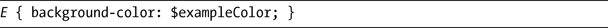
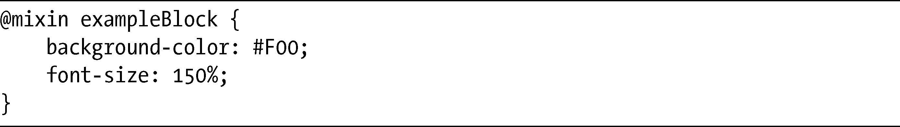
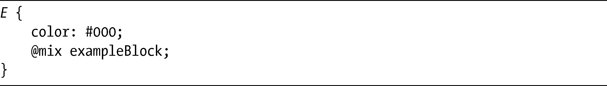
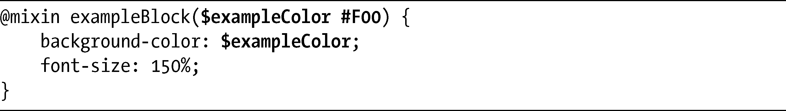
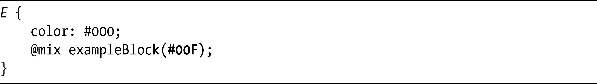
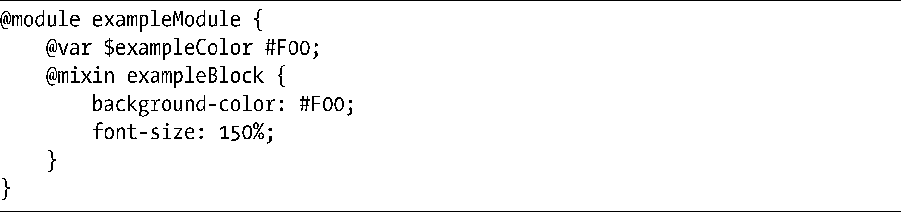
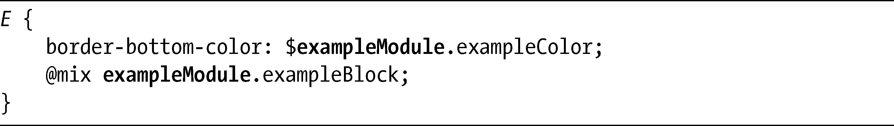
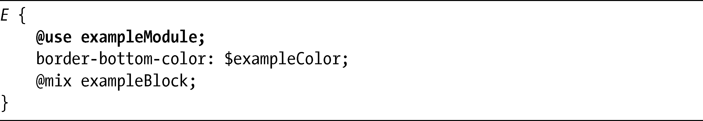
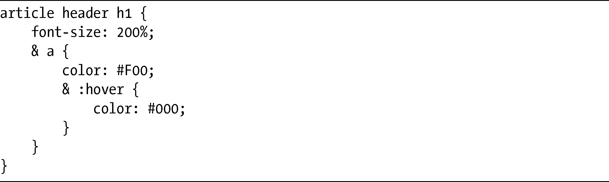

### 17.6　WebKit CSS扩展

在本书即将出版的时候，WebKit团队宣布打算在接下来的几个月内，在它的浏览器上实现许多新的实验特性。程序员们创建了一些在服务器上运行的CSS扩展，诸如SASS（<a class="my_markdown" href="['http://www.sass-lang.com/']">http://www.sass-lang.com/</a>），而WebKit所实现的这些实验特性正是基于这些扩展所提供的特性。

这些特性还没有提交给W3C（在我写这本书的时候），甚至，WebKit还没有生成任何书面的规范——因此，这只是一些还没有被实现的方法。此外，这些新特性并不具备向后兼容的能力，所以你也许需要等上若干年，它们才足以发展为日常使用的方法。

### 17.6.1　CSS变量

在上一节我讨论了两个现有的CSS变量提案，但是WebKit提案还有另外一个选择。这个提案与我展示的第一个提案相类似。首先，我们要使用@var规则定义变量和值：

之后，通过使用定义好的名称（前面带有一个字符$），就可以把这个值放到声明中:

在这个示例元素中，E被赋予的background-color值是#F00。

### 17.6.2　使用mixin扩展变量

刚刚介绍的语法在创建简单变量的时候是很有用的，但是提案更进一步引入了mixins（混入），这是可重用的代码块。如果我们要使用的话，就要先使用@mixin规则声明属性块：

然后可以使用带有定义好的mixin名称的@mix指令，将块插入到其他的规则中：

还有一种方法更胜一筹，你可以把参数传入到mixin中，这样它们的作用就像JavaScript函数一样，意味着你可以像下面这样来扩展你的mixin：

现在有一个变量名出现在mixin定义的名称后面的括号中（$exampleColor），带有一个默认值在后面（#F00），background-color属性会把这个变量当做一个值。如果没有提供其他的参数，这个属性就会使用默认值。不过，在@mix指令使用的时候也可以为它提供参数：

这里，mixin被调用，并且#00F的值被传递给它作为参数，替代在原始的@mixin中提供的默认值。mixin使得CSS成为更加编程化的语言，但牺牲了它在可扩展性方面的简单化。

### 17.6.3　CSS模块

编程人员都知道，只要引入了变量名称，就会面临作用域的问题——也就是说，对于相同的名称，函数中定义的变量会如何影响其他函数。CSS变量和mixin都具有全局作用域：只要在任何地方定义过，就可以在所有地方应用。如果只是构建自己的网站这倒没有问题，但是当许多不同的开发人员混合在一起工作的时候，变量名被定义两次并且引起冲突的几率就会呈指数形式增长了。

CSS模块（CSS Modules）被提出用于避免这个问题。我们可以用@module规则定义一个模块，在其中声明变量和mixin：

现在我们可以使用模块中的一个变量或者mixin，要么使用模块名称作为它的前缀：

要么使用@use指令：

使用这种方法的话，如果两个不同的模块中有两个名为$exampleColor的不同变量，那么只有在exampleModule模块中的那个变量会被使用，从而避免作用域冲突。

### 17.6.4　嵌套规则

最后一个新的计划实现的特性是我们能够对规则进行嵌套。实现这一特性的目的是避免在代码中出现重复，我们可以在嵌套的选择器前面使用和号（&）去执行：

当前，如果我们要编写具有相同作用的规则，需要使用以下方法：

可以看到，即便是在这样简单的代码中，都会存在大量的重复，可以想象在一个具有多个样式表的大型网站上，将会发生多少重复。而嵌套规则可以帮助我们去掉这种重复，让样式表更易于维护。

