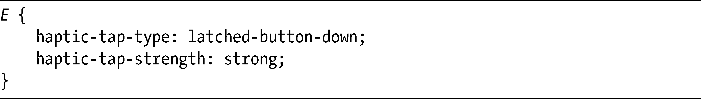

### 17.7　触觉反馈

随着我们进入移动计算的时代，触摸功能变得更加重要。一些触摸屏设备现在提供了触觉反馈——也就是说，它们使用力量和振动去模拟我们触摸物体时的实际感觉。CSS触觉（CSS Haptics，<a class="my_markdown" href="['http://www.starlight-webkit.org/CSS/css3-haptics.html']">http://www.starlight-webkit.org/CSS/css3-haptics.html</a>）是一个来自于Nokia的新概念，它提出允许通过CSS去实现触觉技术。

这一提议包括了两个新的属性：haptic-tap-type和haptic-tap-strength。第一个属性设置元素被触碰时我们的感觉，第二个属性设置回馈的强度。例如，看看像下面这样的代码：

这段代码可以在你按下一个具有强反馈的按钮之后，让按钮保持按下状态的感觉，你也可以使用haptic-tap简写提供相同的值：

这个提议是全新的，所以对它的未来还没有任何决定，触觉回馈只是一个例子，向你展示当我们步入个人计算的全新时代时，CSS将会为我们带来什么样的可能。

