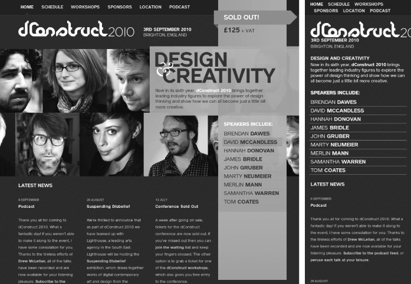

### 2.1　媒体查询的优点

为了迅速展示媒体查询的能力和灵活性，我要使用一个例子，演示网站如何为移动浏览器进行优化，并且无需进行大量额外开发。

人们在移动设备上访问网站的时候很可能颇费周折：文本也许显示得太小，如果放大的话，又意味着需要大量的滚动才能找到导航元素；那些导航元素可能还包含了下拉的功能，手指需要悬停在上面才能触发它，这可是移动设备上通常并不存在的动作；大图片在数据连接比较弱时可能需要花费大量的时间去下载，耗费了每月的大部分带宽限额。一些网站打算为此提供方便移动访问的版本，但通常却需要大量的开发，必须建立一个子域，使用不同于父站点的样式表和HTML模板，图片也不得不重新调整大小以更好地适应小的屏幕，另外还需要创建脚本，检测用户是否使用了移动浏览器，然后重定向到相应的移动站点上。使用这种方法的话，可能会导致以下问题：脚本必须始终跟上所有移动浏览器的版本，为了保持移动和桌面版本的同步，通常还需要大量重复的维护工作。

媒体查询解决了许多问题。首先，它们会基于设备的属性来检测设备，这样就不需要使用浏览器探测脚本，之后允许直接安装设备的功能去设定目标样式表。所以，如果检测到用户使用小屏幕的设备，CSS规则就会调整以适应该屏幕尺寸，从屏幕上去掉无关元素，提供更小的图片，让文本变得更加清晰。

为了举例，不妨看看dConstruct 2010年会议的网站（<a class="my_markdown" href="['http://2010.dconstruct.org/']">http://2010.dconstruct.org/</a>），如图2-1所示。

当我们在桌面浏览器中查看网站的时候，演讲者的网站推荐大图和文本会一列一列呈水平排列。通过媒体查询的力量，在比较狭窄的浏览器中（就像iPhone这样的智能手机所使用的浏览器）浏览这个网站时——演讲者的图片会被去掉，而指向演讲者页面的链接会更加突出，页面上所有的文本会移到单独的一列中，这样的布局对向下滚动的操作来说就非常理想了。

当然，这个网页绝不仅仅只在桌面和智能手机这两种设备上使用。事实上，我们需要致力于为所有设备提供网站优化，所以我强烈建议你读读Ethan Marcotte的文章，“响应式网页设计”（Responsive Web Design，<a class="my_markdown" href="['http://www.alistapart.com/articles/responsive-web-design/']">http://www.alistapart.com/articles/responsive-web-design/</a>），这篇文章对网页设计的新模式提供了非常好的介绍。

<b class="my_markdown">图2-1　在桌面浏览器（左）和移动浏览器（右）中查看dConstruct网站</b>

如果想看看其他人是如何利用媒体查询的，这里有一个很好的在线图库，位于<a class="my_markdown" href="['http://www.mediaqueri.es/']">http://www.mediaqueri.es/</a>，其中展现了一些可以实现的更出色的例子。

