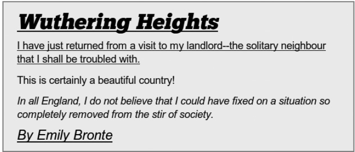

### 4.1　结构伪类

正如我在本章的引言部分所阐述的，伪类提供了一种方法，可以根据文档树中未指明的信息去选择一个元素。伪类有各种各样的子类型可供我们使用，但其中最常用的是结构伪类（structural pseudo-class）。这种伪类的子类型常被用于选择那些使用简单选择器无法访问的元素。例如，看看下面的这段标记：

在这两个p元素中，第一个p元素是div元素的第一个子元素。显然，虽然它来自于文档树，但文档树并没有提供任何信息让你可以把一条规则只应用在第一个p元素上。CSS2引入的:first-child伪类正是出于这个原因：

这个伪类允许根据元素属性不提供但又存在的信息做出选择——这正是伪类的确切目的。自从CSS2引入:first-child之后，它一直都是唯一一个属于这种类型的伪类。但CSS3引入了11个新的结构伪类，极大地扩展了这一范围。

### 4.1.1　nth-*伪类

其中，有四个新的伪类是以一个计数为基础的，该计数用于在文档树中寻找元素的位置。对于这个计数，可以使用语法nth-*。注意我在这里使用星号去替代若干不同的值，在本章剩余部分我会介绍每个伪类的作用。

nth-*伪类的基本语法非常简单。默认情况下，n代表一个从0开始的数字，并以1递增（1、2、3，等等）。另一个整数可以作为一个乘数传递给它。例如，2n就是代表2的每一个倍数（2、4、6，等等），3n就是3的每一个倍数（3、6、9，等等），依此类推：

第一个例子使用了默认值n，所以类型E的所有元素都会被选中。实际上，这相当于使用一个简单的元素选择器。接下来的例子间隔选中E元素，而最后的例子则会每三个E类型就选中一个。

也可以使用数学运算符用于加（+）或者减（-），所以2n+1就是2的每个倍数加上1（即1、3、5，等等），3n-1就是3的每个倍数减去1（即2、5、8，等等）：

上面第一个例子选中了类型E除第一个元素之外的每个元素，它的计数将会是2、3、4、5，等等。接下来的例子选中处于奇数位的E元素（1、3、5，等等）。最后的例子，就像上面提到的，以2、5、8等顺序去选择元素。

有两个特殊的关键字值可以使用，分别是even和odd，它们分别可以替代2n和2n+1：

扫清了基本语法障碍之后，我们来看看伪元素本身究竟是怎么样的。

#### nth-child和nth-of-type

大多数新的结构伪类能够根据元素在文档树中相对于其父元素的位置（-child）或者它们的类别（-of-type）去选择元素。这些定义通常都会有重叠，但它们之间却有关键的差别。

这些伪类中最简单的就是nth-child和nth-of-type。nth-child在选择元素的时候，可以根据其父元素中子元素总数，按照计数的位置进行选择；而nth-of-type并非按照全体子元素进行计数，仅仅只是针对那些特定类型的子元素进行计数。

在这个例子中，规则和是等效的，因为计数值（n）在默认情况下就是被留下的，二者都是简单地选择属于类型E的所有子元素。后面的例子就显露出差别了：在中，nth-child(2n)选择了类型E中所有处于偶数位的元素，计数的时候包括各种类型的兄弟元素。作为对比，在中，nth-of-type(2n)选择E类型的所有偶数位元素，但在计数的时候只包含那些同类型的元素。

演示这些规则比对它们进行解释要容易得多。我们先来看一下这两条规则：

我会使用这段标记来演示它们之间的差别（为了简洁对文本进行了删减）：

这个div元素总共有4个子元素：一个h2元素和三个p元素。第一个示例规则（）的结果显示在图4-1中。nth-child(2n)选择器每两个子元素（第一个和第三个段落）就进行加粗显示。对比图4-2中的第二个示例规则（），nth-of-type(2n)选择器忽略了h2元素，会将粗体应用到三个p类型元素的第二个实例上——即，只有第二个段落会应用粗体效果。

<b class="my_markdown">图4-1　使用nth-child选择器的结果</b>

正如我之前提到的，你肯定已经可以从前面的例子中得出结论，nth-child和nth-of-type有许多的重叠，经常可以交换使用，就像我在下面的例子中那样做。

图4-3是一张表，显示了伦敦五天的天气预报（所有温度是以摄氏度给出的，0℃相当于32℉）。这些数字采用的是1月份的数值——这里可不总是这么冷！我要传递的信息全部在这张表中，但是因为这张表格没有任何视觉格式，所以读起来很困难！

<b class="my_markdown">图4-2　使用nth-of-type选择器的结果</b>

<b class="my_markdown">图4-3　一张天气预报的HTML表格</b>

现在对比一下图4-4所显示的表格。这里，我使用了斑马条纹，可以在眼睛逐行查看的时候提供辅助，然后再将每一列下方的数值居中对齐，从而提高易读性。

<b class="my_markdown">图4-4　将天气预报表格进行格式化以提高可读性</b>

所有这些格式的设置均使用几个CSS3声明来完成：

这张表格所提取出来的标记显示在下面。为了不让这个例子把你混淆，我只是适当显示了表格的标题行以及其中一行数据：

对于斑马条纹的实现，我使用了nth-of-type，将偶数行的背景颜色修改为浅灰色（我也可以使用nth-child来实现这一效果，因为在我的表格标记中，所有的tr元素都是文档树上同一层级中仅有的兄弟元素）。之后，在使用nth-child（带负值）和first-of-type（我马上会谈到）让包含文本的单元格左对齐之前，我会用标准的元素选择器先让所有的head和body元素居中对齐。

负值（-n）会从负方向增加计数——先从0开始，之后往下数-1、-2，等等。这种技术在使用正数作为第二个值的时候是很有用的——这里我使用了+2——所以有效的计数是从2开始往下数的，这样能够让我选择thead元素的第二个和第一个子元素。

在下一节的第一个例子中，我会再次使用这一技术。

#### nth-last-child和nth-last-of-type

nth-last-child和nth-last-of-type伪类接受和nth-child与nth-of-type一样的参数，它们只有一个区别，就是从最后一个元素开始计数，以相反的方向工作。例如，假设我要在天气表格中添加一些视觉上的简单表示，显示第四天和第五天的预报准确性不如前面几天的，如图4-5所示。

<b class="my_markdown">图4-5　使用nth-last-child添加额外的格式</b>

在图4-5中，我使用nth-last-child伪类（尽管nth-last-of-type在这个例子中可以再次使用）并传入参数-n+2，令最后两行的字符倾斜：

这里，我使用负值（-n）从负方向增加计数，这样它起到的效果也是相反的。由于nth-last-child和nth-last-of-type是从文档树向后进行计数，这里使用一个负值会让计数向前走！该计数先从表格的最后一个tr元素开始，然后按相反的顺序递增，所以最后一行和倒数第二行就是前两个计数，因此会被加上斜体的效果。虽然这看上去也许有点儿不符合我们的直觉，但这种方法终将逐渐成为你遍历文档树时的习惯方法。

### 4.1.2　first-of-type、last-child和last-of-type

我在图4-4所使用的示例代码中引入了first-of-type，它和CSS2引入的first-child是类似的。的确，对于这个例子，我们也可以用相同的方式去使用它们。不过实际上，它们之间的差别就像nth-child和nth-of-type一样。

你肯定会意识到，first-child伪类可以将规则应用到到一个元素上，而该元素必须是其父元素的第一个子元素。然而，就像nth-of-type一样，first-of-type也要更加具体一些，它所应用的元素，必须是其父元素的某种指定类型的第一个子元素。同样也存在一组对应的伪类，分别是last-child和last-of-type，对于这两个伪类——你也许可以猜到——选择的是父元素的最后一个子元素或者是属于某种类型的最后一个子元素。

我会用两个例子来演示这种差别。这两个例子都会应用到相同的标记块上（为了简洁对文本进行了删减）：

在第一个例子中，我打算使用first-child和last-child，如下所示：

结果显示在图4-6中。h2元素是div的第一个子元素，所以会应用下划线效果。而div的最后一个子元素是h3元素，所以是倾斜的。一切都非常直接明了。

现在，我们看看在使用first-of-type和last-of-type选择器的时候又有哪些差别：

<b class="my_markdown">图4-6　应用first-child和last-child选择器</b>

看一下图4-7中的结果。你会注意到三个元素——h2、h3和第一个p元素——是有下划线的。这是因为它们是属于该元素类型的第一个实例。同样的，h2、h3和最后的p元素都是斜体。这一次，是因为它们全都是属于该类型的最后的元素，h2和h3既是它们所属类型的第一个也是最后一个元素，所以两条规则都会应用到它们身上。

<b class="my_markdown">图4-7　应用first-of-type和last-of-type选择器</b>

就像所有的*-type和*-child伪类一样，它们之间的差别也十分微妙，甚至有时候最后一个子元素也是其所属类型的最后一个元素，所以选择器就可以替换使用了。但正如我在前面展示的，有时候它们之间还是会有不同的用途。

### 4.1.3　only-child和only-of-type

这两种伪类常用于在文档树中选择这样的元素，该元素有一个父元素，但没有任何的兄弟元素（only-child）或者没有相同类型的兄弟元素（only-of-type）。和前面的许多伪类一样，二者的作用实质上有些重叠，但是下面的例子会说明它们之间的差异。看看下面这两条样式规则：

然后把它们应用到这段标记上：

结果如图4-8所示。

<b class="my_markdown">图4-8　对比only-ochild和only-of-type</b>

两个p元素在文档树中的所在层级，都是其所属类型的唯一元素，所以only-of-type规则把二者都选中并应用了斜体效果。然而位于blockquote内部的p元素，在它的层级中是唯一的子元素，所以也会受到only-child规则的影响，应用下划线效果。

使用only-of-type可以让你从其他类型元素中挑选出一个元素来，反之only-child需要元素单独存在才行。

