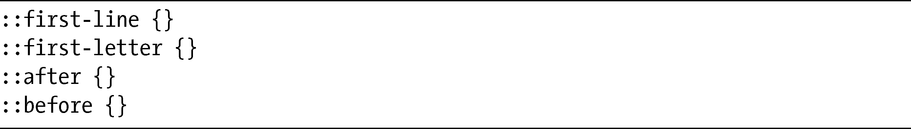
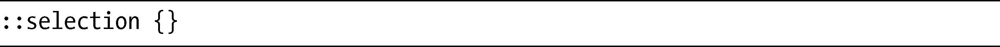
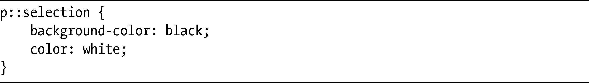
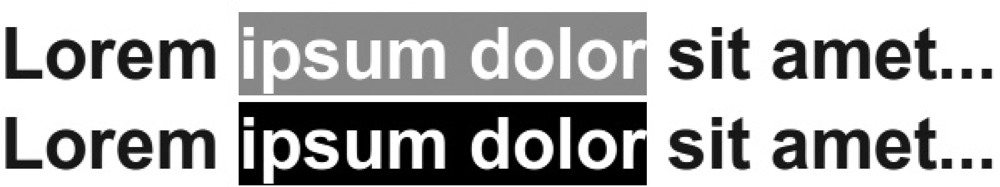

### 4.3　伪元素

像伪类一样，伪元素（pseudo-elements）提供的也是在文档树中没有具体指明的信息。但是在文档树中，伪类利用的是一些“虚幻”的条件，比如元素在文档树中的位置或元素的状态，而伪元素就走得更远了，它可以把样式应用到文档树中根本就不存在的元素上。

在CSS2中，共有四个伪元素，分别是：:first-line和:first-letter，用于选择文本节点中的子元素；还有:after和:before，允许样式应用在现有元素的开始或结尾处。CSS3并没有引入任何新的伪元素，但它对原有伪元素的定义稍微进行了优化，还引入了新的语法将伪类和伪元素进行区分。在CSS3中，伪元素的前缀使用的是双冒号（::），就像这样：

> 注意：
> 单冒号语法为了向后兼容仍然可以被接受，尽管它已经被降级并且你也不应该再继续使用了。

下面介绍selection伪元素。

在CSS3选择器模块的形成阶段，有一个提议就是关于selection伪元素的，这个伪元素可以将规则应用到用户在浏览器中选中的元素上（例如，文本节点的一部分）：

只有少数的属性可以使用selection伪元素应用样式，分别是color、background-color和background简写属性（尽管没有background-image）。使用selection伪元素，可以像这样来实现：

图4-11展示了系统原生的selection颜色（上）和应用了selection伪元素的颜色（下）的对比。

<b class="my_markdown">图4-11　通过selection伪元素应用的自定义颜色</b>

尽管在我写这本书的时候，selection伪元素已经从规范中去掉了，它的未来也还未可预测，但Opera和WebKit已经实现了它，Firefox则通过-moz-前缀去实现，它也有望出现在IE9中——所以，尽管它不再是规范的一部分，但你还是可以继续使用。

