## 5.1　@font-face规则

要在页面上显示网页（或者非系统）字体，需要使用@font-face规则。该规则对字体进行了定义，并且为浏览器提供了文件的使用位置。这是它的基本语法：

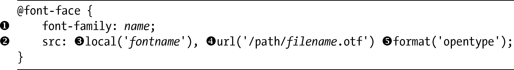
我要对它稍微进行分解。首先，我要用font-family属性给字体设定一个名称（）。对于这个属性你应该很熟悉了，只不过在这里它的用途稍有不同，我用它去声明字体的名称，而不是去引用一个字体。和CSS2.1中的font-family属性一样，你也可以使用多个用空格隔开的单词，只要把它们放入单引号中即可。

> 注意：
> 使用font-family定义字体名称的时候，可以多次使用相同的名称——事实上，我们有时候确实需要这么做。我很快就会在“定义不同的风格”一节中讨论这样做的原因。

接下来是src属性（），它告诉浏览器字体文件的位置。该属性接受几个不同的值：local（）使用源字体的名称去检查字体是否已经安装在用户的机器上；url（）提供一个指向字体的路径，当字体在本地不可用时使用；而format（）指定字体的类型，在这个例子中我使用的是OpenType，但也可以使用更多的类型，稍后我们会在“字体格式”一节进行讨论。

我也可以为src属性提供许多不同的值，这些值分别用逗号隔开，就像在代码示例中那样。这种方法真正利用了层叠的能力去提供不同的回退值，在后面的例子中还会派上用场。

要使用我刚刚定义的字体，我们只需要在字体栈（font stack）中调用它的名称，就像正常情况下那样做：

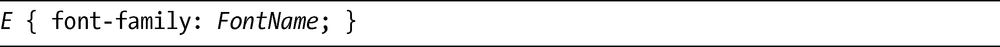
对于现实中的例子，我会使用@font-face把Chunk字体（可以从<a class="my_markdown" href="['http://www.theleagueofmoveabletype.com/fonts/4-chunk/']">http://www.theleagueofmoveabletype.com/fonts/4-chunk/</a>免费下载到）应用到h2元素上。

这里是我要在样式表中使用的代码：

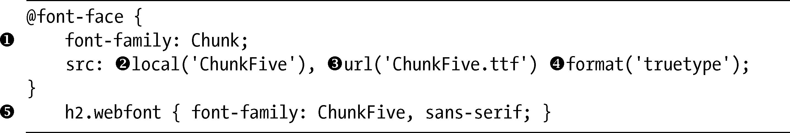
第一步是为字体命名：我选择的名称是Chunk（），因为我可以轻易地记住它，但是我同样可以使用任何其他名称。接下来我们还要为src属性提供几个值：local使用字体的真正名称，“ChunkFive”（），用以检查该字体在我的系统上是否可以使用；接着我又输入了一个相对路径，指向要使用的字体文件（）；最后，我把参数truetype赋给format（）。

注意：

> 通常我们可以使用字体管理程序或者右键单击字体文件去查看字体的信息，找到字体真正的名称。

在上面的CSS代码的最后一行（），我把新字体的名称作为一个值提供给字体栈，该字体栈将应用到带webfont类的h2元素上。为了让大家了解它是如何显示的，我使用下面的标记让大家有一个快速对比：

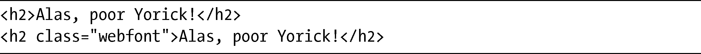
输出结果如图5-1所示。

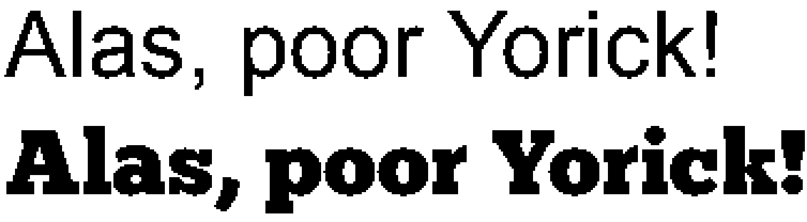

<b class="my_markdown">图5-1　使用@font-face规则调用的Chunk Five字体（下面一行）和系统字体（上面一行）对比</b>

### 5.1.1　定义不同的风格

我们在本章已经了解的@font-face语法是非常简单的，但它只定义了一种字体风格——即粗细变换、倾斜，等等。如果要使用不同的风格，比如更粗的粗细度或者斜体，就需要单独地定义每种字体的风格。为此，我们可以使用两种方法去实现，第一种方法是重用相同的名称并把额外的描述符添加到@font-face规则上：

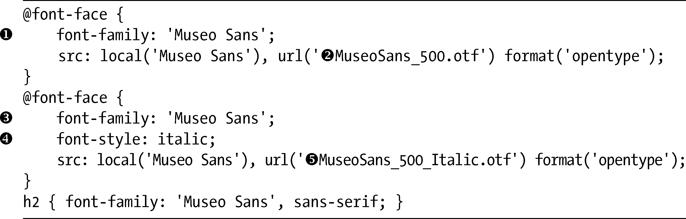
在这里，我们可以看到第一条@font-face规则定义了字体的名称为Museo Sans（），给出了正常风格的URL（）。第二条@font-face规则使用相同的字体名称（），但是添加了带italic值（）的font-style属性，而URL指向的是字体的斜体风格（）。这种方法的优点是斜体样式不需要在CSS中进行定义，就可以被自动、恰当地应用，就像这段示例标记一样：

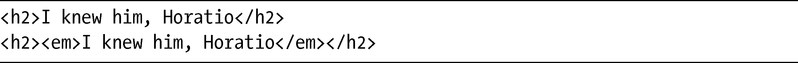
第二个h2元素使用了我们在前面的规则中定义的斜体字体的风格（结果如图5-2所示）。

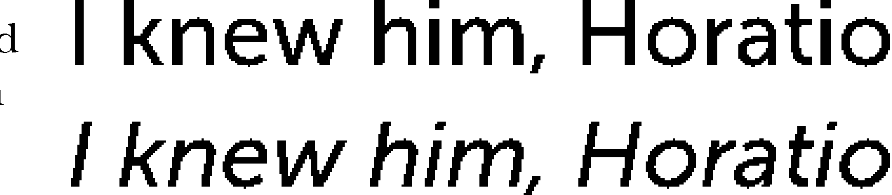

<b class="my_markdown">图5-2　使用@font-face应用Museo Sans字体普通风格（上）和斜体风格（下）</b>

第二种方法为每种字体样式使用了独一无二的名称，并且在字体栈中单独去调用它们：

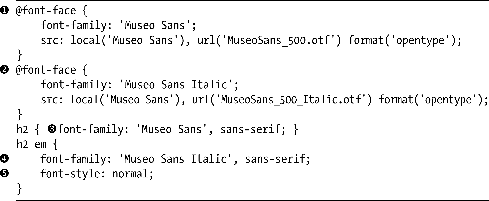
在这个例子中，第一条@font-face规则（）被命名为Museo Sans，而URL指向普通的字体风格。第二条@font-face规则（）被命名为Museo Sans Italic，而URL指向斜体风格。h2元素的字体栈（）使用普通的风格，反之em元素的字体栈，也就是h2的子元素（）则使用了斜体风格。

你会注意到我也添加了一个值为normal的font-style属性（），如果不是这样，Firefox会人为地为斜体再应用上斜体——给你双重斜体的效果！

至于具体要使用哪种方法则完全取决于你，网络上主流的意见似乎偏向第二种，但是你应该试验一下，看看哪一种更能够满足你的要求。在某些情况下，你也许毫无选择，例如，使用第一种方法的时候，Safari就无法识别CSS2.1的font-variant属性（用于应用小写字母）。

先不管你选择的是哪种方法，我们先看看图5-2显示的使用斜体样式的效果。

### 5.1.2　真实字体风格vs.人造字体风格

有一件事情需要我们知道，那就是不论利用哪一种方法，如果要应用不同的字体风格——例如，斜体，就要确保在@font-face规则中定义了指向相关文件的链接。如果没有这样做，一些浏览器（尤其是Firefox）就会尝试人为地重新创造出字体的风格来，结果通常是很丑陋的。

这个例子演示了不定义字体的斜体效果将会发生什么情况：

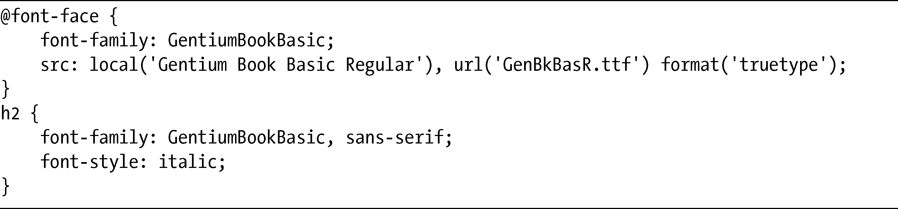
可以看到，我的@font-face规则使用了Gentium Basic字体的普通风格，但是h2元素在它上面声明了斜体样式。在展示它如何渲染之前，先看看我本应该使用的方法：

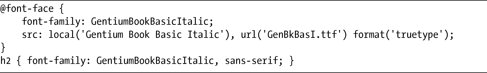
在这段代码中，@font-face规则定义了Gentium Basic的斜体风格，之后会被应用到h2元素上。我们可以在图5-3中比较两种不同的处理方式。

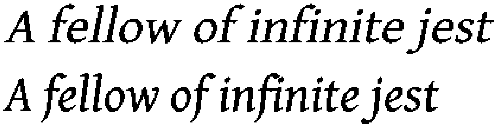

<b class="my_markdown">图5-3　人造斜体（上）和（真正的）倾斜字体风格的对比</b>

可以看到，这两个例子的差别是相当大的。第一个例子使默认的字体倾斜去仿造斜体效果（使用第一段示例代码），它的字符会变得更大，也稍微有点扭曲，间隔的距离也不太一致。第二个例子是真正的倾斜字体风格（使用第二段示例代码），它使用了专为此目的而设计的字符。

在使用Firefox和Internet Explorer的时候，我们要特别注意这个问题，对于应用了上面那种“不好的”代码示例的情况，WebKit会忽略font-style属性并仅仅显示普通的字体风格。同样的警告也适用于所有不同的字体风格：粗体、斜体、粗斜体、小型大写字母、窄体，等等。

