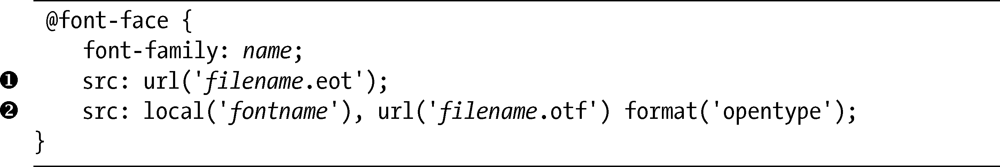
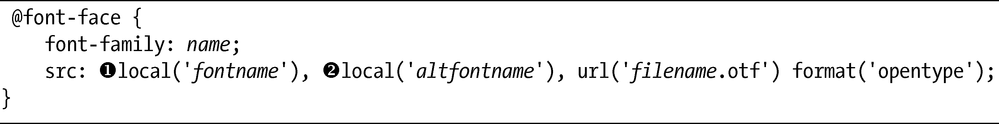
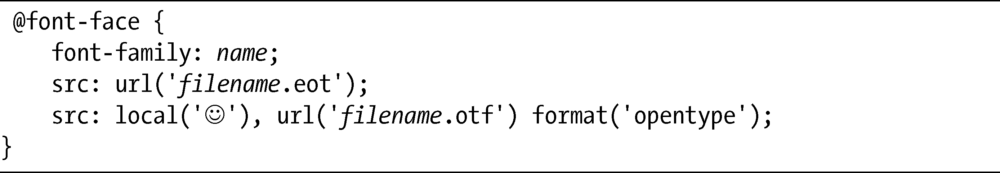
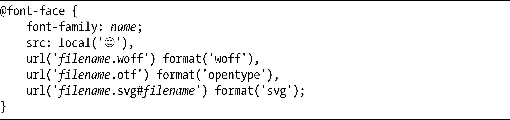
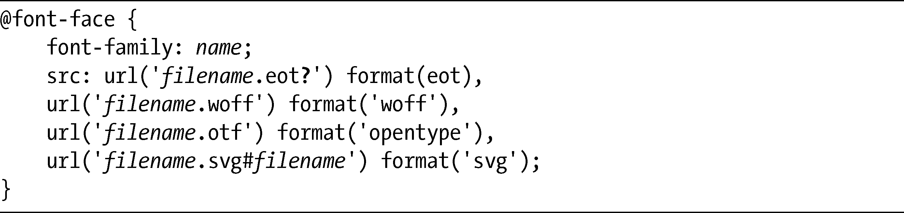

### 5.2　“万无一失”的@font-face语法

@font-face规则也存在一些令人遗憾的遗留问题。在本章开头我解释过，这条规则已经存在相当长一段时间，早在1997年的Internet Explorer就已经实现过。同样，尽管当前的字体模块在2009年的时候更新过，但毕竟也有七年没有修订了。这两方面的因素对一些问题的存在都负有责任，但现代浏览器对@font-face的实现也同样存在差异。

这些问题的存在意味着我们需要有一个解决方案，确保@font-face在所有浏览器上都可以正确地工作，幸运的是，一些聪明的开发人员已经实现了。但是，在我完整介绍跨浏览器“万无一失”的@font-face语法之前，先简要地讨论一下它所解决的一些问题。

### 5.2.1　使用本地字体

src属性的local()值用于检查用户是否已经把定义的字体安装在他或她的系统上——如果用户这样做了，就可以应用本地的拷贝，不必要下载新的拷贝。local()是一个好方法，但它也有三个方面的缺点。第一个缺点，也是尤为重要的，就是local()不支持Internet Explorer 9以下的所有版本。

解决这个缺点的变通方案要依赖于IE8及其以下版本只允许使用的可嵌入开放型（Embeddable Open Type，EOT）字体格式（参见“字体格式”一节了解关于EOT的更多信息）。由于使用了EOT，我们可以声明两次src属性：

第一种情况（）没有local值，使用的是EOT字体格式。在第二种情况下（），local()值有必需的字体名称，使用的则是OTF（OpenTypes）格式。这种情况会被IE8及其以下版本忽略，它们无法识别local()，但在所有其他浏览器上都会占据优先。

下一个缺点就是，在我写这本书的时候，Mac OS X的Safari浏览器（当前的版本是5.03）需要使用不同的字体名称参数作为local()的值。字体通常有两个名称：一个完整名称和一个PostScript名称。Mac上的Safari需要使用PostScript名称，反之其他所有浏览器接受的是完整名称（这种要求在Mozilla Hacks的博客上有深入的解释，参见：<a class="my_markdown" href="['http://hacks.mozilla.org/2009/06/beautiful-fonts-with-font-face/']">http://hacks.mozilla.org/2009/06/beautiful-fonts-with-font-face/</a>）。解决这个问题是很简单的，就是指定两个local()值，每个值都使用不同的参数：

对于第一个local()值（），你可以使用PostScript名称，而对于第二个local()值（），你可以使用其系列名称（尽管列出的顺序实际上无关紧要）。此外，字体管理程序会帮助你找到可以在样式表中指定的不同名称。

然而，使用字体管理程序可能会导致出现第三个缺点。在某些情况下，@font-face规则和字体管理软件相处得可不是太好，它会显示不正确的字符或者打开一个对话框，询问用户使用字体的许可。解决这一缺点的唯一方式就是添加一个“空”值给local()，强制下载所定义的字体。这个空值只需要是一个单独的字符就可以了啦，而按照惯例，实际中我们会使用一个笑脸去代替，但不是说它非得是一个笑脸，只是那样可以起作用并且看起来也更加友好！

所以，如果我们把这一节的所有解决方案放在一起，最终就会得到像下面这样的代码：

### 5.2.2　字体格式

下一个问题源于不同的、相互竞争的格式。正如我已经提到的，IE8及其以下版本只支持专用的EOT格式。而网页字体的兴趣浪潮伴随着现代浏览器而产生——先是Safari，再就是Firefox以及之后其他的浏览器——它们允许使用更加通用的TrueType和OpenType格式。

但是，许多商业的字体开发商并不允许他们的字体以这种方式使用，因为这样会使得对字体的非法拷贝变得更加容易（参见“为网页用途获得字体许可”一节）。出于这个原因，Mozilla跟一些字体制造者进行了协商，从而创建了网页开放字体格式（WOFF）。Firefox 3.6以后的版本均能够支持这种格式，IE9以及即将发布的Chrome和Opera也应该能够支持（对于Safari应该还没有官方的说辞，但我相信它肯定会紧随其后）。另外，还有一些浏览器也接受可伸缩矢量图形（Scalable Vector Graphics，SVG）字体格式。这种字体类型是对字体的矢量再造，在字体文件大小上要轻便一些，更适合移动用途。正因为如此，这种格式是较老版本的Safari for iPhone（4.1及以下版本）上唯一能支持的格式。

由于@font-face规范允许src属性使用多个值，所以我们可以创建一个栈，确保最大范围的浏览器能够支持我们使用的字体：

src值的代码合集中的栈会检查浏览器是否支持WOFF、OpenType和SVG格式（按照这种顺序），并相应地显示正确的字体。

### 5.2.3　最终的“万无一失”语法

为了让选择的字体在每个平台的所有浏览器上都有相同的显示，我们需要使用的代码看上去应该像这样：

想要让字体正常工作，主要的要求就是所选择的字体必须具有三到四种不同的格式。为了减轻负担，我强烈推荐使用Font Squirrel的@font-face生成器（<a class="my_markdown" href="['http://www.fontsquirrel.com/fontface/generator/']">http://www.fontsquirrel.com/fontface/generator/</a>）。只要简单上传你要使用的字体文件，@font-face生成器就会将其转化为所有相关的格式——而且还可以生成需要在页面中使用的CSS，这绝对是一个价值连城的工具。Font Squirrel也有一个字体库，我们可以直接用@font-face去嵌入使用，节省格式转化的工作。

要了解更多关于“万无一失”的@font-face语法，可以访问开发人员Paul Irish的网站，他就是主要负责创建这种语法的人。他详细地解释了为什么这种语法的每个部分都是必需的（<a class="my_markdown" href="['http://www.paulirish.com/2009/bulletproof-font-face-implementation-syntax/']">http://www.paulirish.com/2009/bulletproof-font-face-implementation-syntax/</a>）。

### 5.2.4　Fontspring可靠语法

在这本书即将出版的时候，一种新的、可能更加可靠的语法也公布出来了。这种语法比上面显示的语法要简单得多，只需要用一个简单的问号（?）字符，把它应用到EOT字体源上就可以了：

要弄明白这种Fontspring语法是如何工作的，应该先读读公布这一语法的原始博客文章（<a class="my_markdown" href="['http://www.fontspring.com/blog/the-new-bulletproof-font-face-syntax/']">http://www.fontspring.com/blog/the-new-bulletproof-font-face-syntax/</a>）。虽然这种新的语法看上去还不错，但它其实从公布以来已经修改过许多次了，所以在成为新的默认语法之前，很可能还需要经过更加充分的测试，因此我也在犹豫是否要完全认可这种语法。

