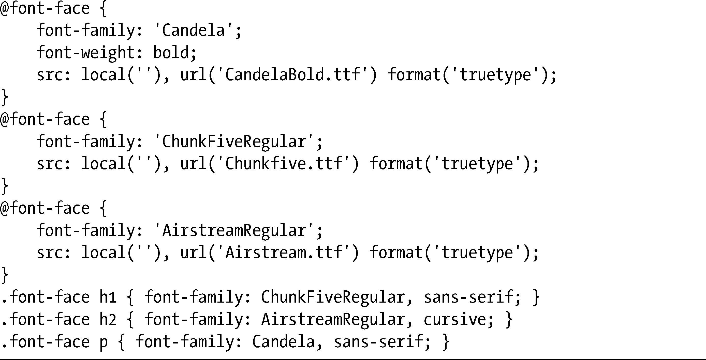
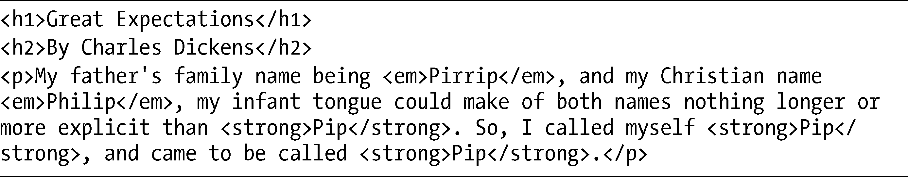
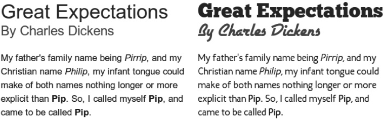

### 5.4　网页字体实际示例

我们讨论了字体、许可和多种语法的错综复杂和细节之后，把目前学到的所有东西放在一起，来看看@font-face的实际应用。我会使用一个例子，将以标准sans-serif字体（Arial）显示的文本和用三种不同字体系列（全部来自于Font Squirrel）显示的同一文本放在一起进行比较。

以下是这个示例的CSS代码。要牢记在心的是，为了让代码更清晰一些，我简化了示例，只显示一种单独的字体格式（TrueType）：

为了让代码尽可能方便阅读，我也忽略了一些颜色和尺寸上的调整。以下是我使用的标记：

输出结果如图5-4所示。

<b class="my_markdown">图5-4　使用标准系统字体（左）的文本和使用不同网页字体（右）的文本</b>

在右边的例子中，我将三种非常有特色的字体系列混合在一起——许多设计人员可能会告诉你，混合对于产品网站来说不是什么好主意，但这种方法对于演示我的观点可谓恰到好处。不论你怎么看待我的字体选择，我都希望你至少同意一点，那就是在应用了那些选择之后，右边的文本看起来更有活力，也更加迷人。

尽管，为了获得跨浏览器的语法，我们的道路仍然漫长而曲折，但使用@font-face并不复杂，所增加的工作负担不过就是要额外花些时间去声明要使用的字体风格和变体，之后我们在字体栈和样式中调用字体的方式和使用系统字体的方式是一模一样的。

