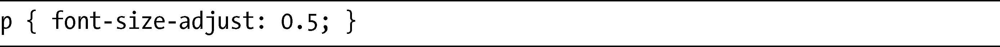
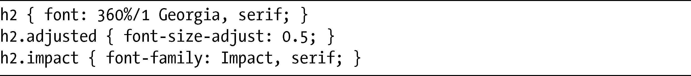
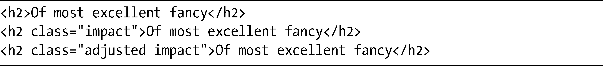
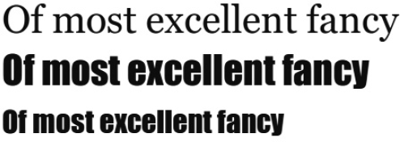
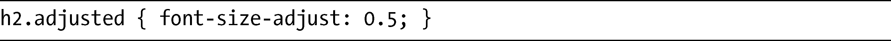
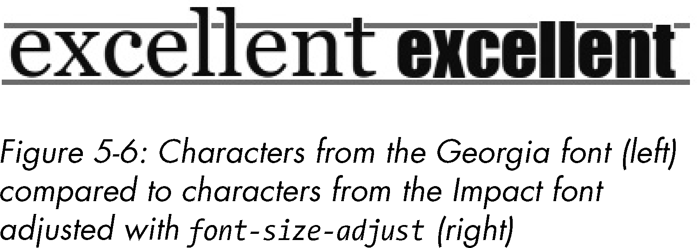
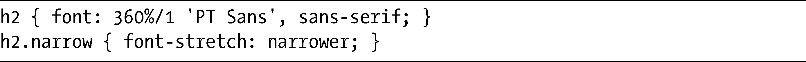
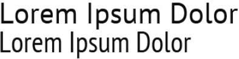

### 5.5　更多的字体属性

CSS3网页字体模块并不仅仅重新引入了@font-face规则，它也重新唤醒了最先由CSS2提议的另外两个字体属性。这些属性对于字体的精细控制可能是非常有用的——我说可能的原因是，在现在这个时候，它们还没有被广泛地实现。

### 5.5.1　font-size-adjust属性

在CSS中使用字体栈的唯一缺点是字体在尺寸上可能会有较大的变化。首选的字体以16px显示的时候看起来很好，但如果该字体不可用，下一种备用字体可能会小得多，也更难以阅读。为了解决这一问题，我们可以使用font-size-adjust属性。该属性可以动态修改font-size属性，确保不管使用字体栈中的哪种字体，都可以显示正常的字体尺寸。font-size-adjust单独使用一个小数值。这是它的语法：

number值是指小写字母x占总高度的比例（被称为x-height）。换句话说，一种字体的总高度也许是16px，但小写字母x的高度也许只有一半大小（8px），所以x-height比例就是0.5（8除以16）：

通过使用font-size-adjust属性，我们可以确保不管显示什么字体，x-height总是有相同的值，也不会有易读性的问题。为了举例说明，考虑下面的代码：

在下面的例子中，我有三个h2元素，font-size全部设置了相同的值。我使用它们的类名为它们应用不同的值，正如这段标记所示：

第一个h2用Georgia字体渲染，第二个使用Impact字体，而第三个也使用Impact字体，但是它应用了font-size-adjust属性，结果如图5-5所示。

<b class="my_markdown">图5-5　font-size-adjust在Impact字体（第三行）上的效果</b>

在前两个h2元素中，可以清楚地看到Georgia字体（第一行）和Impact字体（第二行）之间的差别（当然，你永远不大可能在同一个字体栈中使用这两行，但是由于它们的x-height差别很大，所以可以很好地用来演示）。Georgia的x-height比例大约是0.5，意味着小写字母x就是该字体高度的一半。作为对比，Impact的x-height比例是0.7，意味着大小写字母之间在高度上的对比要小一些。

例子中的前两行没有以任何方式调整，所以第二行中Impact字体的小写字母会比第一行的Georgia字体的小写字母高出许多。不过在第三行，我把font-size-adjust值设置为0.5，和Georgia字体相匹配：

这么做会调整字体的大小，所以Impact字体以更小的尺寸显示——x-height是12px，即24px的总高度的一半。如果我直接比较两个元素，可以看得更加清楚，如图5-6所示。这里，调整过的Impact字体中没有字母出头部分（线条延伸到x-height的上方）的字符——即e、x、c和n，和Georgia字体中的字符有同样的高度。

<b class="my_markdown">图5-6　Georgia字体的字符（左）和使用font-size-adjust调整过的Impact字体的字符（右）的比较</b>

遗憾的是，一种字体的x-height比例并不是那么容易得到的。我们要么可以使用图形软件包去手动测量，要么试着找找在线的资源（我在<a class="my_markdown" href="['http://www.cs.tut.fi/~jkorpela/x-height.html']">http://www.cs.tut.fi/~jkorpela/x-height.html</a>上发现了一个估值工具，该网站也列出了普通网页字体的值）。

在我写这本书的时候，还只有Firefox支持这个属性。

### 5.5.2　font-stretch属性

一些字体系列包含了紧缩或加宽的变体，而font-stretch属性被提出用于访问这些变体。在我写这本书的时候，font-stretch属性还没有得到任何已发布浏览器的实现，尽管它已经处于IE9的Beta版中。

这是其语法：

根据其规范，keyword值可以是下述几个值之一：normal（默认）、ultra-condensed、extra-condensed、condensed、semi-condensed、semi-expanded、expanded、extra-expanded和ultra-expanded。每个关键字都与字体系列内的一种字体变体有关，例如Frutiger的窄体或者Nova Ultra的宽体。还有一组对应的关键字，narrower和wider，列明在该规范2002年的修订版中，尽管之后被去掉了，但已经在IE9 Beta版中实现了。

我们再来看一个使用IE9 Beta版的例子。在这个例子中，我会使用font-stretch属性显示字体PT Sans的两种不同风格，使用下面的代码：

h2元素显示了两次，两次都是以360%（36px）的大小去使用字体PT Sans。在第二种情况下，我使用了带narrower值的font-stretch属性，它告诉浏览器显示的字体风格要比当前更窄一些，我也不需要精确指出需要的宽度。结果如图5-7所示。

尽管这个属性还没有被浏览器广泛支持，但我们也可以只用@font-face规则（在本章开头介绍过）去指定紧缩或加宽的风格，从而复制出这一效果。

<b class="my_markdown">图5-7　第二个例子使用了较窄的字体风格，归功于IE9中的font-stretch属性的效果</b>

