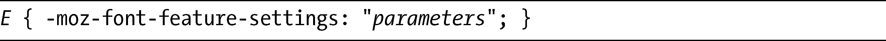
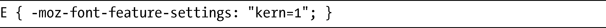
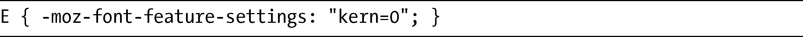
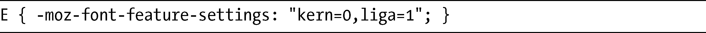
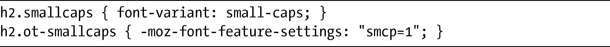
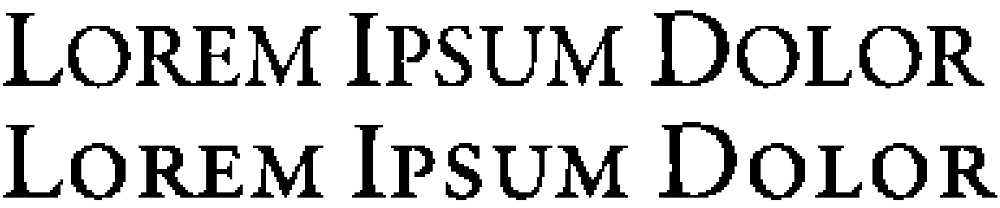
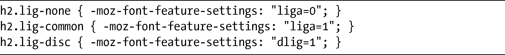
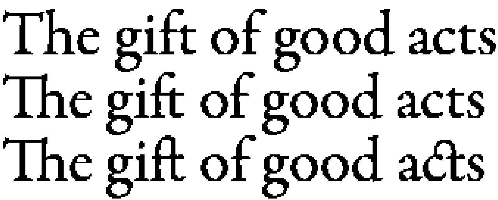

### 5.6　OpenType特性

尽管网页字体排版在CSS3中有了巨大的飞跃，但它对于文字排版的各种各样的可能性来说，仍然只是触及皮毛而已。如果我们把浏览器中提供的选择和类似Adobe Illustrator这样的桌面应用程序所提供的选择做比较的话，你会看到后者比前者要丰富得多。

像OpenType这样的字体格式能够拥有比字体风格或粗细变化更多的变化，它们有一系列的连字、花饰、特殊数字字符以及更多东西（如果这些术语对你来说不知所云，我推荐Magnet Studio的OpenType初学者指南，位于<a class="my_markdown" href="['http://www.magnetstudio.com/words/2010/opentype-guide/']">http://www.magnetstudio.com/words/2010/opentype-guide/</a>）。

最新的Firefox每日构建版有一个实验性的新属性，允许你探索OpenType和其他类似格式提供的新特性。这个新的属性称为-moz-font-feature-settings，以下是它的语法：

parameters值是一个字符串，包含了一个或多个用逗号隔开的二进制值——即这些值是0或者1。这是一个例子：

参数kern的值是1。kern开启了OpenType的字距调整，在这个例子中实际上是多余的，因为Firefox默认已经设置了这一参数。如果要禁用字距调整，可以使用另一个二进制值：

正如我提到的，可以有不只一个参数——只需要创建一个用逗号隔开的列表：

这个属性很大程度上还在发展当中，所以不能保证最后的语法采用的就是这种形式。

我们来看一些例子，这些例子展示了使用OpenType特性的优点。在本章前面，“真实字体风格 vs. 人造字体风格”一节中，我展示了为什么我们总是应该使用真正的斜体字体而不是让浏览器人为去创建。在这个例子中，你将会看到，我们在使用小型大写字母字体变体的时候也应当坚持相同的原则。以下是相关的样式规则：

这里，我用了两个h2元素：我把值为small-caps的font-variant属性应用到第一个h2元素上；对于第二个h2元素，我使用新的属性-moz-font-feature-settings，带有用于切换小型大写字母的参数smcp，我们可以在图5-8中看到这一区别。

<b class="my_markdown">图5-8　位于下方的例子使用了OpenType自己的小型大写字母特性</b>

在第一个h2元素中，使用了模拟的小型大写字母，比例有些不正常，大型和小型大写字母之间的差异几乎不怎么显著。比较第二个h2元素，可以发现它有着更为明显的比例，看上去更舒服一些。

现在我要演示连字的用法，连字（ligatures）常用于把字符的某些部分连结在一起，使它们看起来更加协调。和字距调整一样，Firefox自动使用普通的连字，除非你告诉它不要这样做。所以在这个例子中，我会将没有连字的文本、普通连字和随意连字——即装饰性的连字放在一起作比较。

以下是代码：

这段代码被应用到三个h2元素上。第一个元素的参数字符串是liga=0，所以普通连字被禁用了。第二个元素使用的是相同的参数字符串，只是它的值设置的是1，所以启用了普通连字（我可以忽略它，因为这是默认的状态）。第三个元素使用字符串dlig=1，它将启用随意连字。图5-9对这三者进行了比较。

<b class="my_markdown">图5-9　对比OpenType连字：（从上到下）无、普通和随意</b>

我们把关注点放在字符组合Th、ft和ct上。在第一个h2元素中，没有连字，所以两个字符会作为分开的字符进行渲染。在第二个h2元素中，使用普通连字，所以Th和ft在字符几乎接触在一起的点上会连在一起。在第三个h2元素中，连字是随意的，所以ft现在有两个地方连在了一起，而ct这一组的连结方式则稍显夸张。

我们可以在<a class="my_markdown" href="['http://hacks.mozilla.org/2009/10/font-control-for-designers/']">http://hacks.mozilla.org/2009/10/font-control-for-designers/</a>中看到关于该属性各种可能性的更多例子。尽管人们现在正在讨论这样的东西是否要包含在CSS3中，但这种提议最终是否会成为推荐的语法也仍然不明朗。这个属性当前只在Firefox的每日构建版本（并且只有在OS X和Windows上的版本）中可以使用，也无法保证它在未来会进入任何Firefox的完整发布版中。

