### 6.2　应用空间效果：text-shadow

一直以来，我们都可以使用text-shadow属性为文本应用阴影，Safari最先在1.1版中实现了这个功能，而该版本发布于2005年。所以你也许会疑惑，我为什么要在一本关于CSS3的书中去讨论它。和前面的章节所介绍的字体属性一样，text-shadow由于缺乏实现，在CSS2.1中已经被去掉了。但是这个属性在CSS3规范中又恢复了，并且最近在Firefox和Opera中都得到了实现。

阴影的位置使用我刚刚介绍的x 和y 坐标进行设置。该语法最简单的形式就是接受两个值：x值 用于设置阴影相距文本的水平距离（称之为x 偏离），而y值 用于设置垂直距离（y 偏离）：

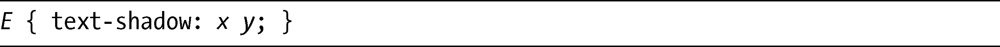
默认情况下，阴影的颜色是从其父元素中继承而来（通常是黑色的）的，所以我们如果要指定不同的颜色，就需要为它提供一个值，例如：

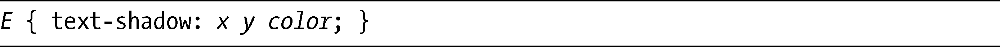
这是一个灰色（十六进制代码#BBB）的阴影，位于原始图片的右侧3px和下方3px处：

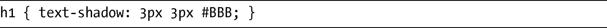
我们可以在图6-3中看到这句代码的输出结果。

<b class="my_markdown">图6-3　简单的text-shadow属性</b>

对于该属性，并不一定要提供正整数作为偏离值，你可以使用两个0（零），也可以使用负数去得到不同的效果。下面是几个例子：

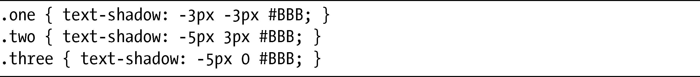
在图6-4中，可以看到这些例子的输出结果。

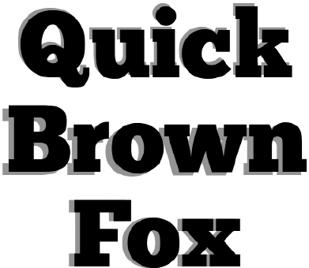

<b class="my_markdown">图6-4　为text-shadow使用不同的坐标轴偏移值</b>

第一个例子（上）在两个坐标轴上都使用了负值，所以阴影会在文本的左上方呈现。下一个例子（中）在x 轴上使用了负值，在y 轴上使用了正值，所以阴影在左下方呈现。最后一个例子（下）在x 轴上使用了负值，y 轴则设置为0，所以阴影在同一基线的左侧呈现。

text-shadow属性也有第四个选项：blur-radius。这个选项设置了阴影上模糊效果的范围，它必须在偏移值之后使用：

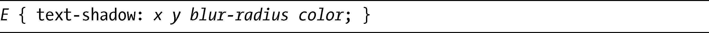
和前面两个偏移值一样，blur-radius值也是一个带长度单位的整数，这个值越大，模糊效果就越宽（也越淡）。如果该值没有设置（就像图6-4展示的例子），blur-radius就会被假设为零。以下是两个例子：

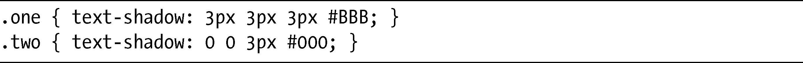
可以在图6-5中看到这些例子的结果。

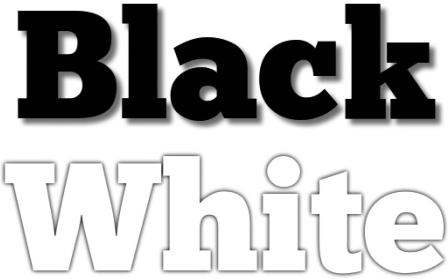

<b class="my_markdown">图6-5　为text-shadow设置不同的模糊值</b>

在第一个例子中，我设置了和图6-1一样的偏移值，但是blur-radius值设置的是3px，其结果是产生了更加柔和、更加“自然”的阴影。在第二个例子中，我把偏移值设置为0，并设置了3px的blur-radius，让文本和背景相匹配，产生一种文本凸起的错觉。

### 6.2.1　多重阴影

我们也没有必要局限于使用单一阴影，text-shadow的语法支持为文本节点添加多重阴影。只要为该属性提供几个附加的值，使用逗号进行分隔，像下面这样：

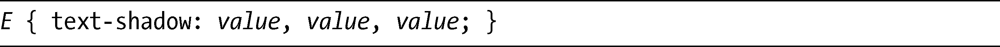
阴影会按照提供的值的顺序被应用，图6-6显示了多重阴影在实际应用中的两个例子。

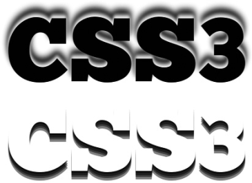

<b class="my_markdown">图6-6　为text-shadow使用多个值</b>

这两个例子的CSS显示在下面。第一个例子有一个名为one的类，第二个则有一个名为two的类。注意，为了让代码清晰一些，我对其进行了缩进处理。

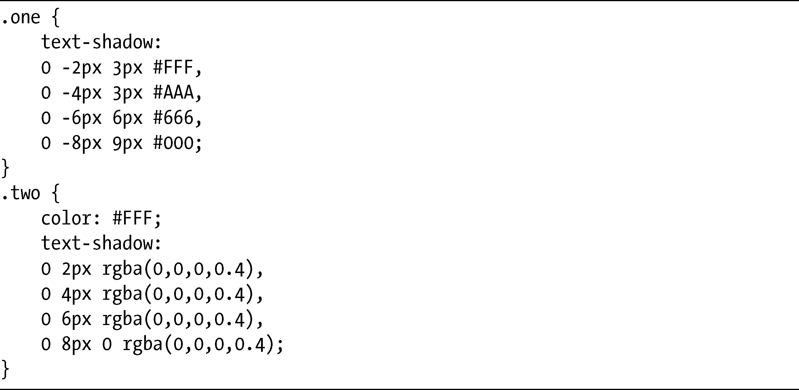
在第一个例子中，我把x 偏移设置为0，将y 偏移的负值从-2px增加为-8px，blur-radius从3px增加到9px，让颜色逐步变暗，在字符后面创造了一种幽灵般的苍白轮廓。

在第二个例子中，x 偏移保持不变，但这一次y 偏移的值向正方向增加。因为blur-radius没有指定，所以仍然保持为零。这里我使用了rgba()颜色函数（将在第10章介绍），所以颜色是相同的，但是有点透明，产生一种重叠的效果。

尽管这些值的改变非常小，但两个元素之间的视觉差异却非常大。

### 6.2.2　活版印刷效果

目前，有一种非常流行的效果就是活版印刷风格。这种风格会制造一种字符被略微按压到背景中的效果，仿佛被铭刻在材料上（就像在活版印刷上）。这种效果可以轻松地使用CSS3实现。

为了营造这种效果，需要使用四种色调，即：用于字符的深色、用于背景的中间色、用于阴影的较浅和较深的两种颜色，然后添加有多个值的text-shadow——一个深色（或者黑色）和一个浅色，就像这个例子一样：

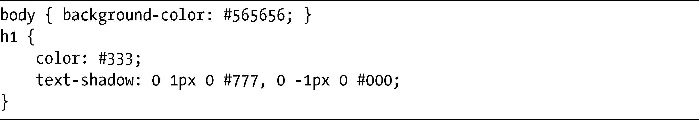
上面的代码中，body的background-color值是#565656，这是一种中等程度的深灰色，而文本则是一种更深的色调。text-shadow有两个值，黑色的用于产生阴影效果，而浅灰色则作为一种突出效果，这两种颜色的组合营造了一种立体感效应。我们可以在图6-7中看到呈现的效果。

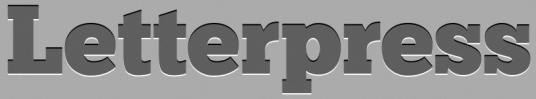

<b class="my_markdown">图6-7　使用text-shadow产生“活版印刷”效果</b>

不过，要清楚这样的效果很可能对一些有视觉缺陷（比如色盲或只有部分视力）的人并不是非常容易识别，因为文本颜色和背景颜色的对比度也许不足以让他们清晰地辨认出字符的外形。你应该使用在线工具（例如<a class="my_markdown" href="['http://www.checkmycolours.com/']">http://www.checkmycolours.com/</a>）去测试颜色的可访问性，我还是想让你自己去做出判断。

