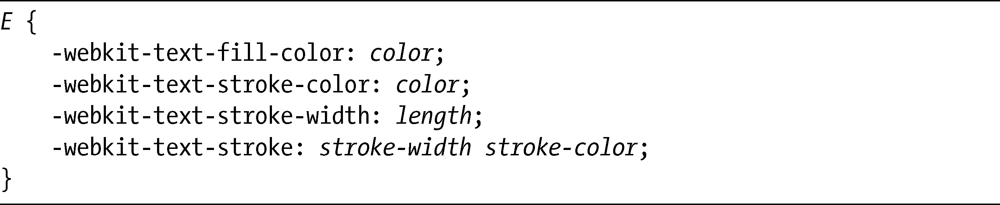
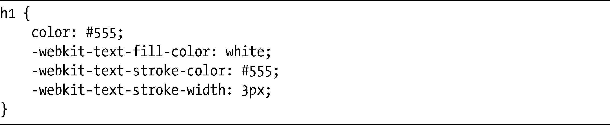
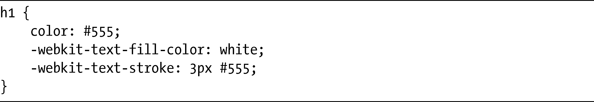

### 6.3　让文本变得更清晰：text-outline和text-stroke

就像我之前所演示的，你可以使用text-shadow对字符的轮廓进行描边。不过，使用这种方法有点太技术化了。文本模块提供了一种更好的控制轮廓的方式，即：text-outline属性。这个属可以接受三个值：

例如，下面的CSS代码使用蓝色为文本提供4px的模糊半径：

text-outline属性当前还没有在所有的浏览器上都得到实现，但WebKit浏览器提供了类似的东西——以及更大的灵活性，那就是：专用的text-stroke属性。

实际上，text-stroke总共有4个属性：两个控制描边本身的外观，另一个是前面两个的简写属性，另外还有一个则控制描边文本的填充颜色。这几个属性的语法如下所示：

第一个属性，text-fill-color，乍看上去似乎有点多余，因为它和color属性有相同的作用。的确，如果我们不指定它，描边的元素将使用color的继承（或指定）值。不过，这个属性可以让你的页面优雅地降级。例如，我们可以把color设置为和background-color一样，然后使用描边让它凸显出来。但我们如果这么做，文本在不支持text-stroke属性的浏览器上就会被隐藏起来，而使用text-fill-color则可以克服这个问题。

其他的text-stroke-*属性有更明显的作用，它们的定义也非常明了：text-stroke-color设置描边的颜色，而text-stroke-width则设置它的宽度（和CSS2的border-width使用相同的方式）。最后，text-stroke是text-stroke-width和text-stroke-color的简写属性。

以下是text-stroke语法的真实例子：

图6-8展示了这些属性应用到文本元素上的效果（以及文本在不支持属性的浏览器上如何显示）。第一个例子展示了原始的、没有描边的状态，以便我们进行比较，而第二个例子则展示了应用text-stroke的一些文本。

<b class="my_markdown">图6-8　没有应用属性的文本（上）和应用了text-stroke的文本（下）的比较</b>

我可以使用text-stroke简写，利用更少的代码达到相同的结果：

要牢牢记住的是：如果我们为text-stroke-width设置了太高的宽度值，就会让文本变得不好看和难以辨认，所以使用这个属性的时候要特别小心。

