### 8.1　背景图片

首先，我要先带你进入W3C首选的规范之一，背景与边框模块（Backgrounds and Borders Module，<a class="my_markdown" href="['http://www.w3.org/TR/css3-background/']">http://www.w3.org/TR/css3-background/</a>）。由于网页开发人员的强烈要求，它的许多新属性已经被浏览器所实现，所以有大量现实中的测试结果可供我们学习。

和CSS之前的版本不同，CSS3能够将多张图片应用到元素上，而且图片可以动态地调整大小。仅仅是这两个新特性就已经足以让我们大部分人感到高兴了，但规范还更进一步提供了定位和平铺图片的更多控制。

当前的背景和边框模块处于候选推荐标准状态，并且很可能在不久的将来成为推荐标准。尽管就像我之前提到过的，该模块的许多特性已经可以供我们使用了，但有一些属性仍然需要专用的浏览器前缀。

### 8.1.1　多背景图片

我们要介绍的背景和边框模块中的第一个新特性并不是一个新属性，但是它是对现有属性的扩展——或者，不如说是对现有的几个属性的扩展。几乎所有的background-*属性现在都可以接受多个值，所以你可以在同一个元素上添加许多背景图片（background-color是例外）。

为了给元素添加多个背景层，我们只要列出用逗号隔开的值就可以了。例如，这是使用background-image的语法：

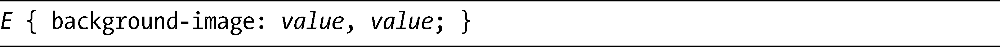
对于我们所创建的每一个背景层，你可以为相关的background-*属性添加适当的值。这是一个真实的例子：

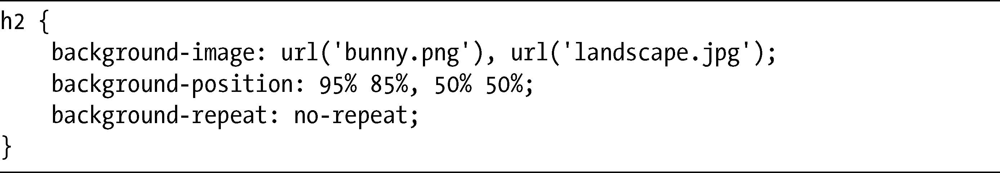
你可以在图8-1中看到其输出结果。这些层以相反的顺序创建——也就是说，列表中的第一层会成为最顶层，等等。在示例代码中，bunny.png是位于landscape.jpg之上的一层。background-position属性遵循相同的顺序，风景图片处在距其包含元素的左侧50%和顶部50%的位置（水平和垂直中心），而兔子图片则位于距左侧95%和顶部85%的位置。

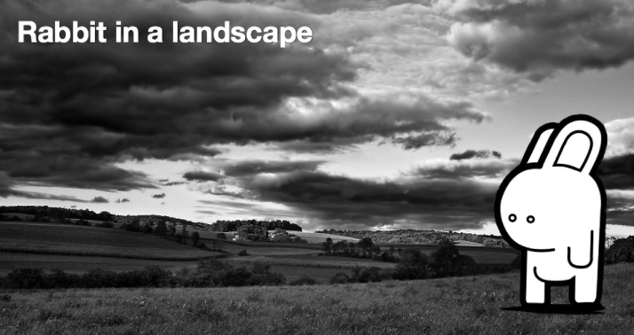

<b class="my_markdown">图8-1　同一元素上的两张背景图片<a class="my_markdown" href="['../Text/Chapter08.html#jzyy1']">[1]</a></b>

注意background-repeat只有唯一的一个值。如果一个属性的值数量比其背景层数量少，这些值就会被重复。在这个例子中，意味着no-repeat将会被应用到所有的背景层上。

你可以对background简写属性使用多个值，和独立的属性一样，你也只需要提供一个逗号隔开的列表。为了获得图8-1所示的结果，我们也可以使用这段代码：

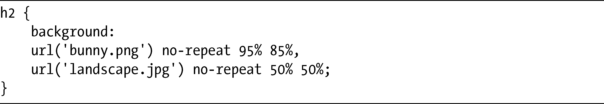
正如我在这一节开头提到的，background-color是唯一一个不接受多个值的background-*元素，颜色层将会一直堆放在图片层下方。如果我们在使用简写属性的时候，要指定背景颜色，就必须把它放在逗号隔开的列表的最后位置。在这段示例代码中，就是风景图片值的位置：

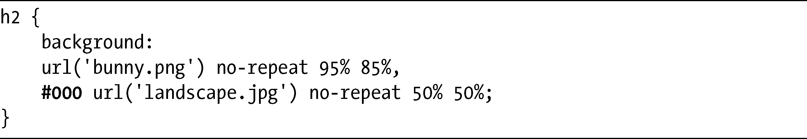
Firefox（3.6及以上版本）、WebKit、Opera均支持多背景，而IE9也计划提供支持。

不过，我们要记住不支持新的多重语法的浏览器——例如，Internet Explorer的较老版本或Firefox 3.4及其以下版本——这些浏览器将会忽略这一语法，并引用层叠中的前一条规则。所以，我们应该在使用多值之前在元素上声明一个属性，作为一种回退方案。例如：

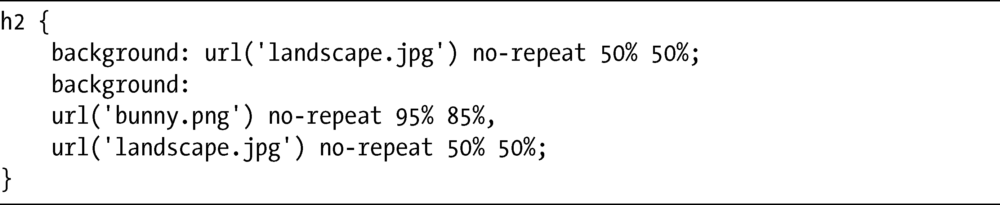
这种情况下，不支持的浏览器将会忽略使用多值的属性，然后使用在它之前的单值。不过，要注意在Internet Explorer中，你需要为这两者使用简写背景属性，如果你使用单独的background-*属性，它们就会优先于简写属性，不会有图片显示出来。

### 8.1.2　背景尺寸

CSS3的一个新属性是background-size。对于这个属性，你很可能已经猜到了，它能够让你对背景图片进行缩放。这是它的语法：

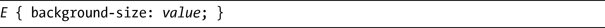
Firefox、WebKit和Opera已经实现了这个属性，对于Firefox（第4版之前）和Safari（第5版之前）之前的版本，你需要使用浏览器的专用前缀（分别是-moz-和-webkit-），之后的版本就无需使用前缀了，IE9预计也中能够包含这个属性（也不需要前缀）。和以前一样，为了简化，我在本章接下来的例子中去掉了浏览器特定的前缀，但在自己的代码中一定要记住使用这些前缀。

该属性的值可以是一对长度或者百分比值、一个单独的长度或者百分比值，或者是一个关键字。如果使用了一对值，其语法是：

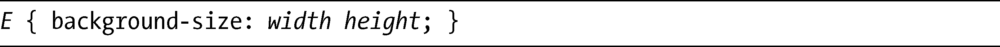
所以，如果要将背景图片的尺寸调整为100px宽和200px高，要使用：

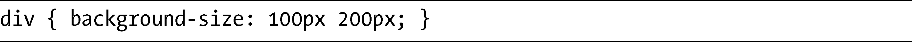
其中的长度可以是所有的标准计量单位。如果你使用百分比，其尺寸就是根据包含元素而不是背景图片来计算的。所以，假如宽度和高度为100%的话，会使背景图片填满整个容器。为了让图片以实际尺寸显示，我们可以使用auto关键字。

如果只指定了一个单独的值，该值会被认为是宽度，而高度则会被赋予默认的值auto。因此，下面这两个例子是完全一样的：

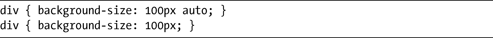
你同样可以通过background-size使用最新学到的多背景方法。例如，我们重新看一下图8-1，这一次我们想多重复几次兔子图片，并为background-position和background-size属性添加不同的值。这是其代码：

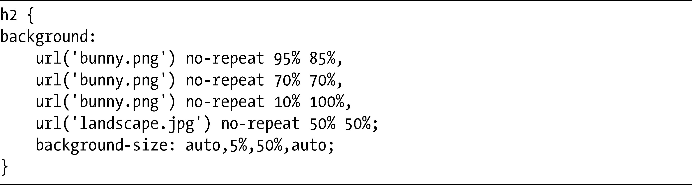
图8-2显示了该方法在实际中的应用。

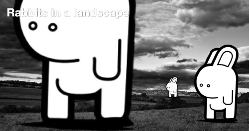

<b class="my_markdown">图8-2　调整背景图片的例子</b>

规范说明了background-size属性可以被用到background简写属性中，只要把它放在background-position之后就可以。然而，这种方式还没有在任何浏览器上实现，所以就目前来说，我们必须单独调用该属性。

另外两个可用的关键字是：contain和cover。contain关键字设置图片应该尽可能地放大（按比例），只要不超过包含元素的高度和宽度；cover设置图片要放大到包含元素的宽度或者高度（具体要看哪一个值更大）。

看看下面的代码就知道我的意思：

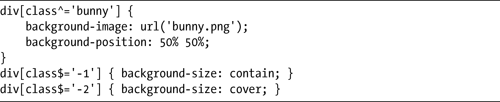
我使用了两个div元素，带有bunny-1类和bunny-2类，为每个元素设置了不同的关键字值。结果如图8-3所示。

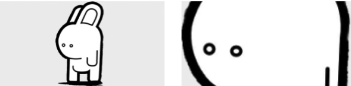

<b class="my_markdown">图8-3　background关键字：contain（左）和cover（右）</b>

左侧的方框设置了contain关键字值，所以背景图片垂直（最短长度）填满了方框；右侧的方框设置了cover关键字值，所以背景图片水平（最长长度）填满了方框。

### 8.1.3　背景裁剪和原点

在CSS2中，背景图片定义的位置是相对于与其包含元素的填充（padding）的外部界限的，所有溢出都会扩展到边框之下。CSS3引入了两个新的属性，可以对其进行更精细的控制。

第一个属性是background-clip，它会设置盒模型的那一部分成为背景（颜色或图片）显示的界限。以下是其语法：

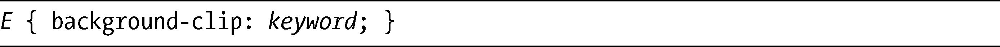
根据规范，关键字可以是以下3个可能值的其中之一：border-box、content-box或者padding-box。默认值是border-box，但它意味着背景将会显示在边框之后（如果使用透明或半透明的边框颜色就可以看到背景）。padding-box值意味着背景将会一直显示到边框（而不会在后面）。content-box意味着背景显示将会在元素的填充处停止。

我将使用下面的代码演示它们之间的差异：

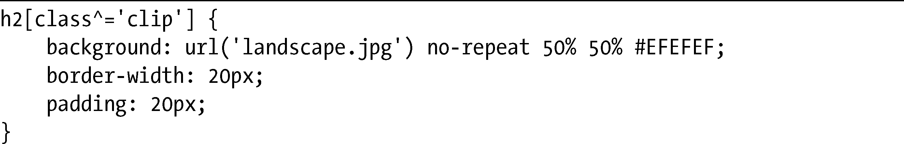

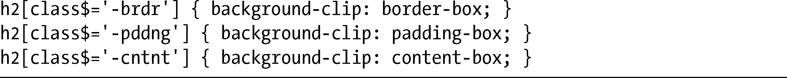
在上面的代码中，我使用了3个元素，分别带有clip-brdr、clip-pddng和clip-cntnt 3个类。图8-4演示了这些值之间的差别。

<b class="my_markdown">图8-4　展示background-clip属性不同值的效果：border-box（左）、
 padding-box（中）和content-box（右）</b>

这里，我使用了半透明的边框，在左边的图片中，你可以看到图片绘制在方框的下方，它使用的是border-box值。中间的方框使用的是padding-box值，正如你所见到的，其背景停止在填充的界限内。在右侧的方框中，其值是content-box，所以背景就没有显示在填充之后。

该属性当前在Opera中得到了实现，在Firefox 4和IE9中应该也没有问题。较老的Firefox版本使用的是非标准的实现，使用值border和padding分别代替了border-box和padding-box，在属性上使用了专用的-moz-前缀。

WebKit的情况还要复杂得多，它最早的实现使用了border和padding值，就像Firefox一样，并且也使用content关键字代替了content-box，而且在所有属性上都具有-webkit-前缀。较新一些的版本使用的是border-box、padding-box和content-box，但它们仍然使用有前缀的属性。最新的WebKit版本（例如，Safari 5之后）在使用border-box和padding-box的时候就没有了前缀的要求，但是对于content-box还是需要前缀。在这种情况下，如果想让示例代码在所有浏览器版本中都能正常工作，就需要把代码像下面这样修改一下：

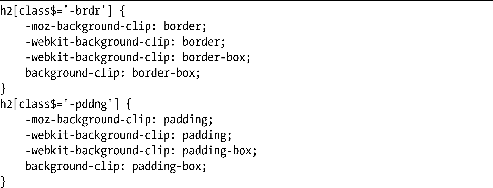

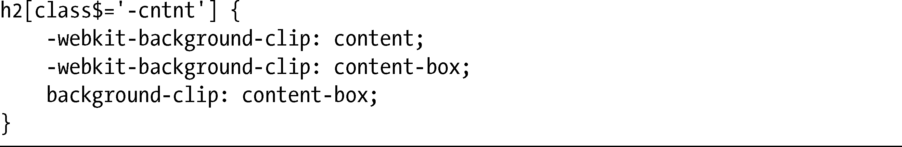
WebKit浏览器允许我们更进一步使用一个非标准的关键字值：text，在带透明背景颜色的文本上使用这个关键字的时候会用背景图片填充文本。为了让它和非WebKit浏览器相兼容，我们应该使用第6章介绍的-webkit-text-fill-color。下面是一个例子：

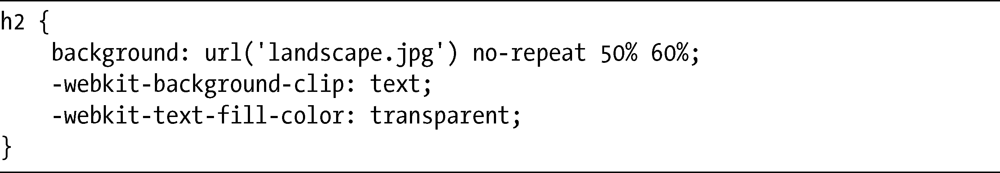
结果如图8-5所示，其中的背景图片根据文本进行了裁剪。

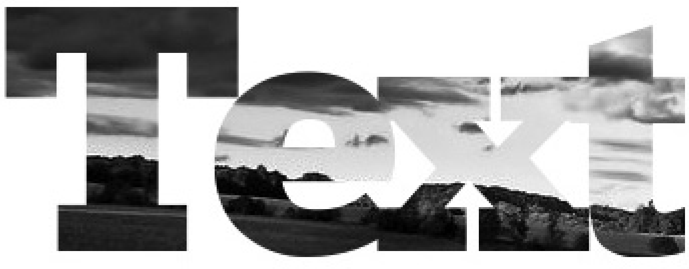

<b class="my_markdown">图8-5　使用-webkit-background-clip属性把背景图片应用到文本上</b>

第二个属性则提供了更精细的控制，它就是background-origin属性。使用background- origin属性，可以设置背景开始计算的点。就像我之前提过的，CSS2背景位置会相对于填充的界限进行计算，但background-origin可以对此进行修改。以下是其语法：

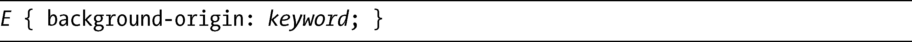
background-origin属性接受我们刚刚在background-clip中看到的相同的关键字值：border-box、content-box和padding-box。再一次，我要召唤我的小兔子出来帮助我演示它们之间的差别。接下来的演示使用的是这段代码：

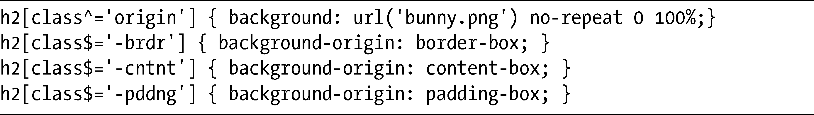
不同的值所产生的效果如图 8-6 所示。在每个方框中兔子都处于不同的位置，因为background- position会根据每个方框内不同的点进行计算。

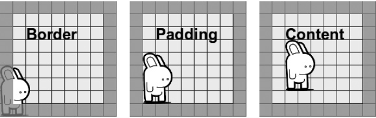

<b class="my_markdown">图8-6　使用border-box值（左）、padding-box值（中）和
 content-box值（右）的background-origin属性</b>

background-position值总是设置为0 100%，就是在左下角。然而，左下角被测量的点会根据background-origin值而改变。在第一个方框中，背景起始于边框的界限；在第二个方框中，背景是从填充的界限开始计算的；在第三个方框中，背景从内容框的界限开始计算。

有几件事情要记住：第一，如果background-position被设置为fixed的话，该属性就没有什么效果。第二，background-clip和background-origin都接受多个值，使用的是8.1.1节中所使用的相同语法。

和background-clip一样，Opera和最新的WebKit浏览器对background-origin的实现和规范是一致，而Firefox 4和IE9应该也是相同的。较老的Firefox和更老一些的WebKit版本并没有实现这个属性的标准版本，它们使用带前缀的属性实现了三个像border、content和padding一样的可能值，而老一点但在Safari 5之前的WebKit版本要求使用正确的值，也是通过带前缀的属性实现。因此，为了支持所有的浏览器版本，前面的代码示例需要像下面这样进行扩展：

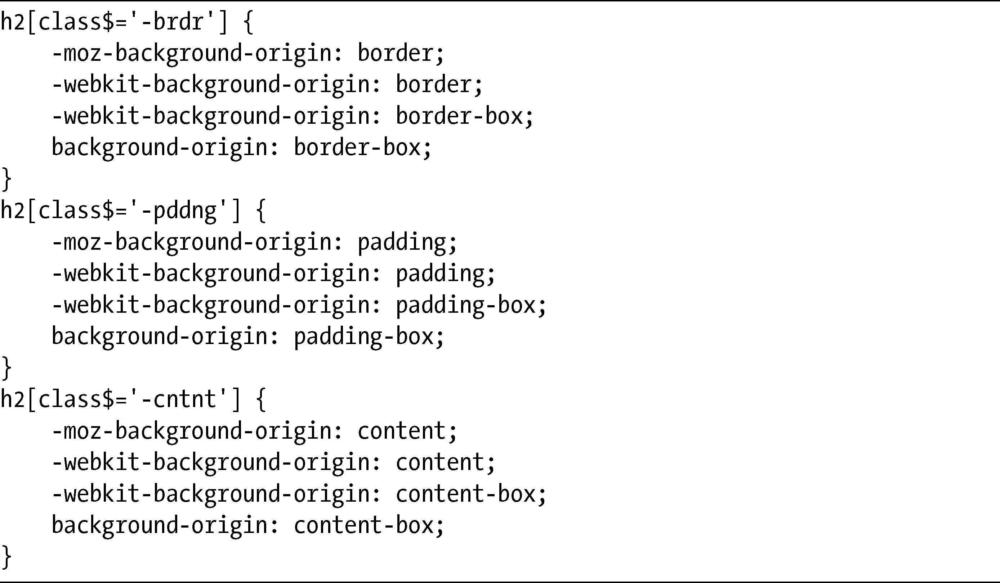
### 8.1.4　background-repeat属性

background-repeat属性当前有4个可能的值：no-repeat、repeat、repeat-x和repeat-y。这些值可以沿着元素的一条轴线（或者两条轴线）对图片进行平铺，但无法实现任何比此更加精细的控制。CSS3使用两个新的值扩展了平铺选项的范围。

第一个值是space，它会把背景图片设置为在其包含元素内尽可能多地进行重复，而不对图片进行裁剪。所有的重复（除了第一次和最后一次）都将是等间距的，所以图片能够均匀地分布。

第二个值是round，它同样会设置背景图片尽可能多地进行重复而不裁剪，但和均匀设置图片的重复间隔不同，图片将会进行缩放，所以会有完整数量的图片填满包含元素。

尽管这些新值同样也计划包含在IE9中，但目前唯一实现的浏览器就是Opera（10.5版以上），所以我提供了一个例子，使用的就是这款浏览器：

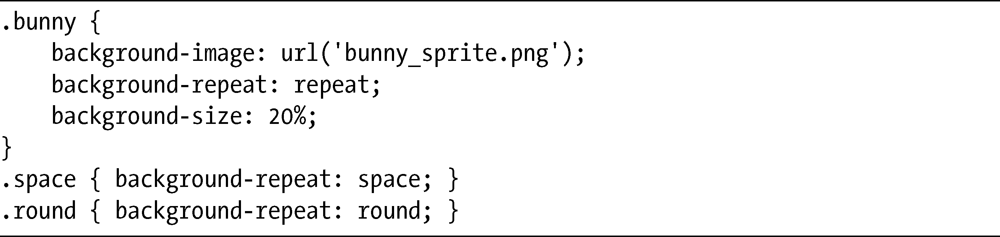
首先，我要使用background-size属性重新调整bunny_sprite.png的大小，然后把它应用到3个不同的方框中，每个方框都使用不同的background-repeat值。图8-7显示了其结果。

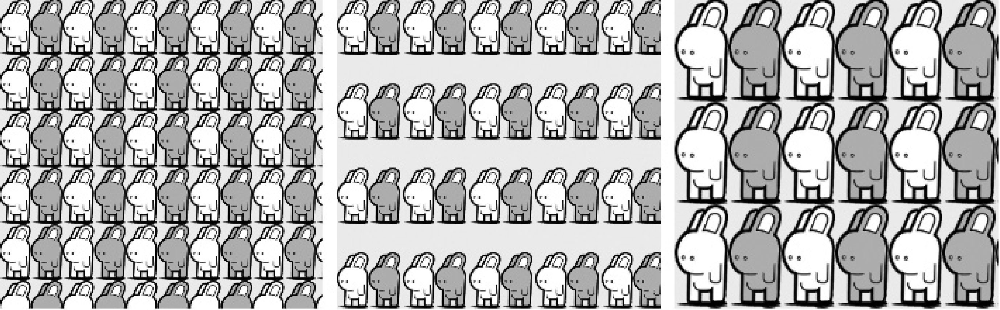

<b class="my_markdown">图8-7　background-repeat值：repeat（左）、space（中）和round（右）</b>

你可以看到其中有一些轻微的取整误差，但影响并不大。左侧方框的background-repeat值是repeat，显示的效果正如你所期待的。而中间方框的值则设置为space，所以将显示能够被平铺且不被裁剪或缩放的最大数量的图片，并且在显示时会有空白区域出现在它们中间。最后，右侧方框的值是round，它将计算能够水平和垂直填充包含元素的图片的最大完整数量。

WebKit可以识别这些关键字，但是会错误地把它们当作是no-repeat。Firefox则会忽略它们并使用之前的层叠或继承值。

### 8.1.5　背景图片裁剪

在最近这几年，有一项技术成为了所有网页开发人员兵器库中的兵器，那就是图片精灵（image sprites）。图片精灵就是把许多不同的图片放在一个单独的文件中，但只是在给定元素上显示图片的一部分。这项技术是从老的视频游戏中借鉴而来的，该技术可以加载更少的图片，也就意味着可以减少对服务器的访问次数。

可是，这项技术并非没有它的缺点：它需要元素能够遮掩图片中不想显示的部分，并且可能导致我们在维护图形时更加困难。

Mozilla在Firefox 4（Beta）中引入了一个新的专用属性，其目的就是为了解决这些问题。该属性名为image-rect，其语法如下：

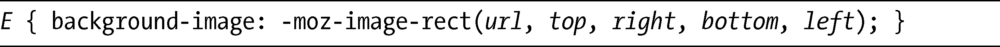
第一个值是要裁剪的图片路径，接下来的四个值定义了要显示的矩形的四边，使用和CSS2的clip属性相同的格式，其顺序是：上、右、下和左，从左上角开始测量。

这个例子精确地阐明了我的意思。我打算使用一个单独的背景精灵，然后给image-rect应用各种各样的值，以显示图片的不同区域。以下是其代码：

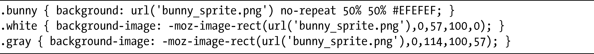
图8-8展示了我使用这项技术的结果。图中显示了3个方框，每个方框都使用了相同的背景图片（第一个方框显示了完整的图片）。

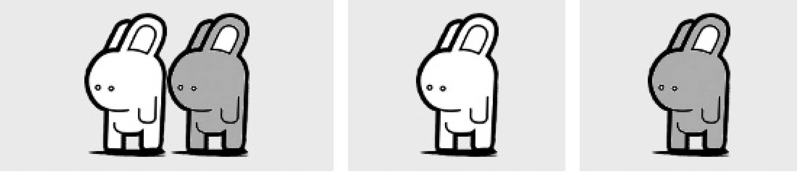

<b class="my_markdown">图8-8　图片精灵（左）使用-moz-image-rect（中间和右侧）裁剪</b>

所有方框都有一个bunny类，所以不支持image-rect的浏览器将会恢复原来的背景图片。原来的图片bunny_sprite.png有114px宽和100px高。

第二个方框有一个white类，并且只显示白色的兔子。image-rect属性设置了图片的URL，后面还跟着裁剪框的大小：顶部距离图片顶部0px，右边距离图片左侧57px，底部距离图片顶部100px，而左边距离图片左侧0px。所以方框只显示图片右手边的内容——即白色的小兔。

我们可以在图8-9中看到那些裁剪值所“画”出来的方框。

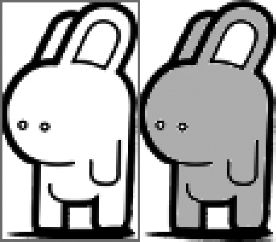

<b class="my_markdown">图8-9　-moz-image-rect属性绘制出来的边界框</b>

第三个方框有一个gray类，并且只显示——猜猜是什么？——灰色的小兔。这次image-rect属性同样有相同的URL值，但这一次它的尺寸是不同的：顶部距离图片顶部0px，右边距离图片左侧114px，底部距离图片顶部100px，而左边距离图片左侧57px。

W3C正考虑在未来的CSS3版本中提供一个属性去替代CSS精灵技术（你可以在17章看到提议的语法），但据我了解，W3C对于使用哪一种语法还没有做出最终的决定。

