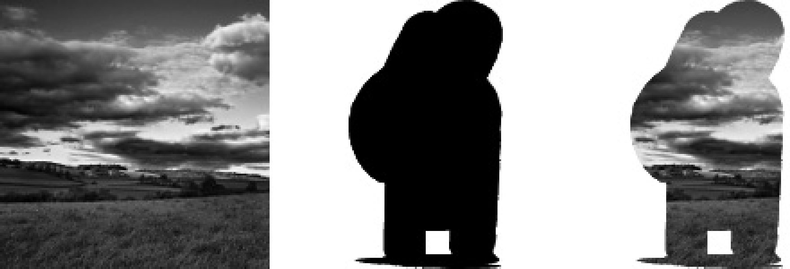
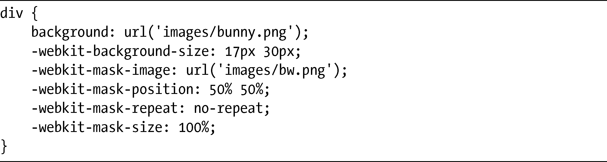
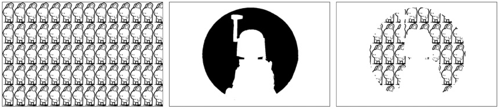
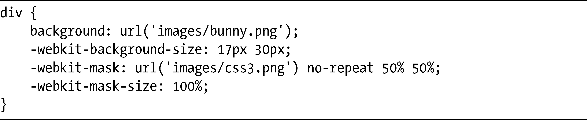

### 8.2　图片遮罩

在最近这几年，WebKit团队创建了一系列新的属性，为CSS添加了“视觉糖果”。其中一些属性已经被W3C所采纳，并被选中包含在CSS3之中，如同CSS效果（CSS Effects）一样为人所熟知。我会在后面的第12章至第14章介绍这些属性。

这些属性中还有一个没有被采纳的，它就是CSS图片遮罩（CSS Image Mask），尽管其他的浏览器厂商现在还看不出有兴趣实现这个属性，但所有的WebKit浏览器都支持图片遮罩。

任何熟悉图形处理的人都应该熟悉遮罩的概念。本质上，遮罩就是把一个图片层放在一个背景之上，让不透明的区域变得透明——也就是说，背景将透过图片层的形状显示出来。在图8-10中可以看到这样的例子。

图8-10是一个图片遮罩的三个部分：左侧是背景，中间是遮罩，右侧就是将遮罩应用到背景上——黑色区域变成透明的，只允许该区域下的背景显示出来。

<b class="my_markdown">图8-10　从左到右分别是：背景、图片遮罩和已经应用到背景上的遮罩</b>

WebKit引入了一组新的属性，允许对任何元素实现这样的效果。其语法（有-webkit-前缀）和background-*属性集是一样的，并且包括了-webkit-mask-image、-webkit-mask-position、-webkit-mask-repeat，等等。

作为示例，我打算在一个元素上设置一张背景图片（使用我的好伙伴，小兔子），然后使用另一张名为bw.png的图片去应用遮罩。

以下是相关的代码：

在图8-11中，我把这一处理过程的三个阶段一起放到一个插图当中。在第一个方框中，我们可以看到图片bunny.png平铺了元素的整个背景。在第二个方框中是图片bw.png，就是要应用到元素上的遮罩。而在第三个方框中，遮罩被应用到图片上，而背景图片则透过黑色区域显示出来。

<b class="my_markdown">图8-11　演示-webkit-mask-属性<a class="my_markdown" href="['../Text/Chapter08.html#jzyy2']">[2]</a></b>

注意这和我们在本章前面使用-webkit-background-clip属性的text值所实现的效果有些类似。

和background-*属性一样，也存在着一个简写属性-webkit-mask，它接受的值是完全一样的。我可以像下面这样缩写前面的代码：

一个没有background-*配对的属性是-webkit-mask-box-image，它允许你使用遮罩作为边框。其语法是基于border-image属性的，该属性将在下一章介绍，其工作的方式也是一样的。注意，在这里你也可以使用CSS渐变语法，该语法我将在第11章完整地进行介绍。

你可以在这篇介绍WebKit遮罩属性的博客文章中了解到更多的内容：<a class="my_markdown" href="['http://webkit.org/blog/181/css-masks/']">http://webkit.org/blog/181/css-masks/</a>。

