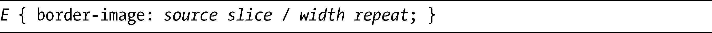
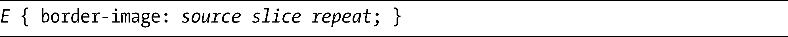
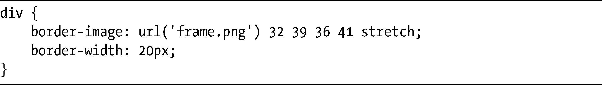
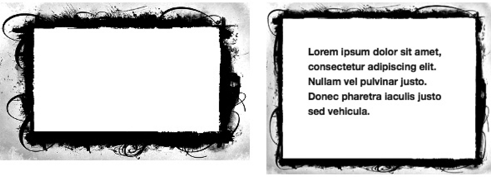
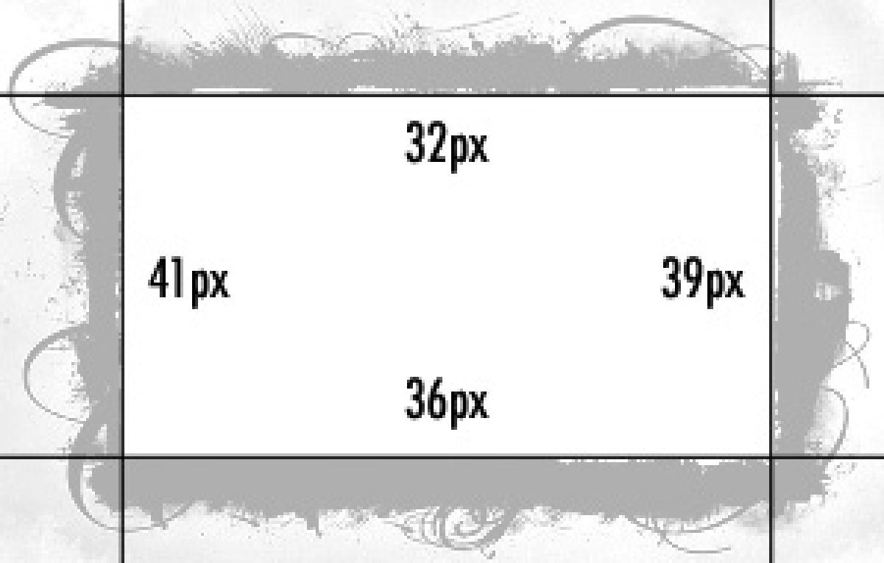
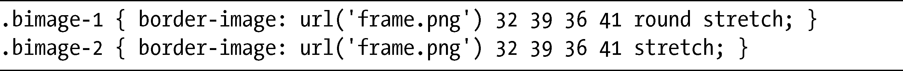
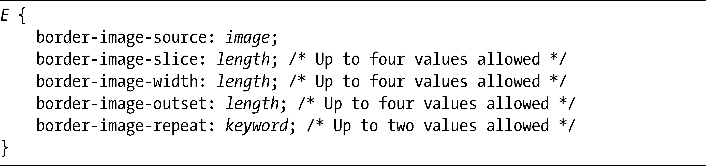

### 9.2　为边框使用图片

样式化元素的另一种常用的方法，就是使用背景图片作为装饰性边框。不过在CSS2中，你无法直接实现这一效果，除非使用许多额外的标记才能获得想要的效果，之后却会付出语义和可维护性方面的代价。CSS3引入了border-image属性，它提供了一种应用装饰性边框的简单语法：

该属性被Opera所支持，同样支持的还有Firefox和Safari（需要使用它们的专用前缀）。不过，只有Firefox支持width值，所以安全的实现方式是使用这样的语法：

第一个值，source，指定了要用在边框上的图片的URL，接下来的slice是一个长度值或者百分比值（或者一系列的值），设置了一个距离值，该值设置了图片每一条边的距离，从而标记出要用在元素“框架”上的区域，我马上会用一个实例来解释清楚。slice可以在一到四个值之间选取，类似于margin、padding、border-radius，等等。

repeat值使用一个或两个关键字，设置的是图片沿着元素上下（第一个关键字）和左右（第二个关键字）重复的方式。可能的值有：stretch，将图片进行延伸以填充边框的长；repeat，沿着边框的长平铺图片；round，沿着边框的长整数次平铺图片（元素将被重新调整大小以适应要求）；而space，也是沿着边框的长整数次平铺图片，但是如果图片不能填满元素则使用空白填充。

上面这些听起来都有点儿复杂，所以这里给出了一个例子，帮助我解释清楚。考虑以下的CSS：

注意，这里的数字都没有包含单位，这些数字提供了两种用途：对于位图图片（比如JPG或PNG），它们就是像素值；但对于矢量图片（比如SVG），它们就是坐标值。之前我提到过，使用百分比值也是允许的，在那种情况下就必须使用百分号（%）。

回到刚才的例子，图9-7演示了我打算用作border-image（frame.png）的元素图片，而右边则使用前面的代码将图片用作为一个边框。

<b class="my_markdown">图9-7　原始图片（左）和使用border-image显示的时候出现的图片（右）<a class="my_markdown" href="['../Text/Chapter09.html#jzyy1']">[1]</a></b>

我先带你看看这段代码。首先，我指定frame.png作为边框的图片。接下来的四个数值设置了要切割的区域：距顶部32px，距右侧39px，距底部36px，距左侧41px。这些值指定了我要使用frame.png的哪一部分分别作为上边框、右边框、下边框和左边框。图9-8展示了我在框架图片上切割的位置。

<b class="my_markdown">图9-8　演示border-image中四个指定的值将会在何处对图片进行切割</b>

如上所示，图片被切割成漂亮的切片：四条边、四个角以及中心区域。几个角和中心会一直保持不变，能够被缩放以填充它们的设置位置，但四条边可以使用属性中指定的值进行修改。在这个例子中，我把repeat值设置为stretch，表示侧面的切片将会延伸，从而填充元素的长（高或者宽）。我把每一边的border-width设置为20px，所以图片切片会被缩放，得以在界限内部填充。

现在举例说明一下repeat值的stretch和round关键字之间的差别，看看下面的代码：

图9-9对两个结果进行了对比。

<b class="my_markdown">图9-9　border-image水平重复（上）和水平延伸（下）</b>

第一个方框的值是round stretch，所以图片会水平地重复三次，但会被垂直延伸。第二个方框的值是stretch，所以图片在两条轴线上会被放大。

在模块中，border-image据说是一系列子属性的简写：

对于简写属性中的一些属性，你可能会觉得熟悉，比如：border-image-source和source值是一样的，border-image-slice和slice是一样的，而border-image-repeat和repeat又是一样的。

border-image-width属性和slice值有着相同的语法，但它的作用不同：它会设置元素边框的宽度，优先权高于border-width（border-image-width常用于提供回退状态，就像我在第6章介绍的text-fill-color）。正如我之前提到的，你可以在Firefox的简写属性中使用这个属性，但不要在其他浏览器中使用。border-image-outset属性也使用和slice一样的语法，但它设置了边框可以在元素外部扩展的长度。

不过，这些属性只是在2009年末才引入规范之中，所以在我写这本书的时候，还没有浏览器能够支持它们，尽管它们很可能在将来会得到实现。

