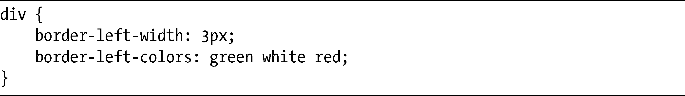
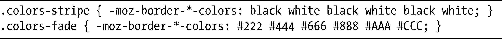
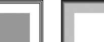

### 9.3　彩色边框

Firefox有一系列的专用属性，可以让我们在边框上定义多种颜色。其语法非常类似（只有一个字母不同）于border-*-color属性：

星号代表用于表示每条边的关键字——top、right、bottom和left——而colors则是用空格隔开的颜色值列表，每种颜色会为边框一个像素的宽度添加颜色。例如，如果你有3px的左侧边框，要为它添加像意大利国旗一样的颜色，可以使用：

由于每种颜色只会应用到单个像素宽度上，如果边框的宽度比颜色定义的数量大，最后指定的颜色将会重复出现在边框宽度的剩余部分。

以下是两个例子的代码：

图9-10展示了这些例子的实际作用。不过要注意，为了让代码示例变得清楚一点，我对每个元素只使用了一个属性。实际上，你需要指定所有四条边才能得到图示的结果。换句话说，这个属性并不是简写属性。

<b class="my_markdown">图9-10　为Firefox的border-*-colors属性提供不同的值（细节图）</b>

两个方框的边框宽度都是6px。左侧方框的边框交替出现了黑白颜色，而右侧方框则使用了几种不同明暗度的灰色，当你离元素越远，就会觉得颜色变得会越深。

