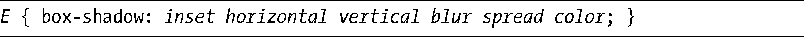
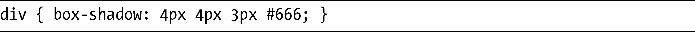
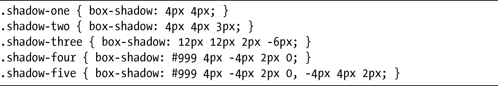
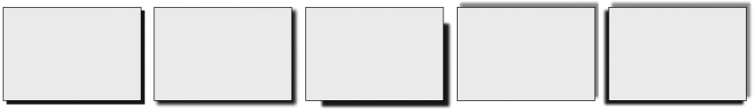
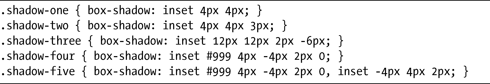
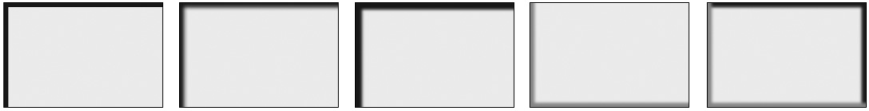

### 9.4　添加阴影

在第6章，我们看到了使用text-shadow属性为文本添加阴影的方法，但CSS3也有一种方法，可以为方框元素添加阴影，就是使用box-shadow属性。box-shadow的语法和text-shadow是类似的：

第一个值，inset，是一个可选的关键字，用于设置阴影位于元素内部还是外部。如果没有指定inset，阴影就会位于外部。接下来的两个值都是长度，分别设置阴影远离方框的水平（horizontal）和垂直（vertical）距离。如果要应用阴影效果，这些值都是必须要设置的。

下一个值设置了模糊（blur）半径，它也是一个长度值。之后还要设置扩散（spread）值，该值设置了阴影扩散的距离。正的长度值可以让阴影比其元素更大，而负的长度值则令其变得更小。两个值都是可选的。

最后要设置的是颜色（color）值。在WebKit中，该值是必须的，但在Firefox和Opera中，则是可选的。如果没有指明，color就会被设置为默认的黑色。

现在我要把它们全部放到一个例子当中：

该语法创建了一个位于元素外部的深灰色的阴影，位于在距元素水平和垂直距离4px的位置上，具有3px的模糊半径。

接下来，我会用更多的例子，演示在box-shadow属性上应用不同的值所产生的效果，使用的是下面的CSS代码：

这些结果如图9-11所示。代码中的元素分别从左到右对应图示中的几个方框。

<b class="my_markdown">图9-11　为box-shadow属性使用不同值的效果</b>

第一个是最简单的阴影，阴影处在与元素水平和垂直相距4px的位置。第二个阴影有着和第一个阴影一样的距离值，但添加了3px的模糊半径去柔化阴影的边缘。第三个阴影的距离在两条轴线上都是12px，但有一个负的spread值（-6px），令阴影小于它的方框。第四个例子具有中度灰色的阴影以及负的垂直距离，意味着阴影会在元素的上方而不是下方。最后，第五个方框应用了两个阴影：第一个阴影和第四个方框的阴影一样，而第二个阴影则是一个具有负水平距离的黑色阴影，所以令阴影落入方框的左侧。

在本节开头，我稍微提到了可选的inset关键字。如果该关键字存在的话，它会在方框的内部绘制一个阴影，但也会产生把阴影“翻转”到方框另一边的效果。我的意思是会出现一个常规的——即外凸的——带正x值和y值的阴影在方框的右下方，而内嵌的阴影则会出现在左上方。

为了举例说明，我会使用和前面的例子一样的代码，但把inset关键字添加到每个例子中：

结果如图9-12所示。

<b class="my_markdown">图9-12　内嵌阴影</b>

这里你可以看到图9-11几乎翻转过来的效果，所有偏移、模糊半径和颜色值都是相同的，但阴影现在出现在方框的内部，并且在相反的角落。

box-shadow属性在各种浏览器中都有非常好的实现：WebKit和Firefox较老的版本（3.6及以下版）使用专用前缀实现了该属性，而Opera、IE9和Firefox 4 则使用标准的语法。有一个需要注意的地方：和border-radius一样，WebKit较老的版本（诸如Safari 4.04及以下版本）使用不同的实现——不带spread值，这意味着本章所使用的一些代码在那些浏览器上也许不会有正确的显示。

