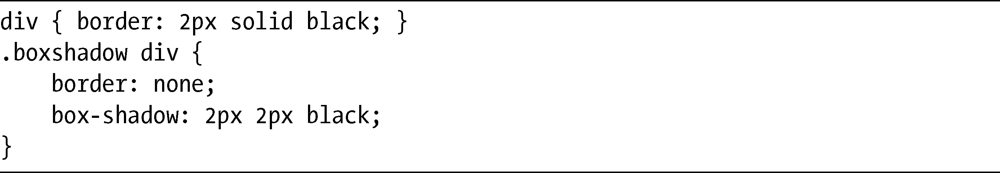

## 特性检测与模拟

如果你正使用CSS3构建一个网站，对于网站在不支持的浏览器中会出现什么情况（对于IE，只能呵呵）必须作为主要考虑因素之一。绝大多数时候，你只要简单地关注一些回退值就可以解决这个问题，但是偶尔也需要一些额外的帮助。

### Perfection Kills

JavaScript在解决这个问题上是理想的手段，你可以使用Style对象进行测试，根据测试的结果查看一个属性是否支持，并执行一些动作。如果你要对每个属性的基本情况进行测试，Perfection Kills博客对于如何实现这种要求进行了很好的概述：

<a class="my_markdown" href="['http://www.perfectionkills.com/feature-testing-css-properties/']">http://www.perfectionkills.com/feature-testing-css-properties/</a>

### Modernizr

不过，我们还有一种更好的替代选择，就是使用Modernizr。这种轻量级的JavaScript库可以测试访问者的浏览器对CSS3的支持情况，然后为每个支持的属性添加一个类到html元素上。下面是一个例子：

然后你就可以使用针对的CSS规则，例如：

在这个例子中，div元素在不支持box-shadow的浏览器中有2px的黑色边框，但在支持该属性的浏览器中会有黑色的阴影但是没有边框。如果觉得很吸引人，可以在以下地址下载Modernizr：

<a class="my_markdown" href="['http://www.modernizr.com/']">http://www.modernizr.com/</a>

### CSS Pie

CSS3 Pie采用的是截然不同方式，它使用微软专有的特性，在IE8和较低版本的IE中模拟一些CSS3属性。它通过利用矢量标记语言（Vector Markup Language，VML，一种微软专用的图形特性，类似于SVG），用behavior属性把HTML组件添加到样式中，从而允许你使用border-image、border-radius、box-shadow及其他的CSS3属性。至于我们应不应该这么用又是另外一回事了，我的意思是我们的设计应该能够在较老的浏览器上优雅地降级，但是你也可以选择不同的方式。先看一看然后再做出决定吧：

<a class="my_markdown" href="['http://www.css3pie.com/']">http://www.css3pie.com/</a>

