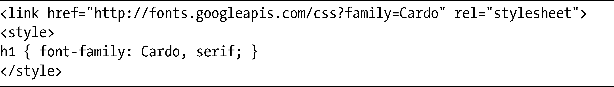

## 网页字体

网页字体是网页设计中炙手可热的新鲜事物，似乎每个星期都会推出一种新的网页服务。有一些是免费的，有一些则必须付费，有一些允许你自己作为字体的宿主，有一些则是基于云的，有一些需要JavaScript，而其他的则可以在字体栈中直接调用。我只会介绍一些更有趣的字体，而不是提供一份详细的清单。

### Typekit

第一个推向市场（我认为的）的是TypeKit，它是一种订阅服务。只要支付了每年的费用，你就可以获得许多不同的字体，放在你的字体包中。每一种字体包都有一个独一无二的ID，可以在页面的头部用script元素去引用，并使用一系列唯一的类名把网页字体应用到元素上。Typekit是一种相当优雅的解决方案，尽管年度订阅的方式使得它可能更加适合那些管理一系列网站的人：

<a class="my_markdown" href="['http://www.typekit.com']">http://www.typekit.com</a>

### Fontdeck

Fontdeck也是基于订阅的，但它是按字体进行订阅，而不是像TypeKit那样：首先，你要使用link元素调用一个唯一的样式表，然后在字体栈中把所选择的每种字体命名为常用的名称。这种解决方案的优点就是我们不再需要使用JavaScript。然而，使用这种服务有一个需要提醒的地方，即每种字体都是按照每年和每个站点进行授权的，所以在使用中价格可能会迅速地累加起来：

<a class="my_markdown" href="['http://www.fontdeck.com']">http://www.fontdeck.com</a>

### Fonts.com网页字体

另一种类似的服务是Fonts.com网页字体。这种服务提供了来自于一些最著名的字体厂商（像Linotype和Monotype）的大约9 000种字体，包括像Helvetica和Frutiger这样的字体，这些字体在其他别的地方是得不到的。它使用一种（有点笨拙的）纯粹的JavaScript解决方案，在工作方式上是一种介于Typekit和Fontdeck的之间的实现。它们有一系列的价格选项，从免费起步：

<a class="my_markdown" href="['http://webfonts.fonts.com']">http://webfonts.fonts.com</a>

### Google Font API

最近Google通过Google Font API也进入了这场角逐，它提供了一种简单的方法，将免费、开源的字体嵌入到你的页面中。Google使用一种和Fontdeck非常类似的方式（但不需要任何账号或支付）：你可以调用一个包含@font-face规则的样式表——使用link或者@import——然后把字体放在你的字体栈中：

目前这种方法还只有有限的字体集可以供我们使用，但这种选择肯定会随着时间而增多：

<a class="my_markdown" href="['http://code.google.com/webfonts']">http://code.google.com/webfonts</a>

### Web FontFonts

如果你觉得租赁字体并不划算，很可能就要买下它们。我在第5章提到过新的WOFF格式，最早销售这种格式的其中一个网站是FontShop的Web FontFonts。他们销售众多的字体（有WOFF和EOT格式），你可以自己去加载。有趣的是，他们也和Typekit有协定，允许你从FontShop购买字体，然后使用TypeKit去加载，这也意味着你可以把它们嵌入到不支持这两种销售格式的浏览器中。真聪明！亲自去看看吧：

<a class="my_markdown" href="['http://www.fontshop.com/fontlist/n/web_fontfonts']">http://www.fontshop.com/fontlist/n/web_fontfonts</a>

### Font Squirrel

我在第5章也提到了Font Squirrel，在这里值得我们再次关注一下，因为它们提供了大量的免费字体，可以配合@font-face去使用：

<a class="my_markdown" href="['http://www.fontsquirrel.com']">http://www.fontsquirrel.com</a>

### Fontspring

Font Squirrel也有一个商业伙伴，Fontspring，它提供了相同的服务，但使用的是付费字体。你可以购买单个站点或无限制的许可，而它的字体来自许多独立的字体制造者：

<a class="my_markdown" href="['http://www.fontspring.com']">http://www.fontspring.com</a>

