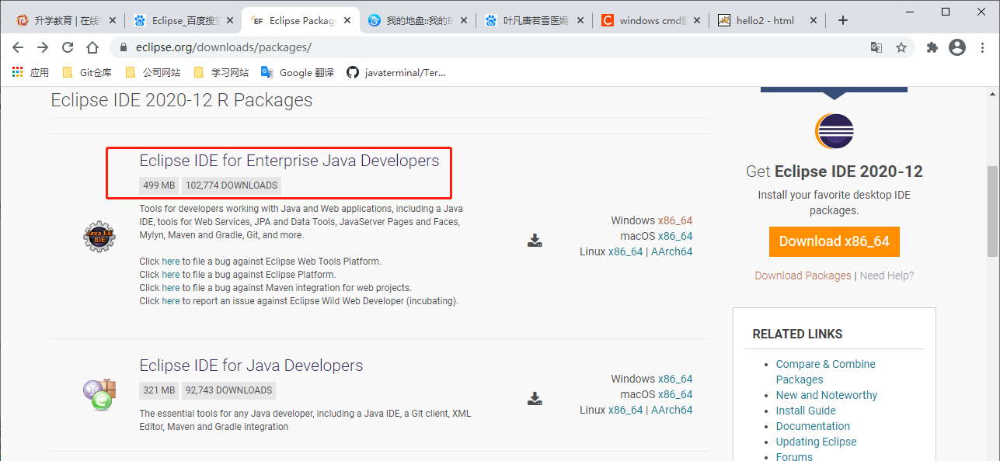
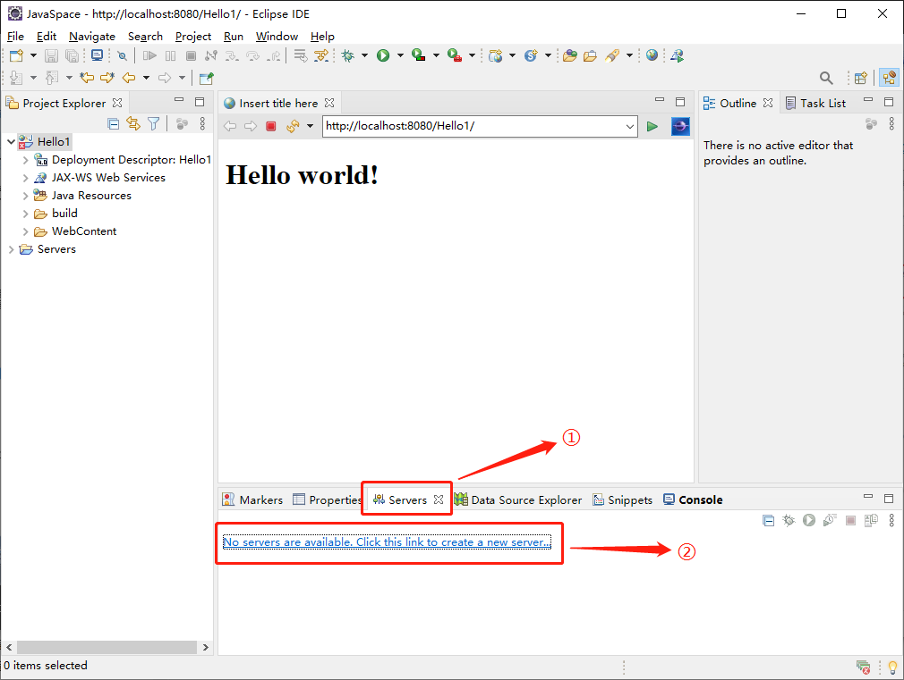
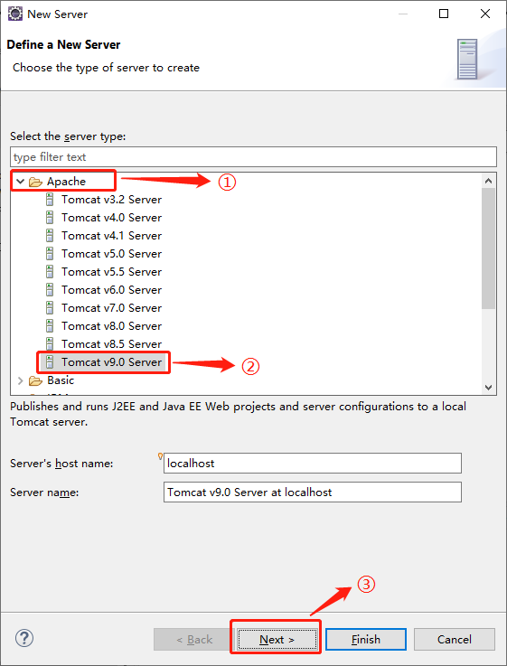
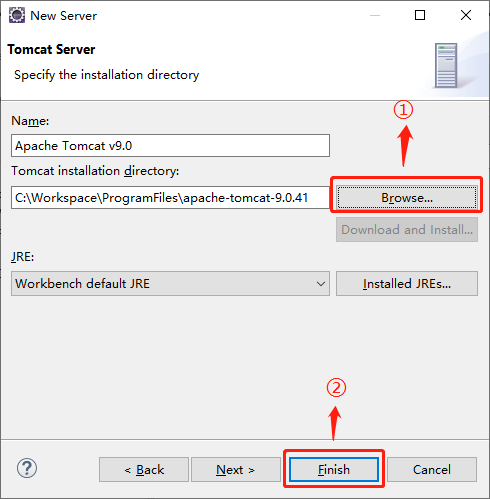
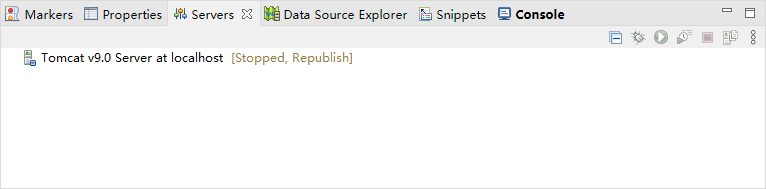

[toc]

### 1. 下载 Eclipse

可以在 <https://www.eclipse.org/downloads/packages/> 下载 Eclipse 。

> 注意：必须是下载 Eclipse IDE for Enterprise Java Developers 版本的 Eclipse。

### 2. 配置 Tomcat

1. 打开 Eclipse，点击应用底部的 `Servers` 选项卡，在选项卡下面的窗口中点击 `No servers are available, Click this link to create a new server...` 按钮。

   

2. 在弹出的对话框中点击 `Apache` 项，在展开的列表中选择要创建的 Tomcat 版本，然后点击 `Next` 按钮。

   

3. 在弹出的窗口中，点击 `Browse...` 按钮，选择 Tomcat 的安装目录，然后点击 `Finish` 按钮即可配置完成。

   

4. 最后可以在 Servers 选项卡下的窗口中看到 Tomcat v9.0 Server at localhost [Stopped, Republish] 项，右击该项可以启动或停止 Tomcat。

   

> 提示：在 Eclispe 中启动 Tomcat 后，并不能在浏览器中访问 Tomcat 页面。该服务只用于测试开发的网站应用。