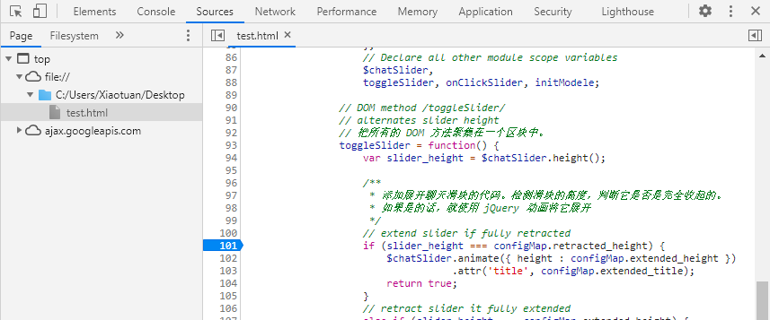

[toc]

### 1. 定义目标

在浏览器窗口的右下角显示一个聊天滑块，当应用加载时，滑块是收起的。当点击滑块时，它就会展开。再次点击，它又会收起。

### 2. 创建文件结构

我们使用单个文件 `spa.html` 来创建应用，外部库只使用 jQuery。

**代码清单 1-1 "小荷才露尖尖角" —— spa.html**

```html
<!DOCTYPE html>
<html lang="utf-8">
    <head>
        <title>SPA Chapter 1 section 1.2.2</title>
        <!--
            添加 style 标签，用来设置 CSS 选择器，在 JavaScript
            之前加载 CSS 通常能更快第渲染页面，这是最佳的做法。
        -->
        <style type="text/css"></style>
        <!--
            添加 script 标签，用来放置 JavaScript
        -->
        <script type="text/javascript"></script>
    </head>
    <body>
        <!--
            新建一个 div，id 为 spa。JavaScript 会管理这个容器的内容。
        -->
        <div id="spa"></div>
    </body>
</html>
```

### 3. 开发 HTML 和 CSS

**代码清单 1-2 HTML 和 CSS —— spa.html**

```html
<!DOCTYPE html>
<html lang="utf-8">
    <head>
        <title>SPA Chapter 1 section 1.2.2</title>
        <!--
            添加 style 标签，用来设置 CSS 选择器，在 JavaScript
            之前加载 CSS 通常能更快第渲染页面，这是最佳的做法。
        -->
        <style type="text/css">
            /*
             *  定义 <body> 标签，填充整个浏览器窗口，并隐藏任何溢出部分。
             *  将背景色设置为中灰色。
             */
             body {
                 width: 100%;
                 height: 100%;
                 overflow: hidden;
                 background-color: #777;
             }
             /*
              * 定义容纳单页应用所有内容的容器
              */
            #spa {
                position: absolute;
                top: 8px;
                left: 8px;
                bottom: 8px;
                right: 8px;
                border-radius: 8px 8px 0 8px;
                background-color: #fff;
            }
            /*
             * 定义 spa-slider 类，将聊天滑块容器固定在它所在容器右下角。
             * 将背景色设置为红色，左上角为圆角。
             */
            .spa-slider {
                position: absolute;
                bottom: 0;
                right: 2px;
                width: 300px;
                height: 16px;
                cursor: pointer;
                background-color: #f00;
            }
        </style>
        <!--
            添加 script 标签，用来放置 JavaScript
        -->
        <script type="text/javascript"></script>
    </head>
    <body>
        <!--
            新建一个 div，id 为 spa。JavaScript 会管理这个容器的内容。
        -->
        <div id="spa">
            <div class="spa-slider"></div>
        </div>
    </body>
</html>
```

### 4. 添加 JavaScript

我们想使用 JavaScript 的最佳写法。有个工具会有所帮忙，它就是由 Douglas Crockford 编写的 JSLint。JSLint 是一种 JavaScript 验证器，能确保代码不会破坏很明显的 JavaScript 最佳写法。我们也想使用 jQuery，它是一种操作 DOM 的工具，由 John Resig 编写。jQuery 提供了能很容易实现滑块动画的跨浏览器工具。

**代码清单 1-3 JavaScript 开发，第一轮——spa.html**

```
/* jslint settings */
// Module /spa/
// Provides chat slider capability
	// Module scope variables
		// Set constants
		// Declare all other module scope variables

	// DOM method /toggleSlider/
	// alternates slider height

	// Event handler /onClickSlider/
	// receives click event and calls toggleSlider

	// Public method /initModule/
	// sets initial state and provides feature
		// render HTML
		// initialize slider height and title
		// bind the user click event to the event handler
// Start spa once DOM is ready
```

**代码清单 1-4 JavaScript 开发，第二轮——spa.html**

```html
<!DOCTYPE html>
<html lang="utf-8">
    <head>
        <title>SPA Chapter 1 section 1.2.2</title>
        <!--
            添加 style 标签，用来设置 CSS 选择器，在 JavaScript
            之前加载 CSS 通常能更快第渲染页面，这是最佳的做法。
        -->
        <style type="text/css">
            /*
             *  定义 <body> 标签，填充整个浏览器窗口，并隐藏任何溢出部分。
             *  将背景色设置为中灰色。
             */
             body {
                 width: 100%;
                 height: 100%;
                 overflow: hidden;
                 background-color: #777;
             }
             /*
              * 定义容纳单页应用所有内容的容器
              */
            #spa {
                position: absolute;
                top: 8px;
                left: 8px;
                bottom: 8px;
                right: 8px;
                border-radius: 8px 8px 0 8px;
                background-color: #fff;
            }
            /*
             * 定义 spa-slider 类，将聊天滑块容器固定在它所在容器右下角。
             * 将背景色设置为红色，左上角为圆角。
             */
            .spa-slider {
                position: absolute;
                bottom: 0;
                right: 2px;
                width: 300px;
                height: 16px;
                cursor: pointer;
                background-color: #f00;
            }
        </style>
        <!--
            添加 script 标签，用来放置 JavaScript
        -->
            /* jslint settings */
            // Module /spa/
            // Provides chat slider capability
            // 
            var spa = (function($) {
                // Module scope variables
                var 
                    // Set constants
                    configMap = {},
                    // Declare all other module scope variables
                    $chatSlider,
                    toggleSlider, onClickSlider, initModele;

                // DOM method /toggleSlider/
                // alternates slider height
                //
                toggleSlider = function() {};

                // Event handler /onClickSlider/
                // receives click event and calls toggleSlider
                //
                onClickSlider = function(event) {};

                // Public method /initModule/
                // sets initial state and provides feature
                //
                initModele = function($container) {
                    // render HTML
                    // initialize slider height and title
                    // bind the user click event to the event handler
                };
            }());
            // Start spa once DOM is ready
        </script>
    </head>
    <body>
        <!--
            新建一个 div，id 为 spa。JavaScript 会管理这个容器的内容。
        -->
        <div id="spa">
            <div class="spa-slider"></div>
        </div>
    </body>
</html>
```

**代码清单 1-5 JavaScript 开发，第三轮——spa.html**

```html
<!DOCTYPE html>
<html lang="utf-8">
    <head>
        <title>SPA Chapter 1 section 1.2.5</title>
        <!--
            添加 style 标签，用来设置 CSS 选择器，在 JavaScript
            之前加载 CSS 通常能更快第渲染页面，这是最佳的做法。
        -->
        <style type="text/css">
            /*
             *  定义 <body> 标签，填充整个浏览器窗口，并隐藏任何溢出部分。
             *  将背景色设置为中灰色。
             */
             body {
                 width: 100%;
                 height: 100%;
                 overflow: hidden;
                 background-color: #777;
             }
             /*
              * 定义容纳单页应用所有内容的容器
              */
            #spa {
                position: absolute;
                top: 8px;
                left: 8px;
                bottom: 8px;
                right: 8px;
                border-radius: 8px 8px 0 8px;
                background-color: #fff;
            }
            /*
             * 定义 spa-slider 类，将聊天滑块容器固定在它所在容器右下角。
             * 将背景色设置为红色，左上角为圆角。
             */
            .spa-slider {
                position: absolute;
                bottom: 0;
                right: 2px;
                width: 300px;
                height: 16px;
                cursor: pointer;
                background-color: #f00;
            }
        </style>
        <!--
            从 Google 的 CDN 引入 jQuery 库，这会减轻服务器的负载，通常会更快。
            因为有很多其他网站也使用 Googele CDN 上的 jQuery，所以用户浏览器已经缓存了 
            jQuery 库的概率很高，这样无需发起 HTTP 请求就可以使用它。
        -->
        <script src="https://ajax.googleapis.com/ajax/libs/jquery/3.5.1/jquery.min.js"></script>
        <!--
            添加 script 标签，用来放置 JavaScript
        -->
        <script type="text/javascript">
            /**
             * 引入 JSLint 设置。使用 JSLint 确保代码不会有常见的 JavaScript
             * 编码错误。现在不用去管这些值是什么意思。附录 A 会讲解 JSLint 的更多细节。 
             */
            /*jslint         browser : true, continue : true,
                devel  : true, indent  : 2,    maxerr   : 50,
                newcap : true, nomen   : true, plusplus : true,
                regexp : true, sloppy  : true, vars     : true,
                white  : true
            */
            /*global jQuery */

            /* jslint settings */
            // Module /spa/
            // Provides chat slider capability
            // 将代码封装在 spa 名字空间内。第 2 章会讲解更多关于这种写法的细节
            var spa = (function($) {
                // Module scope variables
                /* 在使用之前声明所有的变量。把模块的配置值保存在 configMap 中，
                   把模块的状态值保存在 stateMap 中。
                 */
                var 
                    // Set constants
                    configMap = {
                        extended_height: 434,
                        extended_title: 'Click to retract',
                        retracted_height: 16,
                        retracted_title: 'Click to extend',
                        template_html: '<div class="spa-slider"></div>'
                    },
                    // Declare all other module scope variables
                    $chatSlider,
                    toggleSlider, onClickSlider, initModele;

                // DOM method /toggleSlider/
                // alternates slider height
                // 把所有的 DOM 方法聚集在一个区块中。
                toggleSlider = function() {
                    var slider_height = $chatSlider.height();

                    /**
                     * 添加展开聊天滑块的代码。检测滑块的高度，判断它是否是完全收起的。
                     * 如果是的话，就使用 jQuery 动画将它展开
                     */
                    // extend slider if fully retracted
                    if (slider_height === configMap.retracted_height) {
                        $chatSlider.animate({ height : configMap.extended_height })
                                   .attr('title', configMap.extended_title);
                        return true;
                    }
                    // retract slider it fully extended
                    else if (slider_height === configMap.extended_height) {
                        $chatSlider
                            .animate({ height : configMap.retracted_height })
                            .attr('title', configMap.retracted_title);
                        return true;
                    }

                    // do not take action if slider is in transition
                    return false;
                };

                // Event handler /onClickSlider/
                // receives click event and calls toggleSlider
                // 把所有的事件处理程序聚集在一个区块中。保持小而专注的处理程序是很好的做法。
                // 它们应该调用其他方法来更新显示或者修改业务逻辑
                onClickSlider = function(event) {
                    toggleSlider();
                    return false;
                };

                // Public method /initModule/
                // sets initial state and provides feature
                // 把所有的公开方法聚集在一个区块中。
                initModule = function($container) {
                    // render HTML
                    // 添加滑块模板的 HTML 代码，来填充 $container
                    $container.html(configMap.template_html);

                    // 查找聊天滑块 div，把它保存到模块作用域变量 $chatSlider 中。
                    // 模块作用域变量对 spa 名字空间内的所有函数可见。
                    $chatSlider = $container.find('.spa-slider');
                    // initialize slider height and title
                    // bind the user click event to the event handler
                    // 设置聊天滑块的标题，在聊天滑块上面绑定点击事件处理程序 onClickSlider
                    $chatSlider
                        .attr('title', configMap.retracted_title)
                        .click(onClickSlider);

                    return true;
                };

                // 通过返回 spa 名字空间中的对象，导出公开方法。我们值导出了一个方法 initModule。
                return { initModule : initModule };
            }(jQuery));

            // Start spa once DOM is ready
            // 仅在 DOM 可用后，使用 jQuery 的ready 方法，启动单页应用。
            jQuery(document).ready(function() {
                spa.initModule(jQuery('#spa'));
            });
        </script>
    </head>
    <body>
        <!--
            新建一个 div，id 为 spa。JavaScript 会管理这个容器的内容。
        -->
        <div id="spa">
            <!--
                清理 HTML。现在， JavaScript 会渲染聊天滑块，
                所以可以把它从静态 HTML 中移除了。
            -->
            <div class="spa-slider"></div>
        </div>
    </body>
</html>
```

### 5. 使用 Chrome 开发者工具查看应用

我们应该想在执行该语句之前查看代码，点击右边的空白处添加断点。每当 JavaScript 解释器到达脚本的这一行时，它会暂停，所以能查看元素和变量，以便我们更好地理解发生了什么事情。



在开发这个应用的时候，我们会继续使用这些工具，并且建议你花费一些闲暇时间学习一下 <https://developers.google.com/web/tools/chrome-devtools/> 上的在线手册。