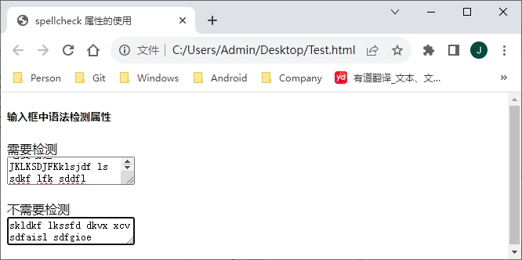

[toc]

在 `HTML5` 中，新增了一个 "全局属性" 的概念。所谓全局属性，是指可以对任何元素都使用的属性。下面将详细介绍几个常用的全局属性。

### 1. contentEditable 属性

由 `Microsoft` 发明，经过反向工程后由所有其他的浏览器实现，`contentEditable` 现在成为了 `HTML` 的正式部分。

该属性的主要功能是允许用户编辑元素中的内容，所以该元素必须是可以获得鼠标焦点的元素，而且在单击鼠标后要向用户提供一个插入符号，提示用户该元素中的内容允许编辑。`contentEditable` 是一个布尔类型的属性，因此可以将其设置为 `true` 或 `false`。

除此之外，该属性还有个隐藏的 `inherir`（继承）状态，属性为 `true` 时，元素被指定为允许编辑；属性为 `false` 时，元素被指定为不允许编辑；未指定 `true` 或 `false` 时，则由 `inherir` 状态来决定，如果元素的父元素是可编辑的，则该元素就是可编辑的。

另外，除了 `contentEditable` 属性外，元素还具有一个 `iscontentEditable` 属性，当元素可编辑时，该属性为 `true`；当元素不可编辑时，该属性为 `false`。

```html
<!DOCTYPE html>
<html>
	<head>
		<meta charset="utf-8">
		<title>contentEditable 属性示例</title>
	</head>
	<body>
		<h2>可编辑列表</h2>
		<ul contentEditable="true">
			<li>列表元素1</li>
			<li>列表元素2</li>
			<li>列表元素3</li>
		</ul>
	</body>
</html>
```

运行效果如下：


在编辑完元素中的内容后，如果想要保存其中的内容，只能把该元素的 `innerHTML` 发送到服务器进行保存。

`contentEditable` 属性具有 "可继承" 的特点，如果一个 `HTML` 元素的父元素是 "可编辑" 的，那么它默认也是可编辑的，除非显示地指定 `contentEditable="false"`。

**示例** 将 `<div>`、`<table>` 元素转换成可编辑状态。

```html
<!DOCTYPE html>
<html>
	<head>
		<meta charset="utf-8">
		<title>将 div 和 table 元素转换为可编辑状态</title>
	</head>
	<body>
		<!-- 定义一个可编辑的 div 元素 -->
		<div contenteditable="true" style="width: 500px;border:1px solid black">
		HTML5 从入门到精通
			<!-- 该元素的父元素有 contenteditalbe="true"，因此该表格也是可编辑的 -->
			<table style="width: 500px; border-collapse: collapse" border="1">
				<tr>
					<td>JavaScript 从入门到精通</td>
					<td>PHP 从入门到精通</td>
				</tr>
				<tr>
					<td>C# 从入门到精通</td>
					<td>Java 从入门到精通</td>
				</tr>
			</table>
		</div>
		<hr/>
		<!-- 这个表格默认不可编辑，双击之后该表格变为可编辑状态 -->
		<table id="target" ondblclick="this.contentEditable=true;" style="width:420px; border-collapse: collapse" border="1">
			<tr>
				<td>JavaScript</td>
				<td>PHP</td>
			</tr>
			<tr>
				<td>C#</td>
				<td>Java</td>
			</tr>
		</table>
	</body>
</html>
```

运行效果如下：


### 2. designMode 属性

`designMode` 属性用来指定整个页面是否可编辑，当页面可编辑时，页面中任何支持上文所述的 `contentEditable` 属性的元素都变成了可编辑状态。`designMode` 属性只能在 `JavaScript` 脚本里被编辑修改。该属性有两个值——`on` 与 `off`。当属性被指定为 `on` 时，页面可编辑；被指定为 `off` 时，页面不可编辑。使用 `JavaScript` 脚本来指定 `designMode` 属性的方法如下：

```js
document.designMode = "on"
```

> 注意：出于安全考虑，`IE8` 不允许使用 `designMode` 属性让页面进入编辑状态。`IE9` 允许使用 `designMode` 属性让页面进入编辑状态。

**示例** 通过双击页面打开整个页面的 `designMode` 状态，将所有支持 `contentEditable` 属性的元素都变成可编辑状态。

```html
<!DOCTYPE html>
<html>
	<head>
		<meta charset="utf-8">
		<title>打开页面 designMode 状态</title>
	</head>
	<body ondblclick="document.designMode='on';">
		<!-- 定义一个可编辑的 div 元素 -->
		<div>HTML5 从入门到精通</div>
		<table style="width:420px; border-collapse: collapse" border="1">
			<tr>
				<td>JavaScript</td>
				<td>PHP</td>
			</tr>
			<tr>
				<td>C#</td>
				<td>Java</td>
			</tr>
		</table>
	</body>
</html>
```

运行效果如下：


### 3. hidden 属性

`hidden` 属性类似于 `aria-hidden`，它告诉浏览器这个元素的内容不应该以任何方式显示。但是元素中的内容还是浏览器创建的，也就是说页面装载后允许使用 `JavaScript` 脚本将该属性取消，取消后该元素变为可见状态，同时元素中的内容也即时显现出来。`hidden` 属性是一个布尔值的属性，当设为 `true` 时，元素处于不可见状态；当设为 `false` 时，元素处于可见状态。

> 提示：`hidden` 属性可以代替 `CSS` 样式中的 `display` 属性，设置 `hidden="true"` 相当于在 `CSS` 中设置 `display:none`。

**示例** 通过 `hidden` 属性控制 `HTML` 元素的显示和隐藏。

```html
<!DOCTYPE html>
<html>
	<head>
		<meta charset="utf-8">
		<title>显示和隐藏 HTML 元素</title>
	</head>
	<body ondblclick="document.designMode='on';">
		<div id="target" hidden="true" style="height: 80px">
			文字内容
		</div>
		<button onclick="var target = document.getElementById('target');target.hidden = !target.hidden;">显示/隐藏</button>
	</body>
</html>
```

运行效果如下：


### 4. spellcheck 属性

`speelcheck` 属性是布尔值，它告诉浏览器检查元素的拼写和语法。如果没有这个属性，默认的状态表示元素根据默认行为操作，可能是根据父元素自己的 `spellcheck` 状态。因为 `spellcheck` 属性属于布尔值属性，因此它具有 `true` 或 `false` 两种值。但是它在书写时有一个特殊的地方，就是必须明确声明属性值为 `true` 或 `false`，书写方法如下：

```xml
<!-- 以下两种书写方法正确 -->
<textarea spellcheck="true"></textarea>
<input type=text spellcheck=false/>
<!-- 以下书写方法为错误 -->
<textarea spellcheck></textarea>
```

> 提示：如果元素的 `readOnly` 属性或 `disabled` 属性设为 `true`，则不执行拼写检查。

**示例** 通过 `spellcheck` 属性执行拼写检查。

```html
<!DOCTYPE html>
<html>
	<head>
		<meta charset="utf-8">
		<title>spellcheck 属性的使用</title>
	</head>
	<body ondblclick="document.designMode='on';">
		<h5>输入框中语法检测属性</h5>
		<p>需要检测<br/>
			<textarea spellcheck="true" class="tt"></textarea>
		</p>
		<p>不需要检测<br/>
			<textarea spellcheck="false" class="tt"></textarea>
		</p>
	</body>
</html>
```

运行效果如下：



### 5. tabindex 属性

`tabindex` 是一个旧的概念，是指用户使用键盘导航一个页面时（通常使用 `Tab` 键，但某些浏览器，如著名的 `Opera`，可能使用不同的键组合来导航），控制页面上的元素获得焦点的顺序。

当站点使用深度嵌套的布局表格来构建时，这个属性非常常用，但是如今这已经不再那么常用了。默认的标签页顺序是由元素出现在标记中的顺序来决定的，因此顺序正确和结构良好的文档应该不再需要额外的标签页顺序来提示。

`tabindex` 属性另外一个有用之处是：通常情况下只有链接、表单元素和图像映射区域可以通过键盘获得聚焦，添加一个 `tabindex` 可以使得其他元素页成为可聚焦的，因此从 `JavaScript` 执行 `focus()` 命令，就可以把浏览器的焦点移动到它们。这也会使得这些元素成为键盘可聚焦的，这可不是我们想要的结果。

使用一个负整数允许元素通过编程来获得焦点，但是不应该允许使用顺序聚焦导航来到达元素。在 `HTML4` 中 `-1` 对于属性来说是一个无效的值，并且在除表单字段和链接以外的任何元素上，该属性自身也是无效的。