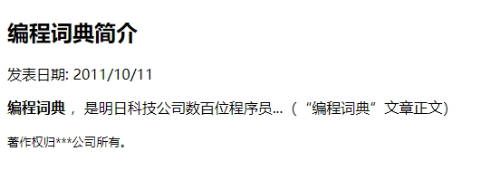
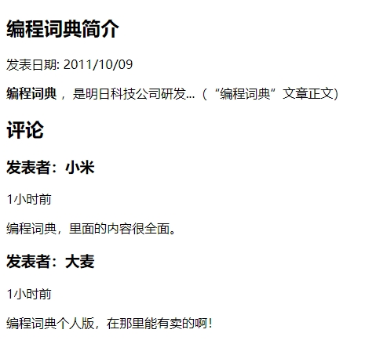

`article` 元素表示文档、页面、应用程序或站点中的自包含成分所构成的一个页面的一部分，并且这部分专用于独立地分类或复用，例如聚合。一个博客帖子、一个教程、一个新的故事、视频及其脚本，都很好地符合这一定义。

除了内容部分，一个 `article` 元素通常有它自己的标题（通常放在一个 `header` 元素里面），有时还有自己的脚注。

例如：

```html
<!DOCTYPE html>
<html>
    <head>
        <meta charset="utf-8">
        <title>article元素</title>
    </head>
    <body>
        <article>
        	<header>
            	<h1>
                    编程词典简介
                </h1>
                <p>
                    发表日期：<time pubdate="pubdate">2011/10/11</time>
                </p>
            </header>
            <p>
                <b>编程词典</b>，是明日科技公司数百位程序员...(“编程词典”文章正文)
            </p>
            <footer>
            	<p>
                    <small>著作权归***公司所有。</small>
                </p>
            </footer>
        </article>
    </body>
</html>
```

运行效果如下：



另外 `article` 元素是可以嵌套使用的，内层的内容在原则上需要与外层的内容相关联。例如，一篇博客文章中，针对该文章的评论就可以使用嵌套 `article` 元素的方式，用来呈现评论的 `article` 元素被包含在表示整体内容的 `article` 元素里面。

例如：

```html
<!DOCTYPE html>
<html>
    <head>
        <meta charset="utf-8">
        <title>article元素的嵌套</title>
    </head>
    <body>
        <article>
        	<header>
            	<h1>
                    编程词典简介
                </h1>
                <p>
                    发表日期：<time pubdate datetime="2010/10/09">2011/10/09</time>
                </p>
            </header>
            <p>
                <b>编程词典</b>，是明日科技公司研发...（“编程词典”文章正文）
            </p>
            <section>
            	<h2>
                    评论
                </h2>
                <article>
                	<header>
                    	<h3>
                            发表者：小米
                        </h3>
                        <p>
                            <time pubdate datetime="2011-10-10T19:10-08:00"></time>
                        </p>
                    </header>
                    <p>
                        编程词典，里面的内容很全面
                    </p>
                </article>
                <article>
                	<header>
                    	<h3>
                            发表者：大麦
                        </h3>
                        <p>
                            <time pubdate datetime="2011-10-10T19:15-08:00">1 小时前</time>
                        </p>
                    </header>
                    <p>
                        编程词典个人版，在里面能有卖的啊！
                    </p>
                </article>
            </section>
        </article>
    </body>
</html>
```

运行效果如下：



另外，`article` 元素也可以用来表示插件，它的作用是使插件看起来好像内嵌在页面中一样。

```html
<!DOCTYPE html>
<html>
    <head>
        <meta charset="utf-8">
        <title>article元素表示插件</title>
    </head>
    <body>
        <article>
        	<h1>
                电子商务网站
            </h1>
            <object>
                <param name="allowFullScreen" value="true">
                <embed src="z/aa.avi" width="400" height="295"></embed>
            </object>
        </article>
    </body>
</html>
```

> 提示：
>
> 在 Chrome 浏览器中无法显示上面示例效果。