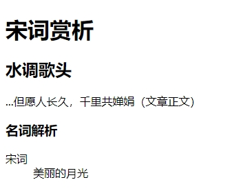
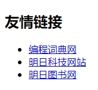

`aside` 元素表示由与 `aside` 元素周围的内容无关的内容所组成的一个页面的一节，也可以认为该内容与 `aside` 周围的内容是分开独立的。

`aside` 元素主要有以下两种使用方法：

（1）被包含在 `article` 元素中作为主要内容的附属信息部分，其中的内容可以是与当前文章有关的信息、名词解释等。

```html
<!DOCTYPE html>
<html>
    <head>
        <meta charset="utf-8">
        <title>文章内部的aside元素示例</title>
    </head>
    <body>
        <header>
        	<h1>
                宋词赏析
            </h1>
        </header>
        <article>
        	<h1>
                <strong>水调歌头</strong>
            </h1>
            <p>
                ...但愿人长久，千里共婵娟（文章正文）
            </p>
            <aside>
                <!-- 因为这个 aside 元素被放置在一个 article 元素内部，
                所以分析器将这个 aside 元素的内容理解成是和 article 元素的内容相关联的。 -->
                <h1>
                    名词解析
                </h1>
                <dl>
                    <dt>宋词</dt>
                    <dd>美丽的月光</dd>
                </dl>
            </aside>
        </article>
    </body>
</html>
```

运行效果如下：



（2）在 `article` 元素之外使用，可以作为页面或站点全局的附属信息部分。最典型的形式就是侧边栏，其中的内容可以是友情链接，博客中其他文章列表、广告单元等。

```html
<!DOCTYPE html>
<html>
    <head>
        <meta charset="utf-8">
        <title>aside 友情链接</title>
    </head>
    <body>
        <aside>
        	<nav>
            	<h2>
                    友情链接
                </h2>
                <ul>
                    <li><a href="http://www.mrbccd.com">编程词典网</a></li>
                    <li><a href="http://www.mingrisoft.com">明日科技网站</a></li>
                    <li><a href="http://www.mingribook.com">明日图书网</a></li>
                </ul>
            </nav>
        </aside>
    </body>
</html>
```

运行效果如下：


