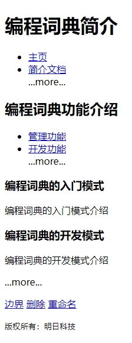

`nav` 元素用来构建导航。导航定义为一个页面中或一个站点内的链接。但是，并不是链接的每一个集合都是一个 `nav`，只需要将主要的、基本的链接组放进 `nav` 元素即可。例如，在页脚中通常会有一组链接，包括服务器条款、版本声明、联系方式等。

`nav` 元素的内容可能是链接的一个列表，标记为一个无序的列表，或者是一个有序的列表，这里需要注意的是 `nav` 元素是一个包装器，它不会替代 `<ol>` 或 `<ul>` 元素，但是会包围它。通过这种方式，不能理解该元素的旧版本浏览器将会显示列表元素和列表项，并且显示效果完全正常。

例如：

```html
<!DOCTYPE html>
<html>
    <head>
        <meta charset="utf-8">
        <title>nav元素示例</title>
    </head>
    <body>
        <h1>
            编程词典简介
        </h1>
        <nav>
        	<ul>
                <li><a href="/">主页</a></li>
                <li><a href="/mr">简介文档</a></li>
                ...more...
            </ul>
        </nav>
        <article>
        	<header>
            	<h1>
                    编程词典功能介绍
                </h1>
                <nav>
                	<ul>
                        <li><a href="#gl">管理功能</a></li>
                        <li><a href="#kf">开发功能</a></li>
                        ...more...
                    </ul>
                </nav>
            </header>
            <section id="rum">
            	<h1>
                    编程词典的入门模式
                </h1>
                <p>
                    编程词典的入门模式介绍
                </p>
            </section>
            <section id="kf">
            	<h1>
                    编程词典的开发模式
                </h1>
                <p>
                    编程词典的开发模式介绍
                </p>
            </section>
            ...more...
            <footer>
            	<p>
                    <a href="?edit">边界</a>
                    <a href="?delete">删除</a>
                    <a href="?rename">重命名</a>
                </p>
            </footer>
        </article>
        <footer>
        	<p>
                <small>版权所有：明日科技</small>
            </p>
        </footer>
    </body>
</html>
```

运行效果如下：



具体来说，`nav` 元素可以用于以下场合。

+ 传统导航条

  现在主流网站上都有不同层级的导航条，其作用是将当前画面跳转到网站的其他主要页面上去。

+ 侧边栏导航

  现在主流博客网站及商品网站上都有侧边栏导航，其作用是将页面从当前文章或当前商品跳转到其他文章或其他商品页面上去。

+ 页内导航

  页内导航的作用是在本页面几个主要的组成部分之间进行跳转。

+ 翻页操作

  翻页操作是指在多个页面的上下或博客网站的上下篇文章滚动。

除此之外，`nav` 元素也可以用于一些比较重要的、基本的导航链接组中。

> 注意：在 HTML 5 中不要用 `menu` 元素代替 `nav` 元素。因为 `menu` 元素是用在一系列发出命令的菜单上的，是一种交互性的元素，或者更确切地说是使用在 `Web` 应用程序中的。