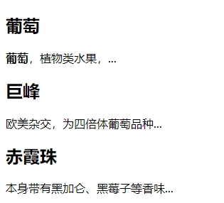

`section` 元素代表文档或应用程序中一般性的 "段" 或者 "节"。"段" 在这里的上下文中，指的是对内容按照主题的分组，通常还附带标题。例如，书本的章节，带标签页的对话框的每个标签页，或者一篇论文的编节号。但 `section` 元素并非一个普通的容器元素；当一个容器需要被直接定义样式或通过脚本定义行为时，推荐使用 `div` 而非 `section` 元素。

例如：

```html
<!DOCTYPE html>
<html>
    <head>
        <meta charset="utf-8">
        <title>section元素</title>
    </head>
    <body>
        <article>
        	<h1>
                葡萄
            </h1>
            <p>
                <b>葡萄</b>，植物类水果，...
            </p>
            <section>
            	<h2>
                    巨峰
                </h2>
                <p>
                    欧美杂交，为四倍体葡萄品种...
                </p>
            </section>
            <section>
            	<h2>
                    赤霞珠
                </h2>
                <p>
                    本身带有黑加仑、黑莓子等香味...
                </p>
            </section>
        </article>
    </body>
</html>
```

运行效果如下：



在 HTML 5 中，`article` 元素可以看成是一种特殊种类的 `section` 元素，它比 `section` 元素更强调独立性。即 `section` 元素强调分段或分块，而 `article` 强调独立性。总结来说，如果一块内容相对来说比较独立、完整，应该使用 `article` 元素；但是如果想将一块内容分成几段时，应该使用 `section` 元素。另外需要注意的是，在 HTML 5 中，`div` 元素编成了一种容器，当使用 `CSS` 样式的时候，可以对这个容器进行一个总体 `CSS` 样式的套用。最后对 `section` 元素的注意事项进行总结：

+ 不要将 `section` 元素用作设置样式的页面容器，那是 `div` 元素的工作。
+ 当 `article` 元素、`aside` 元素或 `nav` 元素更符合页面要求时，尽量不要使用 `section`。
+ 不要为没有标题的内容区块使用 `section` 元素。