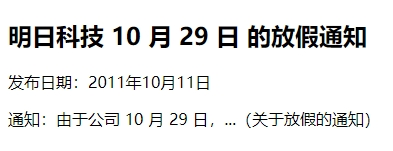

`time` 是一个新元素，用于明确地对机器的日期和时间进行编码，并且以让人易读的方式来展现它。`time` 元素代表 24 小时中的某个时刻或某个日期，表示时刻允许带时差。它可以定义很多格式的日期和时间，如下所示：

```html
<time datetime="2011-10-12">2011 年 10 月 12 日</time>
<time datetime="2011-10-12">10 月 12 日</time>
<time datetime="1985-06-03">我的生日</time>
<time datetime="2011-10-12T20:00">今天晚上 8 点吃饭</time>
<time datetime="2011-10-12T20:00Z">今天晚上 8 点吃饭</time>
<time datetime="2011-10-12T20:00+09:00">现在是晚上 8 点的美国时间</time>
```

`time` 元素的机器可读部分通常放在元素的 `datetime` 属性中，而元素的开始标记与结束标记中间的部分是显示在网页上的。`datetime` 属性中日期与时间之间要用 "T" 字符分隔，"T" 表示时间。时间加上了 "Z" 字符，这表示给机器编码时使用 UTC 标准时间，在最后的示例中则加上了时差，如果是编码本地时间，则不需要添加时差。

`pubdate` 是一个布尔属性，用来表示这个特定的 `<time>` 是一篇 `<article>` 或这个 `<body>` 内容的发布日期。

```html
<!DOCTYPE html>
<html>
    <head>
        <meta charset="utf-8">
        <title>time 文章发布日期</title>
    </head>
    <body>
        <article>
        	<header>
            	<h1>
                    明日科技 <time datetime="2011-10-29">10 月 29 日</time> 的放假通知
                </h1>
                <p>
                    发布日期：<time datetime="2011-10-11" pubdate>2011年10月11日</time>
                </p>
            </header>
            <p>
                通知：由于公司 10 月 29 日，...（关于放假的通知）
            </p>
        </article>
    </body>
</html>
```

