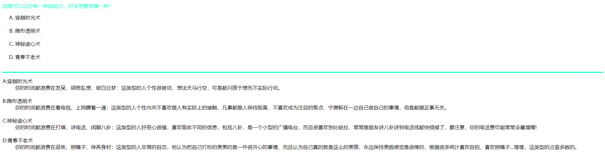

在 HTML 中还有一种列表标记，称为定义列表（Definition Lists）。不同于前两种列表，它主要用于解释名词，包含两个层次的列表，第一层次是需要解释的名词，第二层次是具体的解释。

### 1. 语法

```html
<dl>
    <dt>名词1<dd>解释1
    <dt>名词2<dd>解释2
    <dt>名词3<dd>解释3
    ......
</dl>
```

### 2. 示例代码

```html
<!DOCTYPE html>
<html>
    <head>
        <meta charset="utf-8">
        <title>创建定义列表</title>
    </head>
    <body>
        <font color="#00FFCC">如果可以让你有一种超能力，你会想要有哪一种?</font><br />
        <ol type="A">
            <li>穿越时光术</li><br />
            <li>隐形透明术</li><br />
            <li>神秘读心术</li><br />
            <li>青春不老术</li><br />
        </ol>
        <hr color="#00FFCC" size="3"/>
        <dl>
            <dt>A:穿越时光术</dt><dd>你的时间都浪费在发呆、胡思乱想、做白日梦：这类型的人个性很被动，想法天马行空，可是都只限于想而不实际行动。</dd><br />
            <dt>B:隐形透明术</dt><dd>你的时间都浪费在看电视、上网瞎看一通：这类型的人个性内向不喜欢跟人有实际上的接触，凡事都跟人保持距离，不喜欢成为注目的焦点，宁愿躲在一边自己做自己的事情，但是都跟正事无关。</dd><br />
            <dt>C:神秘读心术</dt><dd>你的时间都浪费在打牌、讲电话、闲聊八卦：这类型的人好奇心很强，喜欢吸收不同的信息，包括八卦，是一个小型的广播电台，而且很喜欢到处哈拉，常常跟朋友讲八卦讲到电话线都快烧掉了，要注意，你的电话费可能常常会暴增喔!</dd><br />
            <dt>D:青春不老术</dt><dd>你的时间都浪费在逛街、照镜子、保养身材：这类型的人非常的自恋，他认为把自己打扮的美美的是一件很开心的事情，而且认为自己真的就是这么的美丽，永远保持美貌感觉是很棒的，根据很多统计喜欢自拍、喜欢照镜子…等等，这类型的占蛮多数的。</dd><br />
        </dl>
    </body>
</html>
```

运行效果如下：



另外，在定义列表中，一个 `<dt>` 标记下可以有多个 `<dd>` 标记作为名词的解释和说明。下面就是一个在 `<dt>` 标记下有多个 `<dd>` 标记的实例。

### 3. 示例代码

```html
<!DOCTYPE html>
<html>
    <head>
        <meta charset="utf-8">
        <title>定义列表</title>
    </head>
    <body>
        <h2>网站开发图书</h2>
        <dl>
            <dt>
                <u>网站前台</u>
            <dd>HTML网页制作
            <dd>JavaScript网页特效
            <dd>HTML5自学视频教程
            <dd>CSS3从入门到精通
            <dt>
                <u>网站后台</u>
            <dd>PHP网站开发
            <dd>Java Web网站开发
            <dd>PHP开发实战宝典
            <dd>asp.net开发实战大全
            <dt>
                <u>数据库</u>
            <dd>MySQL数据库编程
            <dd>Oracle数据库从入门到精通
            <dd>ACCESS数据库基础教程
            <dd>SQL Server 2008数据库基础
        </dl>
    </body>
</html>
```

