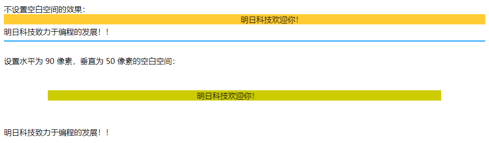

[toc]

### 1. 滚动文字标记 —— marquee

**语法：**

```html
<marquee>滚动文字</marquee>
```

只要在标记之间添加要进行滚动的文字即可，而且可以在标记之间设置这些文字的字体、颜色等。

**示例代码：**

```html
<!DOCTYPE html>
<html>
    <head>
        <meta http-equiv="Content-Type" content="text/html;charset=utf-8" />
        <title>设置滚动文字</title>
    </head>
    <body>
        <marquee><font face="隶书" color="#0066FF" size="5">明日科技欢迎你！</font></font></marquee>
    </body>
</html>
```

### 2. 滚动方向属性 —— direction

默认情况下文字只能是从右向左滚动，而在实际应用中常常需要不同滚动方向的文字，这可以通过 `direction` 参数来设置。

**语法：**

```html
<marquee direction="滚动方向">滚动文字</marquee>
```

该语法中的滚动方向可以包含 4 个取值，分别是 up、down、left 和 right，它们分别表示文字向上、向下、向左和向右滚动，其中向左滚动 left 的效果与默认效果相同，而向上滚动的文字则常常出现在网站的公告栏中。

**示例代码：**

```html
<!DOCTYPE html>
<html>
    <head>
        <meta http-equiv="Content-Type" content="text/html;charset=utf-8" />
        <title>设置滚动方向</title>
    </head>
    <body>
        <marquee direction="down"><font face="楷体" color="#FF3333" size="+4">明日科技欢迎你！</font></font></marquee>
    <marquee direction="up"><font face="隶书" color="#99FF00" size="+5">编程词典横空出世！</font></font></marquee>
    </body>
</html>
```

### 3. 滚动方式属性 —— behavior

可以通过添加 `behavior` 属性来实现文字的滚动方式，如往复运动等。

**语法：**

```html
<marquee behavior="滚动方式">滚动文字</marquee>
```

<center><b>behavior 的取值及其效果</b></center>

| behavior 的取值 | 效果               |
| --------------- | ------------------ |
| scroll          | 循环滚动，默认效果 |
| slide           | 只滚动一次就停止   |
| alternate       | 来回交替进行滚动   |

**示例代码：**

```html
<!DOCTYPE html>
<html>
    <head>
        <title>设置滚动方式</title>
    </head>
    <body>
        <marquee behavior="scroll">古之成大事者</marquee>
        <marquee behavior="slide">不惟有超世之才</marquee>
        <marquee behavior="alternate">亦有坚忍不拔之志</marquee>
    </body>
</html>
```

### 4. 滚动速度属性—— scrollamount

通过 `scrollamount` 属性能够调整文字滚动的速度。

**语法：**

```html
<marquee scrollamount="滚动速度"></marquee>
```

滚动文字的速度实际上是通过设置滚动文字每次移动的长度来实现的，以像素为单位。

**示例代码：**

```html
<!DOCTYPE html>
<html>
    <head>
        <title>设置滚动速度</title>
    </head>
    <body>
        <marquee scrollamount="3">一步一步慢慢地走</marquee>
        <marquee scrollamount="10">看我悠哉地跑</marquee>
        <marquee scrollamount="50">小豹子的速度</marquee>
    </body>
</html>
```

### 5. 滚动延迟属性—— scrolldelay

`scrolldelay` 参数可以设置滚动文字滚动的时间间隔。

**语法：**

```html
<marquee scrolldelay="时间间隔"></marquee>
```

`scrolldelay` 的时间间隔单位是毫秒，也就是千分之一秒。这一时间间隔为滚动两步之间的时间间隔，如果设置的时间比较长，会产生走走停停的效果。

**示例代码：**

```html
<!DOCTYPE html>
<html>
    <head>
        <title>设置滚动延迟</title>
    </head>
    <body>
        <marquee scrollamount="100" scrolldelay="10">看我不停脚步地走</marquee>
        <marquee scrollamount="100" scrolldelay="100">看我走走停停</marquee>
        <marquee scrollamount="100" scrolldelay="500">我要走一步停一停</marquee>
    </body>
</html>
```

### 6. 滚动循环属性 —— loop

设置滚动文字后，在默认情况下会不断地循环下去，如果希望文字滚动几次停止，可以使用 `loop` 参数来进行设置。

**语法：**

```html
<marquee loop="循环次数">滚动文字</marquee>
```

**示例代码：**

```html
<!DOCTYPE html>
<html>
    <head>
        <title>设置滚动循环次数</title>
    </head>
    <body>
        <marquee direction="up" loop="3">
        	<font color="#FF0000" face="隶书" size="+3">
            	君子之交淡若水<br/>
                小人之交甘若醴<br/>
            </font>
        </marquee>
    </body>
</html>
```

### 7. 滚动范围属性 —— width、height

如果不设置滚动背景的面积，那么默认情况下，水平滚动的文字背景与文字同高、与浏览器窗口同宽，使用 `width` 和 `height` 参数可以调整其水平和垂直的范围。

**语法：**

```html
<marquee width="" height="">滚动文字</marquee>
```

此处设置宽度和高度的单位均为像素。

**示例代码：**

```html
<!DOCTYPE html>
<html>
    <head>
        <title>设置滚动范围</title>
    </head>
    <body>
        <marquee behavior="alternate" bgcolor="#66FFFF">王勃</marquee>
        <marquee behavior="alternate" bgcolor="#66CCFF" width="500" height="50">老当益壮，宁知白首之心；穷且益坚，不坠青云之志</marquee>
    </body>
</html>
```

### 8. 滚动背景颜色属性 —— bgcolor

**语法：**

```html
<marquee bgcolor="颜色代码">滚动文字</marquee>
```

**示例代码：**

```html
<!DOCTYPE html>
<html>
    <head>
        <title>设置滚动背景颜色</title>
    </head>
    <body>
        <marquee bgcolor="#CCFFCC" behavior="alternate">蜀相&nbsp;&nbsp;作者：杜甫
        </marquee><br/><br/>
        <marquee bgcolor="#FFCCFF" direction="up">
        丞相祠堂何处寻？锦官城外柏森森，<br/>
        映阶碧草自春色，隔叶黄鹂空好音。<br/>
        三顾频烦天下计，两朝开济老臣心。<br/>
        出师未捷身先死，长使英雄泪满襟。<br/>
        </marquee>
    </body>
</html>
```

### 9. 滚动空间属性—— hspace、vspace

在滚动文字的四周，可以设置水平范围和垂直范围。语法如下：

```html
<marquee hspace="水平范围" vspace="垂直范围">滚动文字</marquee>
```

**示例代码：**

```html
<!DOCTYPE html>
<html>
    <head>
        <title>设置滚动空间</title>
    </head>
    <body>
        不设置空白空间的效果：
        <marquee behavior="alternate" bgcolor="#FFCC33">明日科技欢迎你！</marquee>
        明日科技致力于编程的发展！！
        <br />
        <hr color="#0099FF" />
        <br />
        设置水平为 90 像素，垂直为 50 像素的空白空间：
        <marquee behavior="alternate" bgcolor="#CCCC00" hspace="90" vspace="50">明日科技欢迎你！</marquee>
        明日科技致力于编程的发展！！
    </body>
</html>
```

运行效果如下：


