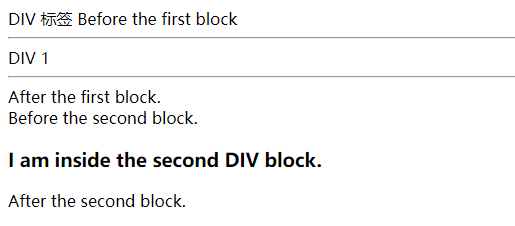

层可以用于创建动态页面。因为 JavaScript 可以动态地定位层，所以层可以在文档中实现移动或跳跃的功能。它是 HTML 与 JavaScript 的组合，并且允许创建动态 HTML。使用层、JavaScript 和样式单，可以在一个页面上创建（用 HTML）、设计（用 CSS）和操作（用 JavaScript）元素。

层属于网页中的块级元素，层元素中可以包含所有其他的 HTML 代码。层提供了一种分块控制网页内容的方法。可以通过改变层的位置来改变层中内容在网页中的相对位置。层中的内容与网页中其他元素内容的不同之处是，各层之间可以彼此叠加，各层在 Z 桌布（垂直于页面的方向上）的次序可以改变。

创建层的首要工作是定义认为是同一层的数据的块。对于一个普通的应用程序，一个浏览器窗口可能被认为是第一层。当在一个菜单上单击链接时，菜单本身会显示在窗口之上——这样是在第一层之上的第二层。如果在一个级联处的子菜单上单击链接，这是另一个层。

定义这些数据块的方法是通过使用 `<div>` 标签。这些标签可以在一个文档中创建一个确定的块级结构。在表示方面，它与 `<p>` 标签类似，`<p>` 标签示意一个新段的开始而且将它里面的数据定义为一个段落的一部分。在 `<div>` 标签定义数据块时，会通过浏览器进行换行。

```html
<!DOCTYPE html>
<html>
    <head>
        <titlt>DIV 标签</titlt>
    </head>
    <body>
        Before the first block
        <div name="layer1">
            <hr/>
            DIV 1
            <hr/>
        </div>
        After the first block.
        <br/>
        Before the second block.
        <div name="layer2">
            <h3>
                <p>
                    I am inside the second DIV block.
                </p>
            </h3>
        </div>
        After the second block.
    </body>
</html>
```

运行效果如下：


