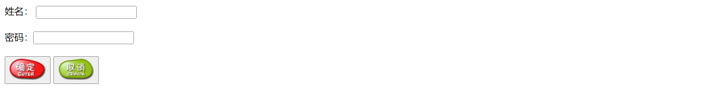

`<button>` 标记用于定义一个按钮，在该标记的内部可以包含普通文本、文本格式化标签和图像等内容。这也是 `<button>` 按钮和 `<input>` 按钮的不同之处。

`<button>` 标记可以指定 `id`、`style`、`class` 等核心属性，也可以指定 `onclick` 等事件属性。除此之外，还可以指定以下几个属性。　

+ `disabled`
  指定是否禁用该按钮。该属性值只能是 `disabled`，或者省略这个属性值。　

+ `name`
  指定该按钮的唯一名称。该属性值通常与 `id` 属性值保持一致。　

+ `type`
  指定该按钮属于哪种按钮，该属性值只能是 `button`、`reset` 或 `submit` 其中之一。　

+ `value`
  指定该按钮的初始值。该值可以通过脚本进行修改。

**示例代码：**

```html
<!DOCTYPE html>
<html>
<head>
<meta charset="utf-8">
<title>button按钮的应用</title>
</head>
<body>
<form action="" method="post" name="invest">
    <label for="username">姓名：</label>
	<input type="text" name="username" id="username" size="20" />
    <br /><br />
    <label>密码：<input type="password" name="password" id="password" /></label>
	<br /><br />
	<button type="submit"></button>
	<button type="reset"></button>
</form>
</body>
</html>
```

运行效果如下：

