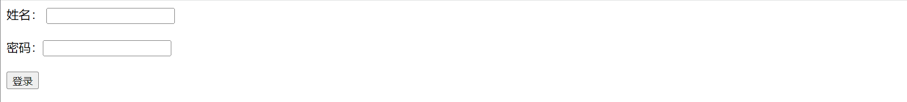

`<label>` 标记用于在表单元素中定义标签，这些标签可以对其他一些表单控件元素（如单行文本框、密码框等）进行说明。

`<label>` 标记可以指定 `id`、`style`、`class` 等核心属性，也可以指定 `onclick` 等事件属性。除此之外，`<label>` 标记还有一个for属性，该属性指定 `<label>` 标记与哪个表单控件相关联。

虽然 `<label>` 标记定义的标签只是输出普通的文本，但 `<label>` 标记生成的标签还有一个另外的作用，那就是当用户单击 `<label>` 生成的标签时，和该标签关联的表单控件元素就会获得焦点。也就是说，当用户选择 `<label>` 元素所生成的标签时，浏览器会自动将焦点转移到和该标签相关联的表单控件元素上。

使标签和表单控件相关联主要有两种方式。　

+ 隐式关联
  使用 `for` 属性，指定 `<label>` 标记的 `for` 属性值为所关联的表单控件的 `id` 属性值。　

+ 显式关联
  将普通文本、表单控件一起放在 `<label>` 标记内部即可。

**示例代码：**

```html
<!DOCTYPE html>
<html>
<head>
<meta charset="utf-8">
<title>标签和表单控件相关联</title>
</head>
<body>
<form action="" method="post" name="invest">
    <label for="username">姓名：</label>
	<input type="text" name="username" id="username" size="20" />
    <br /><br />
    <label>密码：<input type="password" name="password" id="password" /></label>
	<br /><br />
	<input type="submit" value="登录" />
</form>
</body>
</html>
```

运行效果如下：

