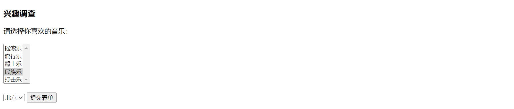

菜单和列表都是通过 `<select>` 和 `<option>` 标记来实现的。

**语法：**

```html
<select name="下拉菜单的名称">
    <option value="" selected="selected">选项显示内容</option>
    <option value="选项值">选项显示内容</option>
    ......
</select>
```

<center><b>菜单和列表标记属性</b></center>

| 菜单和列表标记属性 | 描述             |
| ------------------ | ---------------- |
| name               | 菜单和列表的名称 |
| size               | 显示的选项数目   |
| multiple           | 列表中的项目多选 |
| value              | 选项值           |
| selected           | 默认选项         |

**示例代码：**

```html
<!DOCTYPE html>
<html>
<head>
<meta charset="utf-8">
<title>插入表单</title>
</head>
<body>
<h3>兴趣调查</h3>
<form action="mailto:mingrisoft@mingrisoft.com" method="post" name="invest">
	请选择你喜欢的音乐：<br /><br />
      <select name="music" size="5" multiple="multiple">
        <option value="rock" selected="selected">摇滚乐 </option>
        <option value="rock">流行乐 </option>
        <option value="rock">爵士乐 </option>
        <option value="rock">民族乐 </option>
        <option value="dj">打击乐 </option>
    </select>
      <br /><br />
      <select name="city">
      	<option value="beijing" selected="selected">北京
        <option value="shanghai" >上海
        <option value="nangjing">南京
        <option value="changchun">长春
       </select>
 <input type="submit" name="submit" value="提交表单" />
 </form>
</body>
</html>
```

运行效果如下：

