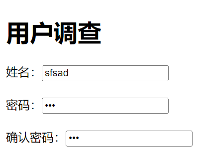

[toc]

### 1. 文字字段——text

`text` 属性值用来设定在表单的文本域中输入任何类型的文本、数字或字母。输入的内容以单行显示。

**语法：**

```html
<input type="text" name="控件名称" size="控件的长度" maxlength="最长字符数" value="文字字段的默认取值" />
```

**示例代码：**

```html
<!DOCTYPE html>
<html>
<head>
    <meta charset="utf-8">
    <title>设定表单的名称</title>
</head>
<body>
<h1>用户调整</h1>
<form action="mail;mingri@qq.com" method="get" name="register">
    姓名：<input type="text" name="username" size="20" />
    <br /><br />
    网址：<input type="text" name="URL" size="20" maxlength="50" value="http://" />
</form>
</body>
</html>
```

运行效果如下：


### 2. 密码域 —— password

在表单中还有一种文本域的形式为密码域，输入到文本域中的文字均以星号 “*” 或圆点显示。

**语法：**

```html
<input type="password" name="控件名称" size="控件的长度" maxlenth="最长字符数" value="文字字段的默认值" />
```

其中，`name`、`size`、`maxlength` 参数是必选。

**示例代码：**

```html
<!DOCTYPE html>
<html>
<head>
    <meta charset="utf-8">
    <title>插入密码域</title>
</head>
<body>
<h1>用户调查</h1>
<form action="mail;mingri@qq.com" method="get" name="register">
    姓名：<input type="text" name="usernamr" size="20" />
    <br /><br />
    密码：<input  type="password" name="password" size="20" maxlength="8" />
    <br /><br />
    确认密码：<input type="password" name="qupassword" size="20" maxlength="8" />
</form>
</body>
</html>
```

运行效果如下：



下面就是一个使密码域更安全的一个实例。在实例中，主要是通过控制密码域的 `oncopy`、`oncut` 和 `onpaste` 事件来实现密码域的内容禁止复制的功能，并通过改变其 `style` 样式属性来实现改变密码域中掩码的样式。

（1）在页面中添加密码域，代码如下。

```html
<input name="txt_passwd" type="password" class="textbox" id="txt_passwd" size="12" maxlength="50">
```

（2）添加代码禁止用户复制、剪切和粘贴密码，代码如下。

```html
 <input name="txt_passwd" type="password" class="textbox" id="txt_passwd" size="12" maxlength="50" oncopy=
"return false" oncut="return false" onpaste="return false">
```

（3）改变密码域的掩码样式，将style属性中的font-family设置为Wingdings，代码如下。

```html
<input name="txt_passwd" type="password" class="textbox" id="txt_passwd" size="12" maxlength="50" oncopy=
    "return false" oncut="return false" onpaste="return false" style="font-family:Wingdings;">
```

运行效果如下：


### 3. 单选按钮 —— radio

**语法：**

```html
<input type="radio" value="单选按钮的取值" name="单选按钮名称" checked="checked" />
```

在该语法中，`checked` 属性表示这一单选按钮默认被选中，而在一个单选按钮组中只能有一项单选按钮控件设置为 `checked`。`value` 则用来设置用户选中该项目后，传送到处理程序中的值。

**示例代码：**

```html
<!DOCTYPE html>
<html>
<head>
    <meta charset="utf-8">
    <title>在表单中添加单选按钮</title>
</head>
<body>
<h2>心理小测试：测试你得心智</h2>
<hr>
在冬日的下午，你一个人在散步，这时你最希望看到什么景色？
<hr/>
<form action="" name="xlcs" method="post">
    <input type="radio" value="answerA" name="test" />在沙滩上晒太阳的螃蟹　
    <br />
    <input type="radio" value="answerB" name="test"/>风中摇曳的红枫
    <br />
    <input type="radio" value="answerC" name="test"/>美丽善良的采茶姑娘
    <br />
    <input type="radio" value="answerD" name="test"/>在空中飞行的一对黑鹤
</form>
</body>
</html>
```

运行效果如下：


### 4. 复选框 —— checkbox

**语法：**

```html
<input type="checkbox" value="复选框的值" name="名称" checked="checked" />
```

**示例代码：**

```html
<!DOCTYPE html>
<html>
<head>
    <meta charset="utf-8">
    <title>在表单中添加复选框</title>
</head>
<body>
<form action="" name="fxk" method="post">
    <h4>Question：测验:以下几种方便面你最喜欢哪种?</h4>
    <input type="checkbox" value="A1" name="test"/>鲜虾鱼板面
    <input type="checkbox" value="A2" name="test"/>红烧牛肉面
    <input type="checkbox" value="A3" name="test"/>香菇炖鸡面
    <input type="checkbox" value="A4" name="test"/>梅菜扣肉面
    <input type="checkbox" value="A5" name="test"/>番茄牛肉面
    <input type="checkbox" value="A6" name="test"/>红烧排骨面
</form>
</body>
</html>
```

运行效果如下：


### 5. 普通按钮 —— button

**语法：**

```html
<input type="button" value="按钮的取值" name="按钮名" onclick="处理程序" />
```

`value` 参数的取值就是显示在按钮上面的文字，而在 `button` 中可以通过添加 `onclick` 参数来实现一些特殊的功能，`onclick` 参数是设置当鼠标按下按钮时所进行的处理。

**示例代码：**

```html
<!DOCTYPE html>
<html>
<head>
    <meta charset="utf-8">
    <title>在表单中添加普通按钮</title>
</head>
<body>
下面是几个有不同功能的按钮：<br/><br/>
<form name="ptan" action="" method="post">
    <!--在页面中添加一个普通按钮-->
    <input type="button" value="普通按钮" name="buttom1" />
    <!--在页面中添加一个关闭当前窗口-->
    <input type="button" value="关闭当前窗口" name="close" onclick="window.close()"/>
    <!--在页面中添加一个打开新窗口的按钮-->
    <input type="button" value="打开窗口" name="opennew" onclick="window.open()" />
</form>
</body>
</html>
```

运行效果如下：


### 6. 提交按钮 —— submit

提交按钮是一种特殊的按钮，不需要设置 `onclick` 参数，在单击该类按钮时可以实现表单内容的提交。

**语法：**

```html
<input type="submit" name="按钮名" value="按钮的取值" />
```

`value` 用于设置按钮上显示的文字。

**示例代码：**

```html
<!DOCTYPE html>
<html>
<head>
<meta charset="utf-8">
<title>插入表单</title>
</head>

<body>
	<form action="mailto:mingrisoft@mingrisoft.com" method="post" name="invest" enctype="text/plain">
    姓名：<input type="text" name="username" size="20" /><br /><br/>
    网址：<input type="text" name="URL" size="20" maxlength="50" value="http://" /><br/><br/>
    密码：<input type="password" name="password" size="20" maxlength="8" /><br /><br/>
    确认密码：<input type="password" name="qurpassword" size="20" maxlength="8" /><br/><br/>
    请选择你喜欢的音乐：
    <input type="checkbox" name="m1" value="rock"/>摇滚乐
    <input type="checkbox" name="m2" value="jazz"/>爵士乐
    <input type="checkbox" name="m3" value="pop"  />流行乐<br/><br/>
    请选择你居住的城市：
    <input type="radio" name="city" value="beijing"  />北京
    <input type="radio" name="city" value="shanghai"  />上海
    <input type="radio" name="city" value="nanjing"  />南京<br/><br/>
    <input type="submit" name="submit" value="提交表单" />
    </form>
</body>
</html>
```

运行效果如下：


### 7. 重置按钮 —— reset

单击重置按钮后，可以清除表单的内容，恢复默认的表单内容设定。

**语法：**

```html
<input type="reset" name="按钮名" value="按钮的取值" />
```

**示例代码：**

```html
<!DOCTYPE html>
<html>
<head>
<meta charset="utf-8">
<title>无标题文档</title>
</head>
<body>
<form action="mailto:mingrisoft@mingrisoft.com" method="post" name="invest" enctype="text/plain">
    姓名：<input type="text" name="username" size="20" /><br /><br/>
    网址：<input type="text" name="URL" size="20" maxlength="50" value="http://" /><br/><br/>
    密码：<input type="password" name="password" size="20" maxlength="8" /><br /><br/>
    确认密码：<input type="password" name="qurpassword" size="20" maxlength="8" /><br/><br/>
    请选择你喜欢的音乐：
    <input type="checkbox" name="m1" value="rock"/>摇滚乐
    <input type="checkbox" name="m2" value="jazz"/>爵士乐
    <input type="checkbox" name="m3" value="pop"  />流行乐<br/><br/>
    请选择你居住的城市：
    <input type="radio" name="city" value="beijing"  />北京
    <input type="radio" name="city" value="shanghai"  />上海
    <input type="radio" name="city" value="nanjing"  />南京<br/><br/>
    <input type="reset"name="cx" value="重置按钮" />
    </form>
</body>
</html>
```

运行效果如下：


### 8. 图像域 —— image

图像域是指可以用在提交按钮位置上的图片，这幅图片具有按钮的功能。

**语法：**

```html
<input type="image" src="图像地址" name="图像域名称" />
```

**示例代码：**

```html
<!DOCTYPE html>
<html>
<head>
<meta charset="utf-8">
<title>无标题文档</title>
</head>
<body>
<form action="mailto:mingrisoft@mingrisoft.com" method="post" name="invest" enctype="text/plain">
    姓名：<input type="text" name="username" size="20" /><br /><br/>
    网址：<input type="text" name="URL" size="20" maxlength="50" value="http://" /><br/><br/>
    密码：<input type="password" name="password" size="20" maxlength="8" /><br /><br/>
    确认密码：<input type="password" name="qurpassword" size="20" maxlength="8" /><br/><br/>
    请选择你喜欢的音乐：
    <input type="checkbox" name="m1" value="rock"/>摇滚乐
    <input type="checkbox" name="m2" value="jazz"/>爵士乐
    <input type="checkbox" name="m3" value="pop"  />流行乐<br/><br/>
    请选择你居住的城市：
    <input type="radio" name="city" value="beijing"  />北京
    <input type="radio" name="city" value="shanghai"  />上海
    <input type="radio" name="city" value="nanjing"  />南京<br/><br/>
    <input type="image" src="images/11.png" name="image1" />
    <input type="image" src="images/22.png" name="image2" />
    </form>
</body>
</html>
```

运行效果如下：


### 9. 隐藏域 —— hidden

表单中的隐藏域主要用来传递一些参数，而这些参数不需要在页面中显示。当用户提交表单时，隐藏域的内容会一起提交给处理程序。

**语法：**

```html
<input type="hidden" name="隐藏域名字" value="提交的值" />
```

**示例代码：**

```html
<!DOCTYPE html>
<html>
<head>
<meta charset="utf-8">
<title>无标题文档</title>
</head>
<body>
<form action="mailto:mingrisoft@mingrisoft.com" method="post" name="invest" enctype="text/plain">
    姓名：<input type="text" name="username" size="20" /><br /><br/>
    网址：<input type="text" name="URL" size="20" maxlength="50" value="http://" /><br/><br/>
    密码：<input type="password" name="password" size="20" maxlength="8" /><br /><br/>
    确认密码：<input type="password" name="qurpassword" size="20" maxlength="8" /><br/><br/>
    请选择你喜欢的音乐：
    <input type="checkbox" name="m1" value="rock"/>摇滚乐
    <input type="checkbox" name="m2" value="jazz"/>爵士乐
    <input type="checkbox" name="m3" value="pop"  />流行乐<br/><br/>
    请选择你居住的城市：
    <input type="radio" name="city" value="beijing"  />北京
    <input type="radio" name="city" value="shanghai"  />上海
    <input type="radio" name="city" value="nanjing"  />南京<br/><br/>
    <input type="image" src="images/11.png" name="image1" />
    <input type="image" src="images/22.png" name="image2" />
    <input type="hidden" name="from" value="invest" />
    </form>
</body>
</html>
```

### 10. 文件域 —— file

文件域在上传文件时常常用到，它用于查找硬盘中的文件路径，然后通过表单将选中的文件上传。在设置电子邮件、上传头像、发送文件时常常会看到这一控件。

**语法：**

```html
<input type="file" name="文件域的名称" />
```

**示例代码：**

```html
<!DOCTYPE html>
<html>
<head>
<meta charset="utf-8">
<title>插入表单</title>
</head>

<body>
	<form action="mailto:mingrisoft@mingrisoft.com" method="post" name="invest" enctype="text/plain">
    姓名：<input type="text" name="username" size="20" /><br /><br/>
    网址：<input type="text" name="URL" size="20" maxlength="50" value="http://" /><br/><br/>
    密码：<input type="password" name="password" size="20" maxlength="8" /><br /><br/>
    确认密码：<input type="password" name="qurpassword" size="20" maxlength="8" /><br/><br/>
    请上传你的照片：<input type="file" name="file" /><br/><br/>
    请选择你喜欢的音乐：
    <input type="checkbox" name="m1" value="rock"/>摇滚乐
    <input type="checkbox" name="m2" value="jazz"/>爵士乐
    <input type="checkbox" name="m3" value="pop"  />流行乐<br/><br/>
    请选择你居住的城市：
    <input type="radio" name="city" value="beijing"  />北京
    <input type="radio" name="city" value="shanghai"  />上海
    <input type="radio" name="city" value="nanjing"  />南京<br/><br/>
    <input type="image" src="images/11.png" name="image1" />
    <input type="image" src="images/22.png" name="image2" />
    </form>
</body>
</html>
```

