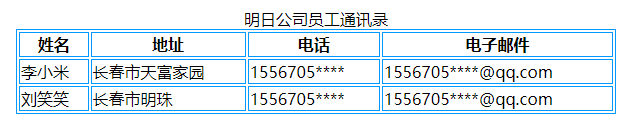
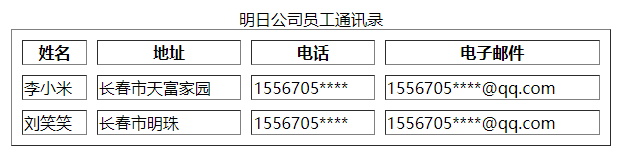
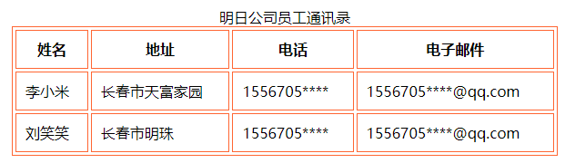

[toc]

<center><b>表格标记</b></center>

| 标记                 | 描述       |
| -------------------- | ---------- |
| `<table>...</table>` | 表格标记   |
| `<tr>...</tr>`       | 行标记     |
| `<td>...</td>`       | 单元格标记 |

### 1. 表格的基本构成——table、tr、td

在表格中一般通过3个标记来构建，分别是表格标记、行标记和单元格标记。其中，表格标记是 `<table>...</table>`，表格的其他各种属性都要在表格的开始标记 `<table>` 和表格的结束标记 `</table>` 之间才有效。

#### 1.1 语法

```html
<table>
    <tr>
    	<td>单元格内的文字</td>
        <td>单元格内的文字</td>
        ......
	</tr>
    <tr>
    	<td>单元格内的文字</td>
        <td>单元格内的文字</td>
        ......
	</tr>
    ......
</table>
```

#### 1.2 示例代码

```html
<!DOCTYPE html>
<html>
<head>
<meta charset="utf-8">
<title>设置表格边框颜色</title>
</head>
<body>
<table align="center" width="600" border="1" bordercolor="#0099FF">
	<caption>明日公司员工通讯录</caption>
    <tr>
    	<th>姓名</th>
    	<th>地址</th>
    	<th>电话</th>
    	<th>电子邮件</th>
    </tr>
	<tr>
    	<td>李小米</td>
    	<td>长春市天富家园</td>
    	<td>1556705****</td>
    	<td>1556705****@qq.com</td>
    </tr>
    <tr>
    	<td>刘笑笑</td>
   		<td>长春市明珠</td>
    	<td>1556705****</td>
    	<td>1556705****@qq.com</td>
    </tr>
</table>
</body>
</html>
```

运行效果如下：



### 2. 设置表格的标题——caption

可以通过 `caption` 来设置一种特殊的单元格——标题单元格。表格的标题一般位于整个表格的第一行，为表格标识一个标题行，如同在表格上方加一个没有边框的行，通常用来存放表格标题。

#### 2.1 语法

```html
<caption>表格的标题</caption>
```

#### 2.2 示例代码

```html
<!DOCTYPE html>
<html>
<head>
<meta charset="utf-8">
<title>设置表格内框宽度</title>
</head>
<body>
<table align="center" width="600" cellspacing="10"  border="1">
	<caption>明日公司员工通讯录</caption>
    <tr>
    <th>姓名</th>
    <th>地址</th>
    <th>电话</th>
    <th>电子邮件</th>
    </tr>
	<tr>
    <td>李小米</td>
    <td>长春市天富家园</td>
    <td>1556705****</td>
    <td>1556705****@qq.com</td>
    </tr>
    <tr>
    <td>刘笑笑</td>
    <td>长春市明珠</td>
    <td>1556705****</td>
    <td>1556705****@qq.com</td>
    </tr>
</table>
</body>
</html>
```

运行效果如下：



### 3. 表格的表头——th

在表格中还有一种特殊的单元格，称为表头。表格的表头一般位于第一行，用来表明这一行的内容类别，用 `<th>` 和 `</th>` 标记来表示。表格的表头与 `<td>` 标记使用方法相同，但是表头的内容是加粗显示的。

#### 3.1 语法

```html
<table>
    <tr>
    	<td>表格的表头</td>
        <td>表格的表头</td>
        ......
	</tr>
    <tr>
    	<td>单元格内的文字</td>
        <td>单元格内的文字</td>
        ......
	</tr>
    ......
</table>
```

#### 3.2 示例代码

```html
<!DOCTYPE html>
<html>
<head>
<meta charset="utf-8">
<title>设置表格文字与边框内框宽度</title>
</head>

<body>
<table align="center" border="1" bordercolor="#FF6633" width="600" cellspacing="3"  cellpadding="10">
	<caption>明日公司员工通讯录</caption>
    <tr>
    <th>姓名</th>
    <th>地址</th>
    <th>电话</th>
    <th>电子邮件</th>
    </tr>
	<tr>
    <td>李小米</td>
    <td>长春市天富家园</td>
    <td>1556705****</td>
    <td>1556705****@qq.com</td>
    </tr>
    <tr>
    <td>刘笑笑</td>
    <td>长春市明珠</td>
    <td>1556705****</td>
    <td>1556705****@qq.com</td>
    </tr>
</table>

</body>
</html>
```

运行效果如下：

