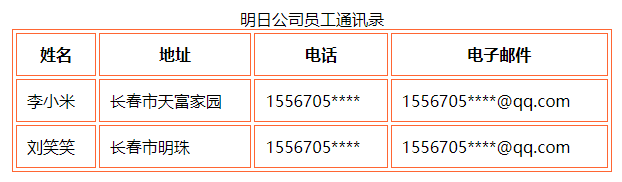

[toc]

### 1. 设置表格宽度——width

默认情况下，表格的宽度是根据内容自动调整的，我们也可以手动设置表格的宽度。

#### 1.1 语法

```html
<table width="表格宽度">
    ......
</table>
```

表格宽度的值可以是具体的像素数，也可以设置为浏览器的百分比数。

#### 1.2 示例代码

```html
<!DOCTYPE html>
<html>
<head>
<meta charset="utf-8">
<title>设置表格文字与边框内框宽度</title>
</head>

<body>
<table align="center" border="1" bordercolor="#FF6633" width="600" cellspacing="3"  cellpadding="10">
	<caption>明日公司员工通讯录</caption>
    <tr>
    <th>姓名</th>
    <th>地址</th>
    <th>电话</th>
    <th>电子邮件</th>
    </tr>
	<tr>
    <td>李小米</td>
    <td>长春市天富家园</td>
    <td>1556705****</td>
    <td>1556705****@qq.com</td>
    </tr>
    <tr>
    <td>刘笑笑</td>
    <td>长春市明珠</td>
    <td>1556705****</td>
    <td>1556705****@qq.com</td>
    </tr>
</table>

</body>
</html>
```

运行效果如下：



### 2. 设置表格高度——height

#### 2.1 语法

```html
<table height="表格高度">
    ......
</table>
```

##### 2.2 示例代码

```html
<!DOCTYPE html>
<html>
    <head>
        <title>设置表格高度</title>
    </head>
    <body>
        <!-- 设置表格的宽度为 400，高度为 400 -->
        <table width="400" height="400">
            <caption>期中考试成绩表</caption>
            <tr>
            	<th>姓名</th>
                <th>语文</th>
                <th>数学</th>
                <th>英语</th>
                <th>物理</th>
                <th>化学</th>
            </tr>
            <tr>
            	<td>李 1</td>
                <td>94</td>
                <td>89</td>
                <td>87</td>
                <td>56</td>
                <td>97</td>
            </tr>
            <tr>
            	<td>孙 2</td>
                <td>94</td>
                <td>87</td>
                <td>84</td>
                <td>86</td>
                <td>87</td>
            </tr>
            <tr>
            	<td>王 1</td>
                <td>82</td>
                <td>84</td>
                <td>87</td>
                <td>86</td>
                <td>77</td>
            </tr>
        </table>
    </body>
</html>
```

### 3. 设置表格对齐方式——align

#### 3.1 语法

```html
<table align="表格对齐方式">
    ......
</table>
```

`align` 参数可以取值为 `left`（左对齐）、`center`（居中）或者 `right`（右对齐）。

#### 3.2 示例代码

```html
<!DOCTYPE html>
<html>
    <head>
        <title>设置表格对齐方式</title>
    </head>
    <body>
        <table align="center" width="600">
            <caption>明日公司员工通讯录</caption>
            <tr>
            	<th>姓名</th>
                <th>地址</th>
                <th>电话</th>
                <th>电子邮件</th>
            </tr>
            <tr>
            	<td>李小米</td>
                <td>长春市天富家园</td>
                <td>1556705****</td>
                <td>1556705****@qq.com</td>
            </tr>
            <tr>
            	<td>刘笑笑</td>
                <td>长春市明珠</td>
                <td>1895845****</td>
                <td>1895845****@qq.com</td>
            </tr>
        </table>
    </body>
</html>
```

### 
