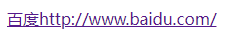

可以使用 `content` 属性把超链接的 URL 字符串动态显示在页面中，代码如下：

```html
<!doctype html>
<html>
    <head>
        <meta charset="utf-8">
        <style type="text/css">
            a:after {
               content: attr(href);
            }
        </style>
    </head>
    <body>
    	<a  href="http://www.baidu.com/">百度</a>
    </body>
</html>
```

运行效果如下：

