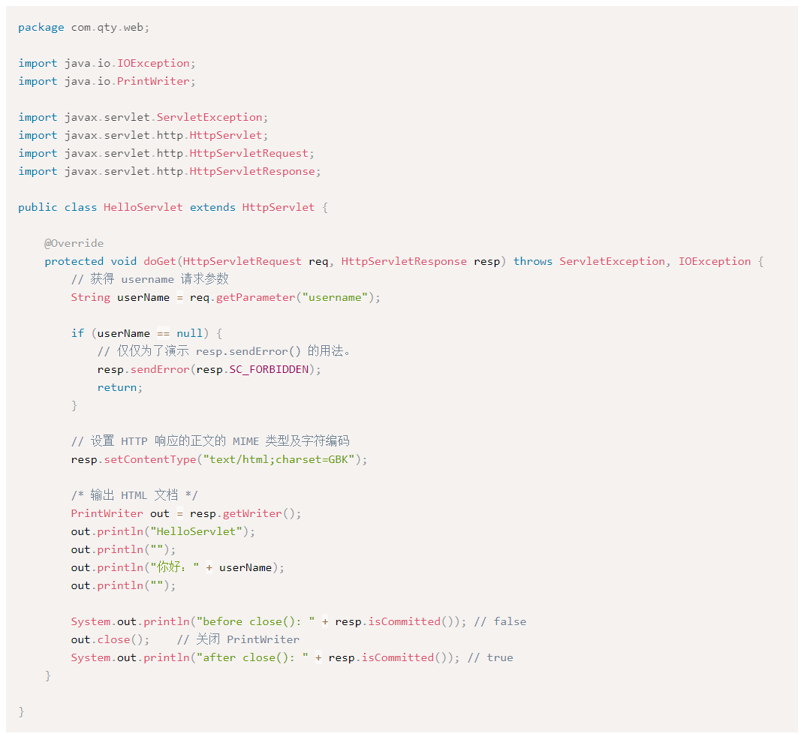
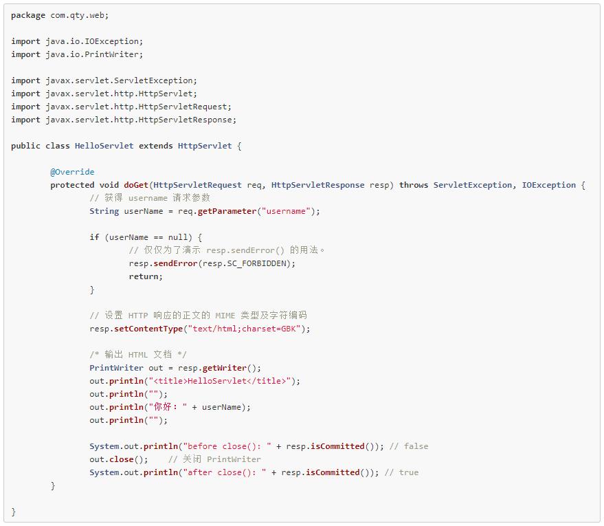
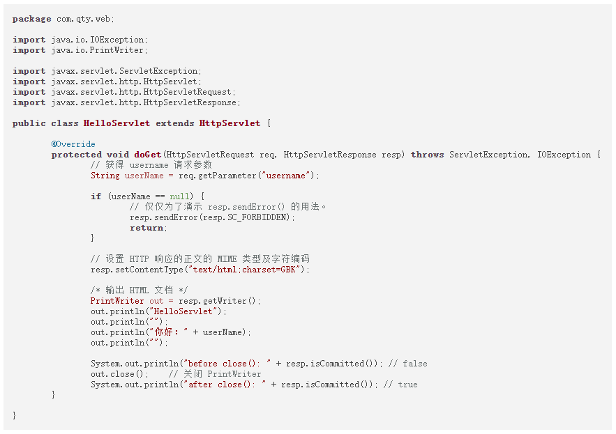
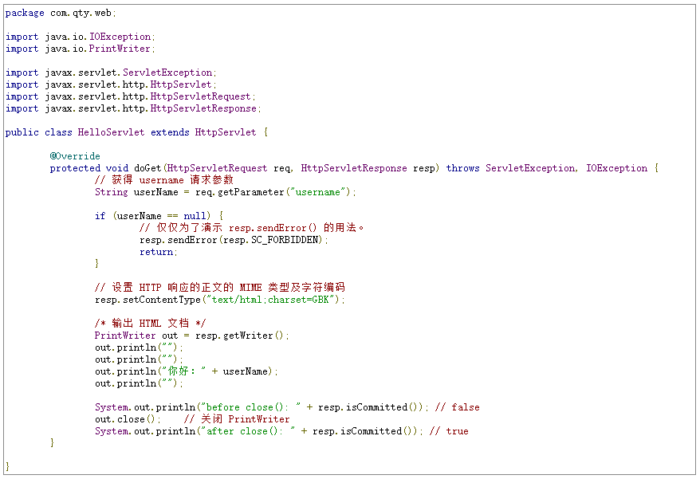
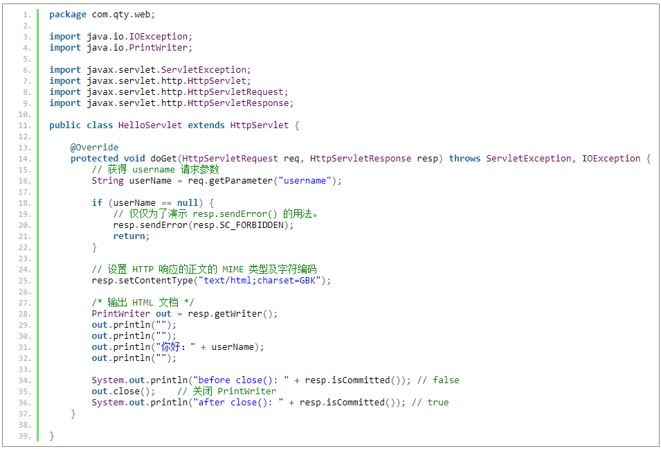

[toc]

### 1. Prism

官网地址：<https://prismjs.com/index.html>

官方文档网站：<https://prismjs.com/index.html#basic-usage>

示例代码：

```html
<!DOCTYPE html>
<html>
	<head>
		<title>Prism Test</title>
		<link rel="stylesheet" href="prism-default.css" />
		<style type="text/css">
			::-webkit-scrollbar {display: none;}
		</style>
	</head>
	<body>
		<div>
		<pre><code class="language-java">package com.qty.web;

import java.io.IOException;
import java.io.PrintWriter;

import javax.servlet.ServletException;
import javax.servlet.http.HttpServlet;
import javax.servlet.http.HttpServletRequest;
import javax.servlet.http.HttpServletResponse;

public class HelloServlet extends HttpServlet {
	
	@Override
	protected void doGet(HttpServletRequest req, HttpServletResponse resp) throws ServletException, IOException {
		// 获得 username 请求参数
		String userName = req.getParameter("username");
		
		if (userName == null) {
			// 仅仅为了演示 resp.sendError() 的用法。
			resp.sendError(resp.SC_FORBIDDEN);
			return;
		}
		
		// 设置 HTTP 响应的正文的 MIME 类型及字符编码
		resp.setContentType("text/html;charset=GBK");
		
		/* 输出 HTML 文档 */
		PrintWriter out = resp.getWriter();
		out.println("<html><head><title>HelloServlet</title></head>");
		out.println("<body>");
		out.println("你好：" + userName);
		out.println("</body></html>");
		
		System.out.println("before close(): " + resp.isCommitted()); // false
		out.close();	// 关闭 PrintWriter
		System.out.println("after close(): " + resp.isCommitted()); // true
	}

}</code></pre>
	<script src="prism.js"></script>
	</body>
</html>
```

运行效果如下：



### 2. Rainbow

官方网站：<https://craig.is/making/rainbows>

源代码网址：<https://github.com/ccampbell/rainbow/tree/master>

CSS 文件下载网址：<https://github.com/ccampbell/rainbow/tree/master/themes/css>

示例代码：

```html
<!-- https://prismjs.com/index.html -->
<!DOCTYPE html>
<html>
	<head>
		<title>Rainbow Test</title>
		<link rel="stylesheet" href="github.css" />
		<style type="text/css">
			::-webkit-scrollbar {display: none;}
		</style>
	</head>
	<body>
		<div>
		<pre><code data-language="java">package com.qty.web;

import java.io.IOException;
import java.io.PrintWriter;

import javax.servlet.ServletException;
import javax.servlet.http.HttpServlet;
import javax.servlet.http.HttpServletRequest;
import javax.servlet.http.HttpServletResponse;

public class HelloServlet extends HttpServlet {
	
	@Override
	protected void doGet(HttpServletRequest req, HttpServletResponse resp) throws ServletException, IOException {
		// 获得 username 请求参数
		String userName = req.getParameter("username");
		
		if (userName == null) {
			// 仅仅为了演示 resp.sendError() 的用法。
			resp.sendError(resp.SC_FORBIDDEN);
			return;
		}
		
		// 设置 HTTP 响应的正文的 MIME 类型及字符编码
		resp.setContentType("text/html;charset=GBK");
		
		/* 输出 HTML 文档 */
		PrintWriter out = resp.getWriter();
		out.println("<html><head><title>HelloServlet</title></head>");
		out.println("<body>");
		out.println("你好：" + userName);
		out.println("</body></html>");
		
		System.out.println("before close(): " + resp.isCommitted()); // false
		out.close();	// 关闭 PrintWriter
		System.out.println("after close(): " + resp.isCommitted()); // true
	}

}</code></pre>
	<script src="rainbow-custom.min.js"></script>
	</body>
</html>
```

运行效果如下：



### 3. Highlight

官方网站：<https://highlightjs.readthedocs.io/en/latest/index.html>

使用文档：<https://highlightjs.readthedocs.io/en/latest/readme.html#in-the-browser>

示例代码：

```html
<!DOCTYPE html>
<html>
	<head>
		<title>Highlight Test</title>
		<link rel="stylesheet" href="https://cdn.jsdelivr.net/gh/highlightjs/cdn-release@11.8.0/build/styles/default.min.css">
		<script src="https://cdn.jsdelivr.net/gh/highlightjs/cdn-release@11.8.0/build/highlight.min.js"></script>
	</head>
	<body>
		<pre><code class="language-java">package com.qty.web;

import java.io.IOException;
import java.io.PrintWriter;

import javax.servlet.ServletException;
import javax.servlet.http.HttpServlet;
import javax.servlet.http.HttpServletRequest;
import javax.servlet.http.HttpServletResponse;

public class HelloServlet extends HttpServlet {
	
	@Override
	protected void doGet(HttpServletRequest req, HttpServletResponse resp) throws ServletException, IOException {
		// 获得 username 请求参数
		String userName = req.getParameter("username");
		
		if (userName == null) {
			// 仅仅为了演示 resp.sendError() 的用法。
			resp.sendError(resp.SC_FORBIDDEN);
			return;
		}
		
		// 设置 HTTP 响应的正文的 MIME 类型及字符编码
		resp.setContentType("text/html;charset=GBK");
		
		/* 输出 HTML 文档 */
		PrintWriter out = resp.getWriter();
		out.println("<html><head><title>HelloServlet</title></head>");
		out.println("<body>");
		out.println("你好：" + userName);
		out.println("</body></html>");
		
		System.out.println("before close(): " + resp.isCommitted()); // false
		out.close();	// 关闭 PrintWriter
		System.out.println("after close(): " + resp.isCommitted()); // true
	}

}</code></pre>
		<script>hljs.highlightAll();</script>
	</body>
</html>
```

运行效果如下：



运行效果如下：



### 4. Google Code Prettify

官方网站：<https://github.com/googlearchive/code-prettify>

样式下载地址：<https://raw.githack.com/google/code-prettify/master/styles/index.html>

示例代码：

```html
<!DOCTYPE html>
<html>
	<head>
		<title>Google Code Prettify Test</title>
		<script src="https://cdn.jsdelivr.net/gh/google/code-prettify@master/loader/run_prettify.js"></script>
	</head>
	<body>
		<pre class="prettyprint lang-java">package com.qty.web;

import java.io.IOException;
import java.io.PrintWriter;

import javax.servlet.ServletException;
import javax.servlet.http.HttpServlet;
import javax.servlet.http.HttpServletRequest;
import javax.servlet.http.HttpServletResponse;

public class HelloServlet extends HttpServlet {
	
	@Override
	protected void doGet(HttpServletRequest req, HttpServletResponse resp) throws ServletException, IOException {
		// 获得 username 请求参数
		String userName = req.getParameter("username");
		
		if (userName == null) {
			// 仅仅为了演示 resp.sendError() 的用法。
			resp.sendError(resp.SC_FORBIDDEN);
			return;
		}
		
		// 设置 HTTP 响应的正文的 MIME 类型及字符编码
		resp.setContentType("text/html;charset=GBK");
		
		/* 输出 HTML 文档 */
		PrintWriter out = resp.getWriter();
		out.println("<html><head><title>HelloServlet</title></head>");
		out.println("<body>");
		out.println("你好：" + userName);
		out.println("</body></html>");
		
		System.out.println("before close(): " + resp.isCommitted()); // false
		out.close();	// 关闭 PrintWriter
		System.out.println("after close(): " + resp.isCommitted()); // true
	}

}</pre>
		<script>hljs.highlightAll();</script>
	</body>
</html>
```

### 5. jQuery Syntax Highlighter

源代码下载网址：<https://github.com/bevry-archive/jquery-syntaxhighlighter>

使用教程：<https://bevry-archive.github.io/jquery-syntaxhighlighter/demo/>

示例代码：

```html
<!DOCTYPE html>
<html>
	<head>
		<title>jQuery Syntax Highlighter  Test</title>
		<!-- Include jQuery (Syntax Highlighter Requirement) -->
		<script type="text/javascript" src="https://cdnjs.cloudflare.com/ajax/libs/jquery/1.4.2/jquery.min.js"></script>
		<!-- Include jQuery Syntax Highlighter -->
		<script type="text/javascript" src="https://bevry-archive.github.io/jquery-syntaxhighlighter/scripts/jquery.syntaxhighlighter.min.js"></script>
	</head>
	<body>
		<pre class="code language-javascript">package com.qty.web;

import java.io.IOException;
import java.io.PrintWriter;

import javax.servlet.ServletException;
import javax.servlet.http.HttpServlet;
import javax.servlet.http.HttpServletRequest;
import javax.servlet.http.HttpServletResponse;

public class HelloServlet extends HttpServlet {
	
	@Override
	protected void doGet(HttpServletRequest req, HttpServletResponse resp) throws ServletException, IOException {
		// 获得 username 请求参数
		String userName = req.getParameter("username");
		
		if (userName == null) {
			// 仅仅为了演示 resp.sendError() 的用法。
			resp.sendError(resp.SC_FORBIDDEN);
			return;
		}
		
		// 设置 HTTP 响应的正文的 MIME 类型及字符编码
		resp.setContentType("text/html;charset=GBK");
		
		/* 输出 HTML 文档 */
		PrintWriter out = resp.getWriter();
		out.println("<html><head><title>HelloServlet</title></head>");
		out.println("<body>");
		out.println("你好：" + userName);
		out.println("</body></html>");
		
		System.out.println("before close(): " + resp.isCommitted()); // false
		out.close();	// 关闭 PrintWriter
		System.out.println("after close(): " + resp.isCommitted()); // true
	}

}</code></pre>
		<!-- Initialise jQuery Syntax Highlighter -->
		<script type="text/javascript">$.SyntaxHighlighter.init();</script>
	</body>
</html>
```

运行效果如下：

