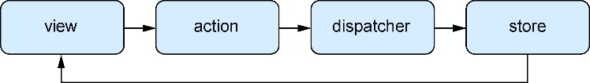

### 10.1　Flux应用架构

现代应用必须比以往做得更多，相应地也更加复杂——内部和外部都是如此。开发者们早就意识到缺乏一致设计的复杂应用的增长所造成的混乱。意大利面条似的代码不仅没有乐趣，还会拖慢开发者的开发进度，进而拖慢业务单元的进度。还记得上一次在满是一次性解决方案和jQuery插件的大型代码库中的工作吗？估计这不会有趣。为了对抗混乱，开发者们开发了MVC（模型-视图-控制器）这样的范式来组织应用的功能并指导开发。Flux（及其扩展Redux）与此相同，都是为了帮助开发者处理应用中不断增加的复杂性。

如果不是特别熟悉MVC范式，也不必担心，在本书中我们不会花太多时间讨论它。但为了便于比较，在讨论Flux和Redux之前，先简单讨论一下MVC。下面是一些基础知识。

+ 模型（model）——应用的数据。通常是像User、Account或Post这样的名词。模型至少应该拥有操作关联数据的基本方法。在最抽象的意义上，模型表示原始数据或知识。模型是数据与应用代码交互的地方。例如，数据库可能存储诸如 `accessScope` 、 `authenticated` 等属性。而模型能够在它上面的 `isAllowedAccessForResource()` 这样的方法中使用这些数据，这些方法将对模型的底层数据进行操作。模型是原始数据与应用代码汇聚的地方。
+ 视图（view）——模型的表示。视图通常是用户界面本身。视图中不应有任何与数据表示无关的逻辑。对于前端框架，这通常意味着特定视图直接与资源关联并具有与之关联的CRUD（创建、读取、更新、删除）操作。前端应用不再总按此方式构建。
+ 控制器（controller）——控制器是将模型和视图绑在一起的“黏合剂”。控制器通常应该只是黏合剂而不做更多的事情（例如，它们不应该包含复杂的视图或数据库逻辑）。一般来说，控制器对数据进行修改的能力应该远低于它们所交互的模型。

虽然本章重点讨论的范式（Flux和Redux）与这些概念大相径庭，但其目标仍是帮助开发者创建可伸缩的、合理的和有效的应用架构。

Redux的起源和设计要归功于Facebook内部流行的一种称为Flux的模式。如果熟悉Ruby on Rails和其他应用框架所使用的流行MVC模式，那么Flux可能与你习惯的模式有所不同。Flux没有将应用的各个部分分解为模型、视图和控制器，而是定义了若干不同部分。

+ store——store包含应用的状态和逻辑。它有点儿像传统MVC中的模型。然而，它们管理许多对象的状态，而不是表示单个数据库记录。与模型不同的是，开发者可以以任何合理的方式表示数据，不受资源的限制。
+ action——Flux应用程序并不是直接更新状态，而是通过创建修改状态的action来修改应用状态。
+ view——用户界面，通常是React，但Flux并不需要React。
+ dispatcher——对store进行操作和更新的一个中心化协调器。

图10-1展示了Flux的概览。

<b class="my_markdown">图10-1　一个简单的Flux概览</b>

如图10-1所示，在Flux模式中，action是从视图中创建的（可能是用户点击了某个东西），然后dispatcher处理传入的action，之后将action发送到适当的store中以更新状态。状态变化后，通知视图应该使用新数据（如果可以应用的话）。请注意这与典型MVC风格的框架有何不同，在MVC风格的框架中，视图和模型（如此处的store）都能够更新彼此。这种双向数据流不同于Flux架构中典型的更为单向的数据流。另外，请注意这里缺少中间件：尽管可以在Flux中创建中间件，但它不像在Redux中那样是一等公民，因此我们在这里省略了它。

如果之前开发过MVC风格的应用，其中一些内容听起来很熟悉，但数据流转方式可能就不是这样了。如前所述，数据在Flux范式中更多的是单向流动，这与MVC类型的实现倾向于使用的双向方式不同。这通常意味着应用中数据流没有单一的来源；系统的许多不同部分都有权修改状态，而且状态通常分散在整个应用中。这种方式在很多情况下都能很好地工作，但在较大的应用中，调试和使用时可能会令人费解。

想象一下，在一个中到大型的应用中，这会是什么情形。假设有一组模型（用户、账户和身份验证），它们与自己的控制器和视图相关联。在应用中的任何地方，都很难确定状态的确切位置，因为状态分布在应用的各个部分（可以在之前提到的3个模型中的任何一个中找到关于用户的信息）。

对较小的应用来说，这可能未必是问题，甚至可以在较大的应用上也能很好地工作，但在大型客户端应用中，它可能变得更加困难。例如，当需要在50个不同的位置修改模型的使用并且有60个不同的控制器需要了解状态的更改时，会发生什么情况？让事情变得更复杂的是，视图有时在某些前端框架中表现的就像模型一样（因此状态更为分散了）。数据的真实来源在哪里？如果它分散在视图和许多不同的模型中，并且所有这些都处于中等复杂的设置中，那么在心里跟踪所有内容将是很困难的。这还可能导致应用状态不一致，这会引发应用bug，因此这不只是一个“只有开发人员才面对”的问题，最终用户也会受到直接影响。

这之所以困难的部分原因在于，人们通常不善于推断随时间发生的变化。为了真正理解这个问题，想象脑海中有一个棋盘。在脑子里保持一张甚至几张棋盘的快照并不难，但能跟踪20个回合的每个棋盘快照吗？30回合呢？整局对弈呢？正因为在脑海中跟踪数据随时间的异步变化很困难，所以我们应该构建更易于我们思考和使用的系统。例如，考虑调用远程API并使用其数据更新应用状态。对数量较少的情况来说这很简单，但如果需要调用50个不同的API服务器端点并且需要跟踪进入的响应，与此同时用户仍在使用应用并进行可能引起更多API交互的改变时，那么会怎么样？很难在脑海中将它们梳理清楚并预测变化的结果。

你可能已经注意到React和Flux之间的一些相似性。它们都是相对较新的一种构建用户界面的方式而且都旨在改进开发人员使用的心智模型。在这两种方式中，变化应该很容易推断，并且开发者应该能够以一种增强而不是碍事的方式构建UI。

Flux在实际代码中是什么样子呢？它主要是一个范式，所以有很多库实现了Flux的核心思想。这些库在实现Flux的方式上略有不同。Redux也一样，尽管它独特的Flux风格已经获得了最多用户和关注。其他Flux库包括Flummox、Fluxxor、Reflux、Fluxible、Lux、McFly和MartyJS（尽管在实践中与Redux相比这些库使用得很少）。

