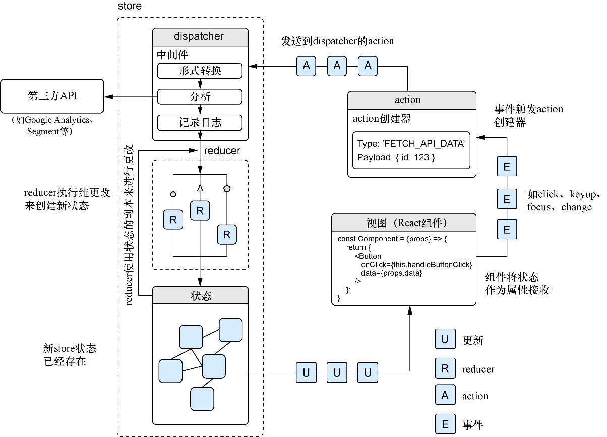

### 10.1.1　初识Redux：Flux的一个变种

也许Redux是实现Flux背后思想的使用最广泛且最知名的库。Redux这个库以稍加修改的方式实现了Flux的思想。Redux的文档将其描述为“JavaScript应用的可预测状态容器”。具体而言，这意味着它通过自己的方式将Flux的概念和思想付诸了实践。

确定Flux的确切定义在这里并不重要，重要的是我将介绍Flux和Redux范式之间的一些重要区别。

+ Redux使用单一的store——Redux应用没有在应用中的多个store中存放状态信息，而是将所有东西都保存在一个地方。Flux可以有多个不同的store。Redux打破了这一规则并强制使用单个全局store。
+ Redux引入了reducer——reducer以一种更不可变的方式进行变更。在Redux中，状态以一种确定的、可预测的方式被改变，一次只修改一部分状态，并且只发生在一个地方（全局store中）。
+ Redux引入了中间件——因为action和数据流是单向的，所以开发者可以在Redux应用中添加中间件，并在数据更新时注入自定义行为。
+ Redux的action与store不耦合——action创建器不会向store派发任何东西；相反，它们会返回中央调度器使用的action对象。

对你来说这些可能只是些细微差别，没关系——你的目标是学习Redux，而不是“找不同”。图10-2展示了Redux架构的概览。我们将深入每个不同的部分，探索它们如何工作，并为你的应用开发一个Redux架构。

<b class="my_markdown">图10-2　Redux概览</b>

如图10-2所示，action、store和reducer构成了Redux架构的主体。Redux使用一个中心化的状态对象，它以特定的、确定的方式进行更新。当开发者想要更新状态时（通常是由于单击之类的事件），一个action被创建出来。action具有特定reducer会处理的类型。处理给定action类型的reducer会生成当前状态的副本，使用来自action的数据对其进行修改，然后返回新状态。当更新store时，视图层（此处是React组件）可以监听更新并相应地作出响应。还要注意，图中的视图只是从store中读取更新——它们并不关心与其通信的数据。React-redux库会在store更改时将新的props传递给组件，但视图仍旧只是接收和显示数据。

