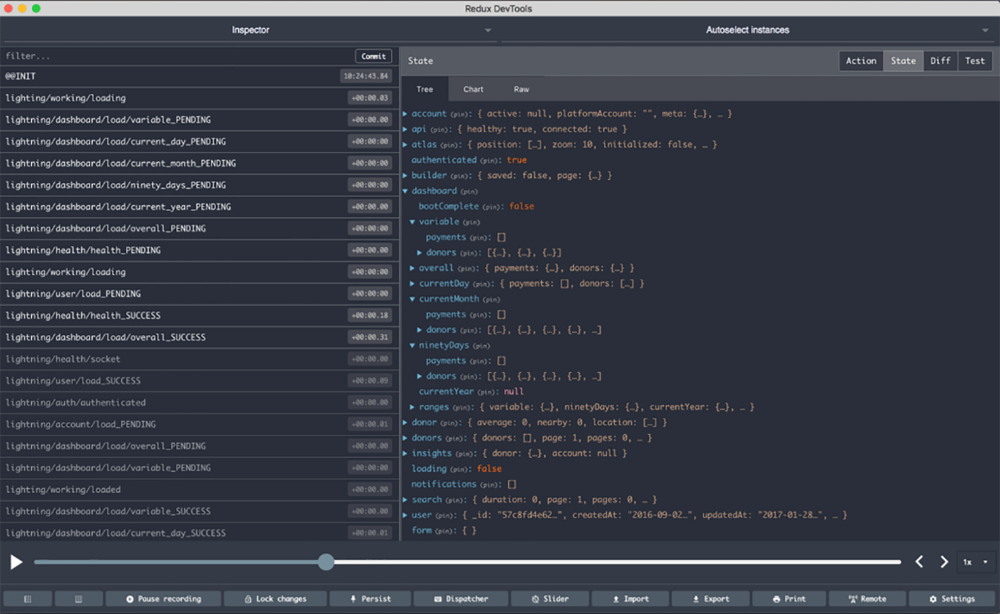

### 10.1.2　为Redux做准备

Redux是一种应用架构范式，它也是一个可安装的库。这是Redux超过“原始”Flux实现的一个方面。Flux范式有非常多的实现（如Flummox、Fluxxor、Reflux、Fluxible、Lux、McFly和MartyJS），它们都有不同程度的社区支持和不同的API。Redux拥有强大的社区支持，但Redux库本身的API却十分小巧而强大，这帮助它成为最受欢迎且最受倚重的React应用架构库之一。事实上，Redux与React一起使用的情况非常常见，以至于两个核心团队经常彼此交流，以确保兼容和知晓特性。有些人甚至同时身处两个团队，所以两个项目之间有着很好的可见性和良好的沟通。

为了设置好Redux从而使用它，需要做一些工作。

+ 确保使用当前章的源代码运行 `npm install` ，以便所有正确依赖被安装到本地。我们在本章将开始利用几个新库，包括 `js-cookie` 、 `rudux-mock-store` 和 `redux` 。
+ 安装Redux开发者工具。我们可以利用它们在浏览器中查看Redux的store和action。

Redux被设计为可预测的，这使得创建令人惊异的调试工具变得容易。Dan Abramov和其他致力于Redux和React库的工程师已经开发出了一些处理Redux应用的强大工具。因为Redux中的状态是以可预测的方式变化的，所以有可能用新方式进行调试：开发者可以跟踪应用状态的单个变化，检查变化之间的差异，甚至可以回退和重放应用状态随时间的变化。Redux Dev Tools扩展可以让使用者完成所有这些工作甚至更多，而且其被打包为浏览器扩展进行分发。图10-3快速窥探了Redux Dev Tools拥有的功能。

<b class="my_markdown">图10-3　Redux Dev Tools扩展将来自于Dan Abramov的流行的Redux Dev Tools库打包成一个
 方便的浏览器扩展。有了它，就可以回退和重放Redux应用，逐个查看变化，检查状态
 变化之间的差异，在一个区域检查整个应用的状态，生成测试样板，等等</b>

安装好扩展后，应该能在浏览器的工具栏中看到新开发工具的图标。在写作本书时，它仅会在开发模式下检测到Redux应用实例时才变为彩色的，所以如果访问的应用或网站没有使用Redux，扩展就不会起作用。不过一旦配置好应用，就会看到图标变成彩色的，并且点击它会打开这个工具。

