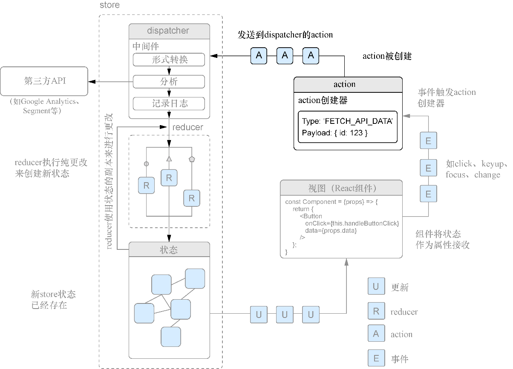

### 10.2　在Redux中创建action

在Redux中，action是将数据从应用发送给store的信息载体。除了action，store没有任何其他获取数据的方式。整个Redux应用使用action来发起数据变更，尽管action本身并不负责更新应用的状态（store）。reducer更多涉及应用状态的更新，我们将在action之后了解reducer。如果你习惯于按自己喜欢的方式更新应用状态，那么一开始可能不会喜欢action。它们可能需要一些时间来适应，但它们会让应用更容易预测、更容易调试。如果应用的数据更改方式受到严格的控制，就可以很容易地预测应用中什么应该改变而什么不应该改变。图10-4展示了action在更大图景中的位置。我们将从action开始，随后一路经过store、reducer，最后回到React来完成数据流。


<center class="my_markdown"><b class="my_markdown">图10-4　action是Redux应用获悉更改的方式；它们有类型信息和应用需要的任何额外信息</b></center>

Redux的action是什么样子？它是一个普通的旧式JavaScript对象（POJO），具有一个必需的type属性和用户期望的其他任意内容。type属性将被reducer和其他Redux工具用于将一组更改关联在一起。每一种唯一类型的action都应该具有唯一的type属性。type通常应该定义为字符串常量，可以随意地为type属性指定任何唯一的名称，当然给出可以遵循的命名模式会更好。代码清单10-1展示了一些可能会用到的action类型名称。

代码清单10-1　一些简单的Redux action

```javascript
{
    type: 'UPDATE_USER_PROFILE',  ⇽--- action可以包含一些信息，这些信息会告诉应用应该如何做更改，如一个新的用户电子邮件地址、错误诊断或其他信息
    payload: {
        email: 'hello@ifelse.io'  ⇽--- action可以包含一些信息，这些信息会告诉应用应该如何做更改，如一个新的用户电子邮件地址、错误诊断或其他信息
    }
}
{
    type: 'LOADING'  ⇽--- 每个action都必须有type，如果没有，应用就不知道需要对store做什么样的更改
}
{
    type: appName/dashboard/insights/load'  ⇽--- type通常是大写的字符串常量，如此就可以将它们与应用中的常规值区分开来，但是这里使用了命名空间方案来确保action不但是唯一的，而且也可读
}
```

通常而言，应该持续关注action的大小以便它们只包含绝对需要的信息。如此，可以避免四处传递额外的信息而且需要考虑的信息会更少。代码清单10-1展示了两个简单的action，一个带有额外数据，另一个没有。注意，可以在action上任意命名额外的键，但如果命名不一致的话可能会令人困惑，对团队来说尤其成问题。

