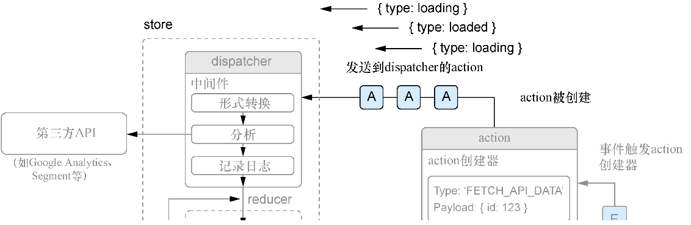
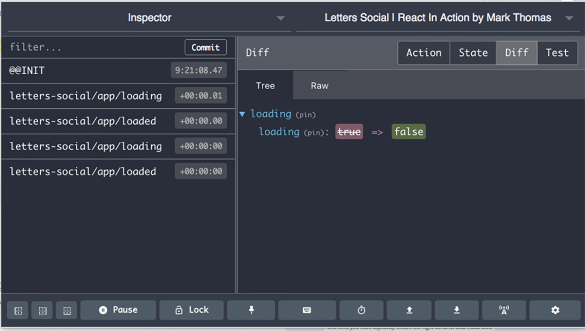

### 10.2.3　创建Redux store并派发action

action创建器自身并不会做任何事情来更改应用的状态（它们只是返回对象）。想让action创建器生效，需要使用Redux提供的dispatcher。 `dispatch` 函数由Redux store本身提供，它是将action发送给Redux进行处理的方法。接下来将设置Redux store以便能够使用它的 `dispatch` 函数来处理action。

在设置store之前，还需要创建一个根reducer文件，它允许开发人员创建一个有效的store，在之后回过头来将其构建出来之前，这个reducer不会做任何事情。在src中创建一个名为reducers的文件夹，并在其中创建一个名为root.js的文件，在这个文件中，使用Redux提供的 `combineReducers` 函数来设置之后的reducer的去处。 `combineReducers` 函数的功能和它字面上的意思完全一样：将多个reducer合并成一个。

如果没有合并reducer的能力，开发者将会遇到多个reducer之间冲突的问题而且必须找到合并reducer和路由action的方法。这是Redux显而易见的好处。虽然将所有东西设置好还有一些工作要做，但是一旦完成这些工作，Redux就可以更容易地扩展应用的状态管理。代码清单10-4展示了如何创建根reducer文件。

代码清单10-4　创建根reducer（src/reducers/roots.js）

```javascript
import { combineReducers } from 'redux';  ⇽--- 从Redux导入combineReducers
const rootReducer = combineReducers({});  ⇽--- 目前使用combineReducers和空对象来创建根reducer
export default rootReducer;  ⇽--- 导出根reducer
```

现在已经为Redux设置了一个reducer，接下来将设置store。创建一个名为store的文件夹，并在其中创建一些文件：store/configureStore.js、store/configureStore.prod.js、store/configureStore.dev.js和store/exampleUse.js。这些文件负责导出创建store的函数并在开发模式下集成开发者工具。代码清单10-5展示了所创建的store相关的文件。这里为每个环境使用了不同的文件，因为开发环境和生产环境可能会包含不同的中间件和库。这只是一个惯例——Redux并没有要求开发者将函数放在多个或一个文件中。

代码清单10-5　创建Redux store

```javascript
// src/store/configureStore.js
import { __PRODUCTION__ } from 'environs';  ⇽--- 这个文件让在应用中使用store更为容易，而不必关心是开发环境还是生产环境
import prodStore from './configureStore.prod';
import devStore from './configureStore.dev';
export default __PRODUCTION__ ? prodStore : devStore;  ⇽--- 这个文件让在应用中使用store更为容易，而不必关心是开发环境还是生产环境
// src/store/configureStore.prod.js
import { createStore } from 'redux';
import rootReducer from '../reducers/root';
let store;
export default function configureStore(initialState) {  ⇽--- 将初始状态传递给配置以供Redux使用
  if (store) {
    return store;
  }
  store = createStore(rootReducer, initialState);  ⇽--- 使用Redux的createStore方法来创建store
  return store;
}
// src/store/configureStore.dev.js
import thunk from 'redux-thunk';
import { createStore, compose} from 'redux';  ⇽--- 从Redux中导入compose实用程序，以组合middleware
import rootReducer from '../reducers/root';
let store;
export default initialState => {
    if (store) {  ⇽--- 确保一直访问同一个store——这段代码用于确保另一个文件访问已创建的store时会返回同一个store
        return store;
    }
    const createdStore = createStore(
        rootReducer,
        initialState,
        compose(window.devToolsExtension())  ⇽--- 如果已经安装了开发者工具扩展，这段代码会将其集成进来
    );
    store = createdStore;
    return store;
};

```

现在已经设置好了一个可以使用的store，可以尝试派发一些action并来看看它们是如何工作的。不久之后，我们将把Redux集成到React中，但请记住，Redux并不是一定要与React或其他任何库或者框架一起用，但有不少开源项目将Redux与Angular、Vue等框架集成在一起。

Redux store提供了几个在使用Redux的整个过程中会持续使用的重要方法—— `getState` 和 `dispatch` 。 `getState` 用于获取给定时间点的Redux store状态的快照， `dispatch` 则是将action发送到Redux store的方式。在调用dispatch方法时，传入一个action，该action是调用action创建器的结果。由于使用 `store.dispatch()` 是在Redux中触发状态更改的唯一方法，因此会在很多地方用到它。接下来，将尝试使用之前设置的“加载”action创建器，让store来派发一些action。代码清单10-6展示了如何使用临时文件（src/store/exampleUse.js）派发一些action。此文件仅用于演示，主应用工作并不需要它。

代码清单10-6　派发action（src/store/exampleUse.js）

```javascript
import configureStore from './configureStore';  ⇽--- 导入configureStore方法并使用它创建store
import { loading, loaded } from '../actions/loading';
const store = configureStore();
console.log('========== Example store ===========');
store.dispatch(loading());  ⇽--- 调用store的dispatch方法，并将action创建器的调用结果传递进去，action创建器将返回action对象供dispatch方法使用
store.dispatch(loaded());  ⇽--- 派发另一个action
store.dispatch(loading());
store.dispatch(loaded());
console.log('========== end example store ===========');
```

要派发这些action，只需要将exampleUse文件导入主应用文件中，当打开应用时它就会运行。代码清单10-7展示了需要对src/index.js进行的小修改。一旦将Redux与React对接，将通过React组件与Redux交互，而不需要像下面这样出于演示的目的来手动派发action。

代码清单10-7　导入exampleUse文件（src/index.js）

```javascript
import React from 'react';
import { render } from 'react-dom';
import { App } from './containers/App';
import { Home, SinglePost, Login, NotFound, Profile } from './containers';
import { Router, Route } from './components/router';
import { history } from './history';
import { firebase } from './backend';
import configureStore from './store/configureStore';
import initialReduxState from './constants/initialState';
import './store/exampleUse';  ⇽--- 导入这个store文件，以便在打开应用时运行
//...
```

如果在开发模式下加载应用（使用 `npm run dev` ），应该会看到Redux开发者工具的图标变为启用状态。当应用运行时，被导入的文件将运行并多次调用store的dispatcher，将action发送到store。目前还没有为action设置任何处理程序（通过reducer），也没有将任何东西挂接到React上，因此不会有任何有意义的变化。但如果打开开发者工具并查看action历史，应该会看到，每个“加载”action都已经被派发并记录下来。图10-5展示了该上下文中的action派发图以及在Redux开发者工具中应该看到的结果。



<center class="my_markdown"><b class="my_markdown">图10-5　当运行应用时，我们创建的示例store将接收action创建器的结果并将这些结果发送到store。
 目前还没有设置任何reducer来做任何事情，所以什么也不会发生。一旦设置了reducer，
 Redux将根据所派发的action类型来决定对状态进行哪些更改</b></center>

