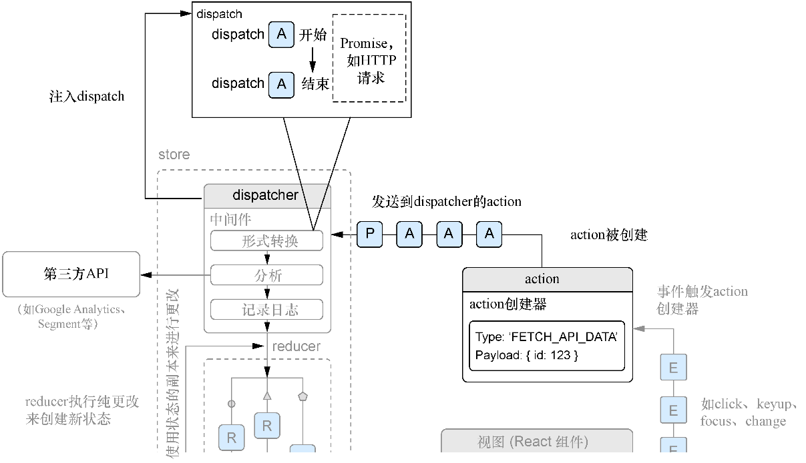

### 10.2.4　异步action和中间件

我们已经可以派发action了，但目前它们还是同步的。很多情况下开发者会希望基于异步的action对应用进行更改，可能是一个网络请求、从浏览器读取一个值（通过本地存储器、cookie存储等）、处理WebSocket或其他的异步操作。Redux不支持开箱即用的异步action，因为它期望action只是对象（而不是Promise或其他任何东西），但我们可以通过集成一个已安装的库来启用它，这个库就是 `redux-thunk` 。

`redux-thunk` 是Redux的一个中间件库，这意味着它以一种“途经”或“传递”的方式在Redux中起作用。你可能使用过其他应用这个概念的API，如Express或Koa（Node.js的服务器端框架）。中间件的工作方式是让开发者以一种可组合的方式介入到某个周期或流程中，这意味着可以在单个项目中创建和使用相互独立的多个中间件函数。

用Redux文档的话说，Redux中间件是“从发送action到action到达reducer之间的第三方扩展点”。这意味着在reducer处理一个action之前，开发者有机会对该action进行操作或修改。接下来将使用Redux的中间件创建错误处理程序，但目前要用 `redux-thunk` 中间件在应用中启用异步action创建。代码清单10-8展示了如何将 `redux-thunk` 集成到应用中。需要注意的是要将中间件同时添加到生产环境和开发环境的store中（configureStore.prod.js和configureStore.dev.js）。请记住，可以选择最适合自己情况的生产和开发store的设置，我在这里只将它们分为两个，以便明确在不同环境下使用哪一个。

代码清单10-8　通过redux-thunk启用异步action创建器

```javascript
import thunk from 'redux-thunk';
import { createStore, compose, applyMiddleware } from 'redux';  ⇽--- 为了将中间件集成到Redux store中，导入applyMiddleware实用程序
import rootReducer from '../reducers/root';
let store;
export default (initialState) => {
  if (store) {
    return store;
  }
  const createdStore = createStore(rootReducer, initialState, compose(  ⇽--- 在Redux中使用applyMiddleware方法插入和排列中间件——这里将redux-thunk中间件插入store中
    applyMiddleware(
      thunk,
    ),
    window.devToolsExtension()
    )
  );
  store = createdStore;
  return store;
};
```

安装了 `redux-thunk` 中间件之后，就可以创建异步action创建器了。为什么我说的是异步action创建器而不是异步action？因为即使在做异步的事情（如进行网络请求），你创建的action也不是异步任务本身。相反，当一个Promise到来的时候， `redux-thunk` 让Redux store知道如何处理一个Promise。这个Promise的过程就是开发者向store派发action的方式。Redux并没有真正改变什么，这些action仍然是同步的，但是Redux现在知道在将Promise传递给 `dispatch` 方法时，需要等待着Promiser去解析。

在前面几章中，我们创建了一些使用 `isomorphic-fetch` 库从API获取文章的逻辑并使用React展示它们。执行这样的异步操作通常需要派发多个action（通常是“加载中”“成功”和“失败”的action）。例如，希望用户上传文件到服务器，服务器在上传期间发回进度数据。将这一过程的不同部分映射到action的一种方式是，创建一个表示上传开始的action、一个告知应用其他部分当前有东西正在加载的action、一个表示从服务器发回的进度更新的action、一个表示上传结束的action和一个处理错误的action。

`redux-thunk` 通过包装store的 `dispatch` 方法来工作，这样它就可以处理派发普通对象以外的东西（如Promise，一个处理异步流的API）。随着Promise被执行，中间件将异步派发创建的action（例如，在请求的开始和结束时），并让开发者适当地处理这些更改。如前所述，这里的关键区别在于action本身仍然是同步的，但当它们被派发并发送到reducer时，它们是异步的。图10-6展示了这一过程。


<center class="my_markdown"><b class="my_markdown">图10-6　redux-thunk这样的中间件库支持异步action创建器，它允许开发者除action之外还可以派发诸如Promise（一个完成异步工作的方法，是JavaScript规范的一部分）之类的内容。它会解析Promise并允许开发者在Promise的生命周期的不同时间点（执行前、完成、出错等）派发action</b></center>

接下来将根据我们对异步action创建器的了解来编写一些处理帖子获取和帖子创建的action创建器。因为 `redux-thunk` 包装了store的dispatch方法，所以可以从action创建器中返回一个函数，该函数接收 `dispatch` 方法作为函数，允许开发者在一个Promise的执行过程中派发多个action。代码清单10-9展示了这类action创建器的样子。我们将创建几个异步action创建器和一个同步action创建器。我们先创建一些action，用于处理帖子和评论的用户交互。先是一个error action，如果出现问题，将使用它来显示用户错误信息。在更大型的应用中，可能需要创建不止一种方式来处理错误，但对我们而言，这应该足够了。我们可以在这里使用这个error action，也可以在任何组件的错误边界中使用这个error action。 `componentDidCatch` 将提供可以派发到store的错误信息。

代码清单10-9　创建error action（src/actions/error.js）

```javascript
import * as types from '../constants/types';
export function createError(error, info) {  ⇽--- 这个action创建器是参数化的——开发者期望将错误信息发送到store
    return {
        type: types.app.ERROR,  ⇽--- 这个action拥有通用的应用错误类型——在更大型的应用中将会有很多种错误类型
        error,  ⇽--- 传递实际错误和信息
        info
    };
}
```

现在有了处理错误的方式，可以开始编写一些异步action创建器了。我们将从评论开始，然后再到帖子。帖子和评论的action总体上应该是相似的，但每组action的工作方式仍有一些细微的差别。我们希望能够做一些与评论相关的事情，如显示和隐藏、加载以及为指定的文章创建新评论。代码清单10-10展示了将要创建的评论action。

代码清单10-10　创建评论action（src/actions/comments.js）

```javascript
import * as types from '../constants/types';
import * as API from '../shared/http';  ⇽--- 导入API辅助函数
import { createError } from './error';
export function showComments(postId) {  ⇽--- 创建参数化的action创建器，以便可以显示特定的评论部分
    return {
        type: types.comments.SHOW,
        postId
    };
}
export function toggleComments(postId) {  ⇽--- 切换评论的功能
    return {
        type: types.comments.TOGGLE,
        postId
    };
}
export function updateAvailableComments(comments) {  ⇽--- 创建获取评论的功能——此文件中的异步action创建器将使用这个函数
    return {
        type: types.comments.GET,
        comments
    };
}
export function createComment(payload) {  ⇽--- 从给定荷载中创建评论，返回一个函数而不是普通对象
    return dispatch => {
        return API.createComment(payload)
            .then(res => res.json())  ⇽--- Fetch API实现了诸如json()和blob()这样的基于Promise的方法
            .then(comment => {
                dispatch({  ⇽--- 使用从服务器获得的评论的JSON来派发创建评论的action
                    type: types.comments.CREATE,
                    comment
                });
            })
            .catch(err => dispatch(createError(err)));  ⇽--- 如果收到一个错误，则使用createError action来将其发送给store
    };
}
export function getCommentsForPost(postId) {  ⇽--- 获取指定帖子的评论并使用updateAvailableComments action
    return dispatch => {
        return API.fetchCommentsForPost(postId)
            .then(res => res.json())  ⇽--- 如果有的话，处理错误
            .then(comments => dispatch(updateAvailableComments(comments)))
            .catch(err => dispatch(createError(err)));  ⇽--- 如果有的话，处理错误
    };
}
```

随着创建完这些action和其他action，将继续使用 `isomorphic-fetch` 库来执行网络请求，而 `isomorphic-fetch` 库遵循的Fetch API在浏览器中正变得更为标准，而且现在已经是执行网络请求的事实上的方式了。如果可能的话，建议你继续使用遵循相同规范的Web平台API或库。

创建完评论的action，现在可以开始创建帖子的action了。帖子的action与刚刚创建的action类似，但会使用一些评论的action。能够混合和搭配整个应用内的不同action是Redux能够成为良好的应用架构的另一个原因。它提供了一种结构化的、可重复的方式来利用action创建功能，然后在整个应用内使用该功能。

接下来将继续创建action并为帖子添加一些功能。前几章创建了用于获取和创建帖子的功能，现在将创建为帖子点赞和踩帖子的功能。代码清单10-11展示了与应用中的帖子相关的action创建器。现在将从4个action创建器开始，然后在代码清单10-12中探索更多action创建器。

代码清单10-11　同步和异步action创建器（src/actions/posts.js）

```javascript
import parseLinkHeader from 'parse-link-header';  ⇽--- JSON API使用链接头信息来表示分页选项
import * as types from '../constants/types';
import * as API from '../shared/http';
import { createError } from './error';
import { getCommentsForPost } from './comments';
export function updateAvailablePosts(posts) {  ⇽--- 就像对评论所做的那样，这个action创建器将把新评论一起传给store
    return {
        type: types.posts.GET,
        posts
    };
}
export function updatePaginationLinks(links) {  ⇽--- 相应地更新store中的分页链接
    return {
        type: types.posts.UPDATE_LINKS,
        links
    };
}
export function like(postId) {  ⇽--- 使用ID来为特定帖子点赞
    return (dispatch, getState) => {  ⇽--- Redux会将dispatch和getState方法注入这个返回的函数中
        const { user } = getState();
        return API.likePost(postId, user.id)
            .then(res => res.json())
            .then(post => {
                dispatch({  ⇽--- 派发LIKE action并将帖子作为元数据附加在其上
                    type: types.posts.LIKE,
                    post
                });
            })
            .catch(err => dispatch(createError(err)));
    };
}
export function unlike(postId) {  ⇽--- 踩帖子涉及相同的流程，只是派发不同的action类型
    return (dispatch, getState) => {
        const { user } = getState();
        return API.unlikePost(postId, user.id)
            .then(res => res.json())
            .then(post => {
                dispatch({
                    type: types.posts.UNLIKE,
                    post
                });
            })
            .catch(err => dispatch(createError(err)));
    };
}
```

我们需要为帖子创建更多action类型。现在已经可以给帖子点赞或踩帖子，但仍然没有移植之前创建的发帖功能，而且还需要获取多个和单个帖子的功能。代码清单10-12展示了相应的需要创建的action创建器。

代码清单10-12　创建更多的帖子action创建器（src/actions/posts.js）

```javascript
//...
export function createNewPost(post) {
    return (dispatch, getState) => {  ⇽--- 就像之前一样，使用getState方法来访问状态快照
        const { user } = getState();
        post.userId = user.id;  ⇽--- 在新帖子中嵌入用户ID
        return API.createPost(post)
            .then(res => res.json())
            .then(newPost => {
                dispatch({  ⇽--- 派发创建帖子的action
                    type: types.posts.CREATE,
                    post: newPost
                });
            })
            .catch(err => dispatch(createError(err)));
    };
}
   export function getPostsForPage(page = 'first') {
    return (dispatch, getState) => {
        const { pagination } = getState();  ⇽--- 抓取分页状态对象
        const endpoint = pagination[page];
        return API.fetchPosts(endpoint)
            .then(res => {
                const links = parseLinkHeader(res.headers.get('Link'));  ⇽--- 使用链接头解析器并传入链接头
                return res.json().then(posts => {
                    dispatch(updatePaginationLinks(links));  ⇽--- 派发链接action
                    dispatch(updateAvailablePosts(posts));  ⇽--- 派发更新帖子的action
                });
            })
            .catch(err => dispatch(createError(err)));
    };
}
export function loadPost(postId) {
    return dispatch => {  ⇽--- 从API加载帖子并获取它的相关评论
        return API.fetchPost(postId)
            .then(res => res.json())
            .then(post => {
                dispatch(updateAvailablePosts([post]));  ⇽--- 从API加载帖子并获取它的相关评论
                dispatch(getCommentsForPost(postId));
            })
            .catch(err => dispatch(createError(err)));
    };
}
```

希望现在你已经开始掌握异步action创建器的诀窍了。在许多应用中，这类action创建器非常常见。但可能性还不止于此。我发现，使用 `redux-thunk` 本身就足以满足大多数需要异步创建action的应用，但人们已经创建了许多其他库来满足这一需要。

