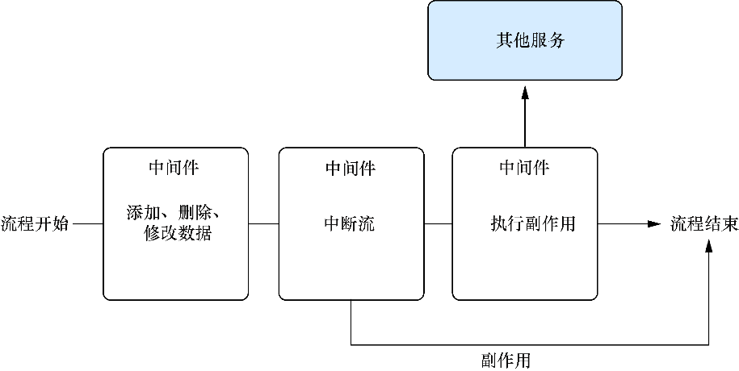

### 10.2.7　创建用于崩溃报告的自定义Redux中间件

现在已经创建了一些action，但在继续介绍reducer之前，还可以添加一些自己的中间件。中间件是Redux允许开发者连接到数据流过程中的一种方式（action被派发到store，经由reducer处理，更新状态，通知监听器）。Redux的中间件方法类似于Express或Koa（Node.js的Web服务器框架）等工具，只是它解决的问题有所不同。图10-7展示了一个以中间件为中心的流的示例，它可能出现在Express或Koa之类的框架中。


<center class="my_markdown"><b class="my_markdown">图10-7　中间件位于流程的起点和终点之间并允许使用者在这之间做各种事情</b></center>

有时开发者可能希望中断流、将数据发送到另一个API，或者解决应用的一些其他问题。图10-7展示了一些中间件的不同用法：数据修改、流中断和执行副作用。这里的一个关键点是中间件应该是可组合的——开发者应该能够对其中任何一个进行重新排序而不必担心它们会相互影响。

Redux的中间件允许开发者在派发action和action到达reducer之间做操作（参见图10-7的“中间件”部分）。这是一个关注Redux应用所有部分的共同问题的好地方，否则很多地方需要重复的代码。


**练习10-1　定义**

将术语与其定义相匹配：

A．Store

B．reducer

C．Action

D．Action创建器

____Redux的中心状态对象，真相之源。

____包含与更改相关的信息的对象。它们必须有一个类型并且可以包含用于传达事情发生的任何额外的信息。

____Redux用来根据发生的事情计算状态变化的函数。

____用于创建关于应用中所发生的事情的类型和荷载信息的函数。


例如，使用中间件是集中处理错误、将分析数据发送到第三方API、记录日志等的好方法。我们将实现一个简单的崩溃报告中间件，该中间件可以确保任何未处理的异常都报告给错误跟踪和管理系统。我使用的是Sentry，这是一款用于跟踪和记录异常以便以后进行分析的应用，但可以选择使用任何对开发者或团队最合适的工具（Bugsnag是另一个不错的选择）。代码清单10-15展示了如何创建一些基本的错误报告中间件，当Redux遇到错误时，这些中间件将对错误进行日志输出并将其发送到Sentry。通常，当应用出现异常时，工程师会收到某种类型的通知（立即或在仪表盘中），Sentry会记录这些错误并告诉开发者错误发生的时间。

代码清单10-15　创建简单的崩溃报告Redux中间件

```javascript
// ... src/middleware/crash.js
import { createError } from '../actions/error';
export default store => next => action => {  ⇽--- Redux的middleware是由Redux注入的复合函数组成的
    try {
        if (action.error) {
            console.error(action.error);
            console.error(action.info);
        }
        return next(action);  ⇽--- 如果没有错误，则继续下一个action
    } catch (err) {  ⇽--- 如果有错误，则报告它
        const { user } = store.getState();  ⇽--- 获取用户信息并将其和错误一起发出；发送错误到store
        console.error(err);
        window.Raven.setUserContext(user);  ⇽--- 获取用户信息并将其和错误一起发出；发送错误到store
        window.Raven.captureException(err);
        return store.dispatch(createError(err));  ⇽--- 获取用户信息并将其和错误一起发出；发送错误到store
    }
};
//... src/store/configureStore.prod.js
import thunk from 'redux-thunk';
import { createStore, compose, applyMiddleware } from 'redux';
import rootReducer from '../reducers/root';
import crashReporting from '../middleware/crash';  ⇽--- 引入要在生产中使用的中间件
let store;
export default function configureStore(initialState) {
  if (store) {
    return store;
  }
  store = createStore(rootReducer, initialState, compose(
    applyMiddleware(thunk, crashReporting)  ⇽--- 为生产环境添加中间件
  ));
  return store;
}

```

这只是使用Redux 中间件所能做的一个小尝试。Redux的大量文档包含了Redux的丰富信息以及设计和API用法的洞察，并且提供了优秀的示例。

