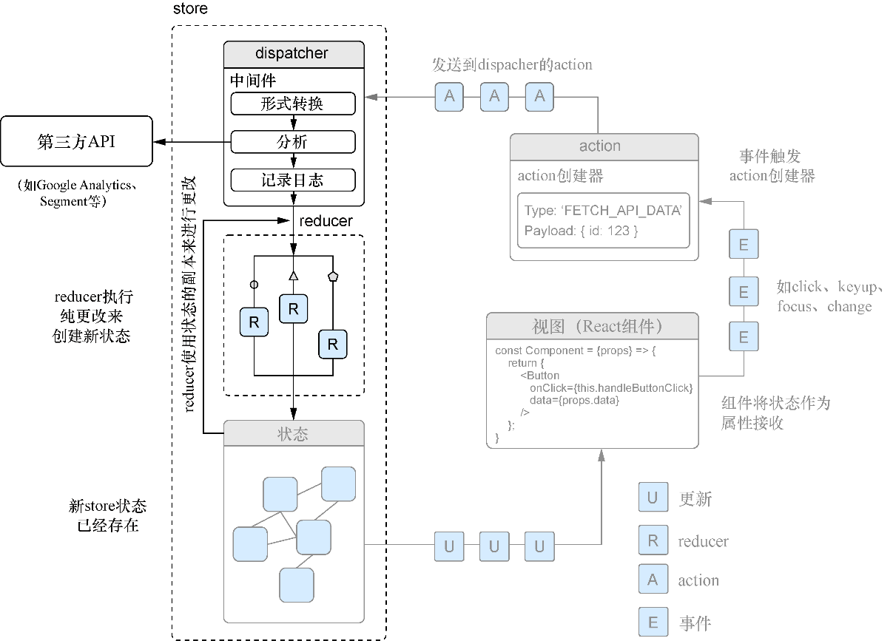

### 11.1　reducer决定状态应该如何改变

我们能够创建和派发action以及处理错误，但还不能做任何事情来改变状态。还需要设置reducer来处理传入的action。记住，action只是用来描述发生了什么事情并说明所发生事情的相关信息的一种方式，仅此而已。而reducer的工作则是指定store的状态应当怎样响应这些action进行改变。

图11-1展示了reducer如何纳入到我们一直关注的Redux全局图中。

<b class="my_markdown">图11-1　reducer只是函数，用于确定应该对状态进行哪些更改。可以将它们
 视为某种应用程序状态网关，用来严格控制传入的更改</b>

但什么是reducer？到目前为止，如果喜欢Redux的简单便捷，将不会对reducer感到失望：它们（reducer）只是一些简单的、目标单一的函数。reducer是把前一个状态和action当作参数，返回下一个状态的纯函数（上下文无关的函数）。根据Redux的文档，这些函数之所以叫作reducer是因为它们的方法签名与传递给 `Array.prototype.reduce` 的一样（举个例子， `[1, 2, 3].reduce((a, b)=>a + b, 0)` ）。

reducer必须是纯函数，意思就是给这个函数同样的输入，每次都会产生相同的相关输出结果。这与产生副作用并常常进行API调用的action或中间件形成鲜明对比。在reducer中执行任何异步或者不纯的操作（如调用 `Date.now`  或者  `Math.random()` ）是反模式的，可能降低应用的性能和可靠性。Redux文档中明确指出：“给定相同的参数，reducer应该计算下一状态并将它返回。没有意外，没有副作用，没有API调用，没有更改，只是计算。”

