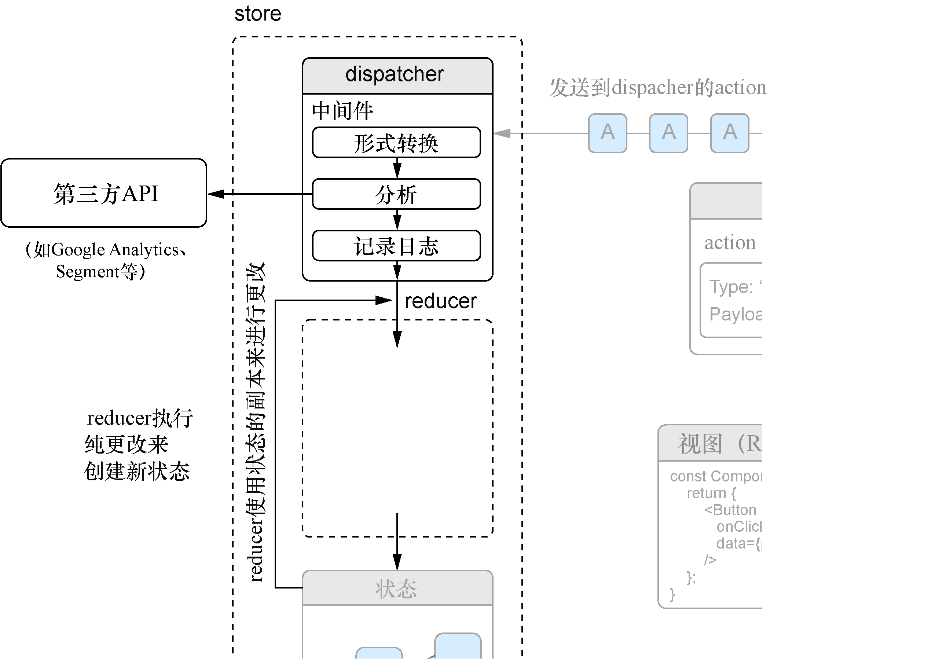

### 11.1.2　设置reducer来响应传入的action

设置好初始状态之后，我们应该创建一些reducer来处理传入的action，以便store能够得到更新。reducer通常使用 `switch` 语句来匹配传入的action类型，而后更新状态。它们返回一个将被用到的新的状态副本（不是经过更改的同一个版本）来更新store。reducer还执行兜底行为，以确保未知类型的action仅返回现有状态。有一个之前已经提及的重要事项需要再次重申：reducer执行计算并且应该根据给定的输入每次返回相同的输出；不应该引起任何副作用或者执行不纯的操作过程。

reducers负责计算store如何改变。在大部分应用程序中，开发人员会有很多reducers，它们各自负责store的一个切片。这有助于保持这些文件整齐划一。开发人员最终会使用Redux的 `combineReducers` 方法将多个 reducer合并成一个。大部分reducer都使用 `switch` 的case语句处理不同的action类型并用底部的default来保证未知的action类型（如果有的话，也许是意外创建的）不会对状态产生任何意外影响。

reducer还会创建状态的副本，而不会直接改变现存的store状态。如果回看图11-1，可以看到reducer执行工作时使用了状态。这种方法类似不可变数据结构的工作方式；创建改变的副本而不是直接改变。代码清单11-2 展示了如何设置“加载中”状态的reducer。注意，这种情况仅需要处理一个“扁平”的状态切片（布尔类型的 `loading` 属性）所以仅需返回 `true` 或 `false` 给新状态。读者经常会处理具有多个键或者嵌套属性的状态对象，并且reducer需要做比返回 `true` 或 `false` 更多的事情。

代码清单11-2　设置“加载中”状态的reducer（src/reducers/loading.js）

```javascript
import initialState from '../constants/initialState';
import * as types from '../constants/types';
export function loading(state = initialState.loading, action) {  ⇽--- 函数接收两个参数，state和action
  switch (action.type) {  ⇽--- 通常，会使用switch语句来明确处理每个action类型，以及在默认情况下返回现有状态
    case types.app.LOADING:  ⇽--- 如果action有“加载中”的类型，返回true给新状态值
      return true;
    case types.app.LOADED:  ⇽--- 处理已加载的情况并返回相应的false
      return false;
    default:  ⇽--- 默认返回现有状态
      return state;
  }}
```

现在，当一个与“加载中”相关的action被派发，Redux store对此将能有所行动。当一个action传进来并通过所有中间件，Redux将会调用reducer来根据action确定应该创建什么新状态。在设置任何reducer之前，store无法知道action中包含的更改信息。为了展示这一点，图11-2从流程中删除了reducer；看看action为何无法到达store？


<center class="my_markdown"><b class="my_markdown">图11-2　有reducer在，当actions被派发时，Redux将会知道如何对store进行更改。在中等复杂的应用程序中，通常有很多不同的reducer，各自负责自己的store状态“切片”</b></center>

接下来，我们会创建另一个reducer来让Redux技能发挥作用。毕竟，许多reducer不会仅仅返回 `true` 或者 `false` ，或者至少如果它们这样做，也会比计算 `true` 或者 `false` 要做的更多。Letters Social应用的另一个关键部分是显示和创建帖子，我们需要将其迁移到Redux。就像将一个真实的React应用迁移到Redux一样，应该能够保留很多应用已经使用的逻辑并将它们转换成Redux友好的形式。我们将创建两个reducer来处理帖子以及一个reducer来追踪帖子的ID。在大型应用中，我们也许会将这些合并到另一个健下，但现在让它们保持分开的状态也不错。这也作为设置多个reducers来处理单个action的示例。代码清单11-3展示了如何创建评论的reducer。虽然会在这里创建不少reducer，但一旦完成，应用将不仅对可能发生的action有全面的描述，而且会对状态可能改变的方式有全面的描述。

代码清单11-3　创建评论的reducer（src/reducers/comments）

```javascript
import initialState from '../constants/initialState';  ⇽--- 引入初始状态
import * as types from '../constants/types';
export function comments(state = initialState.comments, action) {  ⇽--- reducer是函数，其接收状态对象和action
    switch (action.type) {  ⇽--- 用switch语句决定如何响应传进来的action
        case types.comments.GET: {  ⇽--- 对于GET，创建状态的副本并添加还没有的评论
            const { comments } = action;
            let nextState = Object.assign({}, state);
            for (let comment of comments) {
                if (!nextState[comment.id]) {
                    nextState[comment.id] = comment;
                }
            }
            return nextState;  ⇽--- 返回新状态
        }
        case types.comments.CREATE: {  ⇽--- 将新评论添加到状态中
            const { comment } = action;
            let nextState = Object.assign({}, state);
            nextState[comment.id] = comment;
            return nextState;
        }
        default:  ⇽--- 默认返回同样的状态
            return state;
    }
}
export function commentIds(state = initialState.commentIds, action) {
    switch (action.type) {
        case types.comments.GET: {
            const nextCommentIds = action.comments.map(comment =>
    comment.id);  ⇽--- 这里只需要ID，因为我们将ID与其主对象分开存储了
            let nextState = Array.from(state);  ⇽--- 创建前一个状态的副本
            for (let commentId of nextCommentIds) {
                if (!state.includes(commentId)) {
                    nextState.push(commentId);
                }
            }
            return nextState;
        }
        case types.comments.CREATE: {  ⇽--- 存入新ID
            const { comment } = action;
            let nextState = Array.from(state);
            nextState.push(comment.id);
            return nextState;
        }
        default:
            return state;
    }
}
```

现在，当派发与评论相关的action时，store的状态会相应更新。注意到程序是如何能够响应那些严格说来不是相同类型的action吗？reducer可以响应在其管辖范围内的action，即使它们不是完全相同的类型。这是必须做到的，因为即使“帖子”的状态分片管理着帖子，其他类型的action仍然可能影响它。这里的要点是，reducer负责决定状态的特定方面如何改变，而不管传入是哪个action或哪种action类型。有些reducer可能需要知道许多不同类型的action，而这些action与reducer操纵的资源（帖子）没有特定关系。

现在已经创建了评论的reducer，可以创建处理帖子的reducer了。这与评论的reducer非常相似，可以采用相同的策略将它们分别存储为ID和对象。这里还需要了解如何处理为帖子点赞和踩帖子（我们已经在第10章为这个功能创建了action）。代码清单11-4展示了如何创建这些reducer。

代码清单11-4　创建帖子的reducer（src/reducers/posts.js）

```javascript
import initialState from '../constants/initialState';
import * as types from '../constants/types';
export function posts(state = initialState.posts, action) {
    switch (action.type) {
        case types.posts.GET: {  ⇽--- 处理获得的新帖子
            const { posts } = action;
            let nextState = Object.assign({}, state);
            for (let post of posts) {
                if (!nextState[post.id]) {
                    nextState[post.id] = post;
                }
            }
            return nextState;
        }
        case types.posts.CREATE: {
            const { post } = action;
            let nextState = Object.assign({}, state);
            if (!nextState[post.id]) {
                nextState[post.id] = post;
            }
            return nextState;
        }
        case types.comments.SHOW: {  ⇽--- 显示或隐藏对一个帖子的评论
            let nextState = Object.assign({}, state);
            nextState[action.postId].showComments = true;
            return nextState;
        }
        case types.comments.TOGGLE: {  ⇽--- 显示或隐藏对一个帖子的评论
            let nextState = Object.assign({}, state);
            nextState[action.postId].showComments =
     !nextState[action.postId].showComments;
            return nextState;
        }
        case types.posts.LIKE: {
            let nextState = Object.assign({}, state);
            const oldPost = nextState[action.post.id];  ⇽--- 给帖子点赞或者踩帖子，这涉及用来自API的新数据更新状态内的特定帖子
            nextState[action.post.id] = Object.assign({}, oldPost, action.post);
            return nextState;
        }
        case types.posts.UNLIKE: {  ⇽--- 给帖子点赞或者踩帖子，这涉及用来自API的新数据更新状态内的特定帖子
            let nextState = Object.assign({}, state);
            const oldPost = nextState[action.post.id];
            nextState[action.post.id] = Object.assign({}, oldPost, action.post);
            return nextState;
        }
        case types.comments.CREATE: {
            const { comment } = action;
            let nextState = Object.assign({}, state);
            nextState[comment.postId].comments.push(comment);
            return state;
        }
        default:
            return state;
    }
}
export function postIds(state = initialState.postIds, action) {  ⇽--- 用与处理评论相同的方式处理新ID
    switch (action.type) {
        case types.posts.GET: {
            const nextPostIds = action.posts.map(post => post.id);
            let nextState = Array.from(state);
            for (let post of nextPostIds) {
                if (!state.includes(post)) {
                    nextState.push(post);
                }
            }
            return nextState;
        }
        case types.posts.CREATE: {
            const { post } = action;
            let nextState = Array.from(state);
            if (!state.includes(post.id)) {
                nextState.push(post.id);
            }
            return nextState;
        }
        default:
            return state;
    }
}
```

这些文件中包含了两个reducer，因为它们密切相关而且处理相同的基础数据（帖子和评论），但读者也许会发现，大部分情况下开发人员为了简单只想每个文件一个reducer。多数情况下，reducer的设置会反映或者至少遵循store的结构。读者或许已经注意到其中的微妙之处——设计store结构的方法（参见本章早前设置的初始状态）会极大地影响如何定义reducer，并在较小的程度上也会影响如何定义action。由此得出的结论是，一般而言花费更多时间来设计状态的结构比随意处理它要好。在设计上花费太少时间也许会导致大量返工来改善状态的结构。而坚实的设计外加Redux所给予的模式会让添加新功更容易。


**迁移到Redux：值得吗？**

我在本章中已经提过好几次，Redux的初始设置可能颇费周章（也许读者正在感受），但最终这往往是值得的。显然，不可能所有情况都如此，但我发现我参与的项目的确如此，而且我认识的其他工程师参与的项目也是如此。我参与的一个项目涉及将应用程序从Flux完全迁移到Redux架构。整个团队大约花费了一个月的时间，但我们能够以最小的不稳定性和bug来开始应用程序的重写。

然而，正是因为Redux帮助我们落实到位的那些模式，总体结果是能够更快地对产品进行迭代。迁移到Redux的几个月后，我们最终完成了应用的一系列重新设计。即使我们最终重构了应用的大部分React，但Redux架构意味着只需对应用的状态管理和业务逻辑部分进行相对较少的修改。更重要的是，Redux提供的模式使得在必要之处添加应用状态时非常简单。集成Redux的好处超过了初始设置以及将应用迁移到Redux上的付出，而且会在之后很长时间持续产生效益。


处理了一些更为复杂的reducer之后，我们将通过创建错误处理、分页和用户的reducer来完结Redux的reducer部分。在代码清单11-5中，我们将从创建错误处理的reducer开始。

代码清单11-5　创建错误处理的reducer（src/reducers/error.js）

```javascript
import initialState from '../constants/initialState';
import * as types from '../constants/types';
export function error(state = initialState.error, action) {
    switch (action.type) {
        case types.app.ERROR:  ⇽--- 这个状态分片并不复杂，派发action上的错误
            return action.error;
        default:
            return state;
    }
}
```

接下来，需要确保分页状态可以被更新。现在，分页只与帖子相关，但更大的应用中或许要为应用的许多不同部分设置分页（举个例子，当一个拥有非常多评论的帖子需要一下展示出来时）。对于这个示例应用，只需要处理简单的分页即可，所以我们在代码清单11-6中创建了一个分页reducer。

代码清单11-6　创建分页的reducer（src/reducers/pagination.js）

```javascript
import initialState from '../constants/initialState';
import * as types from '../constants/types';
export function pagination(state = initialState.pagination, action) {
    switch (action.type) {
        case types.posts.UPDATE_LINKS:  ⇽--- 用新的分页信息来更新那些URL
            const nextState = Object.assign({}, state);  ⇽--- 创建前一个状态的副本并合并action的荷载中的URL
            for (let k in action.links) {
                if (action.links.hasOwnProperty(k)) {
                    if (process.env.NODE_ENV === 'production') {  ⇽--- 由于部署到ZEIT时Letters Social会终止SSL，如果无须自己部署，请忽略应对此问题的办法
                        nextState[k] =
    action.links[k].url.replace(/http:\/\//, 'https://');  ⇽--- 由于部署到ZEIT时Letters Social会终止SSL，如果无须自己部署，请忽略应对此问题的办法
                    } else {
                        nextState[k] = action.links[k].url;  ⇽--- 更新每个链接类型的URL
                    }
                }
            }
            return nextState;
        default:
            return state;
    }
}
```

现在，需要创建reducer来响应用户相关的事件，比如登入和登出。在这个reducer中，还会将一些cookie存储在浏览器上，以便之后第12章处理服务端渲染时使用它们。cookie是服务端发送给用户浏览器的小片数据。虽然读者可能由于日常使用计算机而熟悉cookie（有些网站会出于法律原因提醒用户），但也许之前从未以编程方式处理过它们。没关系。我们将使用js-cookie库与cookie交互，我们所要做的就是当用户验证状态变化时设置或删除特定的cookie。代码清单11-7展示了创建用户的reducer来实现这一点。

代码清单11-7　创建用户的reducer（src/reducers/user.js）

```javascript
import Cookies from 'js-cookie';  ⇽--- 导入js-cookie库以便使用
import initialState from '../constants/initialState';
import * as types from '../constants/types';
export function user(state = initialState.user, action) {
    switch (action.type) {
        case types.auth.LOGIN_SUCCESS:
            const { user, token } = action;  ⇽--- 从action中取得user和token
            Cookies.set('letters-token', token);  ⇽--- 使用js-cookie将token作为cookie存储到浏览器上
            return Object.assign({}, state.user, {  ⇽--- 返回新用户数据（包括token）的状态副本
                authenticated: true,
                name: user.name,
                id: user.id,
                profilePicture: user.profilePicture ||
    '/static/assets/users/4.jpeg',
                token
            });
        case types.auth.LOGOUT_SUCCESS:  ⇽--- 当用户登出时，将用户状态置为初始状态并清除cookie
            Cookies.remove('letters-token');
            return initialState.user;
        default:
            return state;
    }
}
```

