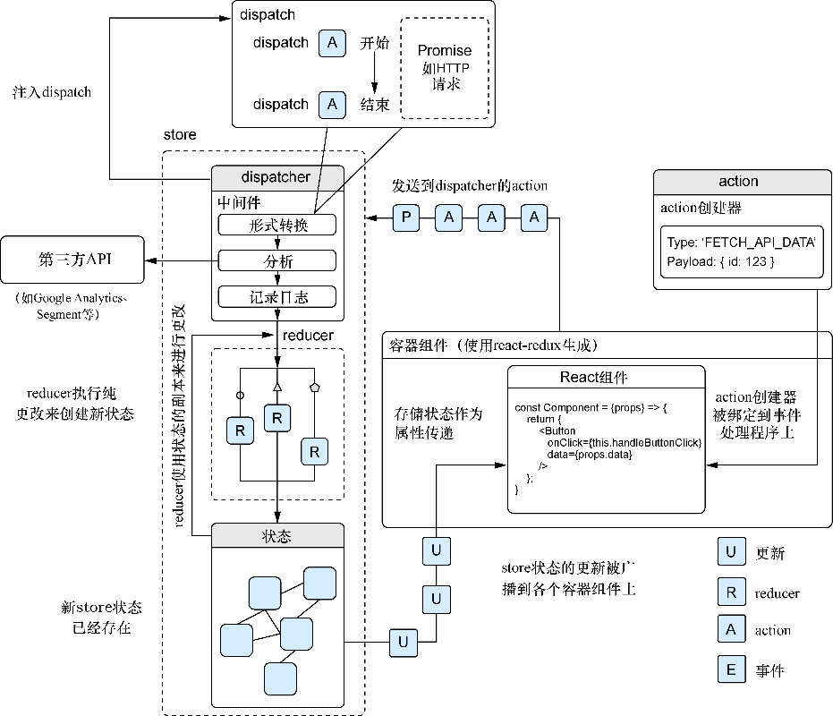

### 11.2.1　容器组件与展示组件

当把Redux集成到React应用中时，几乎可以肯定要用到 `react-redux` 库。这个库作为抽象，涵盖了将Redux的store、action集成到React组件中。我会介绍一些 `react-redux` 的使用方式，包括如何将action引入组件，以及讨论一些新组件类型：展示组件和容器组件。我们不再需要将状态分配到多个组件中，因为Redux负责用action、reducer和store来管理应用的状态。再次注意，创建不使用Redux的React应用本身并没有任何问题，开发人员依然可以继续得到使用React的其他所有好处。Redux的可预测性及增加的结构使设计和维护大型复杂React应用更加容易，而这正是许多团队选择使用它而非“纯”React的原因所在。

这两个新类别的组件（展示组件和容器组件）实际上只是组件已经做的事情的更有针对性的表现形式。“任何旧”组件与展示组件或容器组件之间的区别就在于它们做什么。展示组件处理UI和UI相关的数据，容器组件处理应用程序数据（按Redux的方式）, 而不是让任何组件去处理样式、UI数据和应用数据。

理解容器组件和展示组件之间的区别很重要，程序也在做相同的事情，但是以更好的关注点分离的方式进行。我们并没有将全新的东西引入到使用Redux的应用中；React组件仍然接收属性，维护状态，响应事件，并使用与之前相同的生命周期来渲染。 `react-redux` 提供的关键不同在于将store、reducer和action整合到了组件中。而展示组件和容器组件之间的新划分不过是一种让生活更轻松的模式罢了。

让我们看看这两种在Redux架构的React应用程序中使用的通用组件。如前所述，展示组件是“只用于UI”的组件。这意味着它们通常与确定应用程序数据如何更改、更新或发送没有太大关系。

以下是展示组件的一些基础知识。

+ 它们处理事物如何展示而不是数据如何流动或确定。
+ 它们仅在必要时才拥有自己的状态（它们是带有支撑实例的React类）；大多数时候，它们应该是无状态的函数组件，通过 `react-redux` 的绑定接收来自于Redux的属性。
+ 当它们拥有自己的状态时，应该是UI相关的数据，而不是应用程序数据。举个例子：一个打开或关闭的下拉菜单项和它的状态。
+ 它们不决定数据如何加载或者改变，那应该主要发生在容器组件中。
+ 它们通常由“手工”创建，而不是通过 `react-redux` 库。
+ 它们也许会持有样式信息、像CSS类这样的东西、其他样式相关的组件以及任何其他UI相关的数据。

如果正在探索React/Redux生态系统，可能听别人提过“smart”组件（容器组件）和“dumb”组件（展示组件）。这种提法已经过时了，因为这非但一点帮助都没有反而还有轻蔑的意味，但如果读者看到那些术语，要能把它们对应到展示/容器分类上。鉴于此，容器组件完成以下所有事情。

+ 作为数据源而且可以有状态，状态通常来自于Redux store。
+ 将数据和行为信息（如action）提供给展示组件。
+ 可以包含其他展示组件或容器组件；容器组件作为包含许多展示组件的父组件是很常见的。
+ 通常使用 `react-redux` 库的 `connect` 方法来创建（稍后会详细介绍）而且通常是高阶组件（从其他组件创建新组件的组件）。
+ 通常不会有与应用数据无关的样式信息。举个例子，在Redux store里的用户资料的状态分片也许会将“red”记录为用户“最喜欢的颜色”，但容器不会将该数据用于任何样式，它只会把数据传递给展示组件。

在本章中，我们会采用折中的方式，将组件分解为展示组件和连接组件或容器组件。对于每个想要连接到Redux store的组件，将会做如下事项。

+ 除常规组件之外，通过导出连接组件来修改它。
+ 将任何属性和状态移动到 `react-redux` 能够使用的特定函数中（稍后会详细介绍）。
+ 引入任何需要的action并将其绑定到组件的 `actions` 属性上。
+ 在适当的情况下将本地状态替换为已经与Redux store建立映射的属性。

图11-3会帮助我们更好地了解连接组件的工作原理。虽然相同的Redux元素还在，但已围绕React组件进行了“重新排列”，以便来自store的更新会传递给组件。

<b class="my_markdown">图11-3　集成了React的Redux。 `react-redux` 提供的实用工具可以有助于
 生成组件（高阶组件——生成其他组件的组件）</b>

本章没有足够的篇幅介绍我们在本书中接触到的所有组件的转换，但容器组件和展示组件之间的区别以及React和Redux的集成方式应该提供了一些良好的入门实践，从而指明正确的方向。

