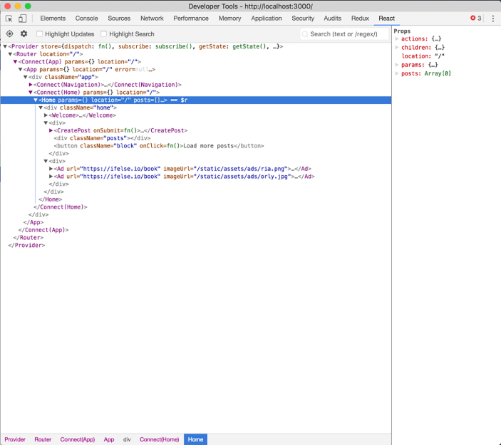
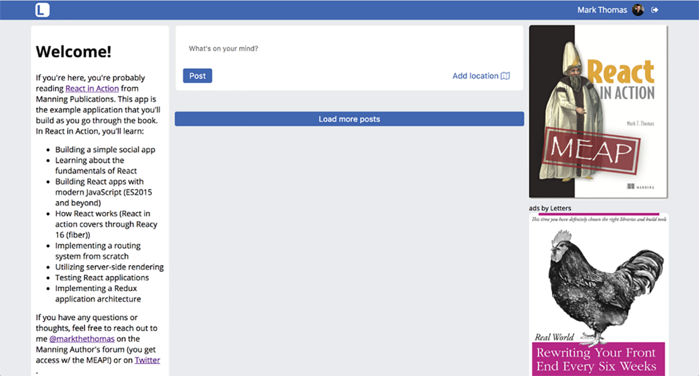

### 11.2.2　使用<Provider />将组件连接到Redux store

将Redux设置集成到React应用的第一步是用 `react-redux` 提供的Provider组件来包装整个应用程序。这个组件接收Redux store作为属性并使该store对“连接”组件可用——另一种描述连接到Redux的组件的方法。几乎所有情况下，这都是React组件和Redux集成的核心。容器必须有一个可用的store，否则应用程序就无法正常运行（甚至根本不会运行）。代码清单11-10展示了如何使用Provider组件以及更新用户验证监听器来处理Redux的action。

代码清单11-10　用react-redux的<Provider />包装应用程序

```javascript
import React from 'react';
import { render } from 'react-dom';
import { Provider } from 'react-redux';
import Firebase from 'firebase';
import * as API from './shared/http';
import { history } from './history';
import configureStore from './store/configureStore';  ⇽--- 这里导入我们需要的Redux相关模块
import initialReduxState from './constants/initialState';
import Route from './components/router/Route';
import Router from './components/router/Router';
import App from './app';
import Home from './pages/home';
import SinglePost from './pages/post';
import Login from './pages/login';
import NotFound from './pages/404';
import { createError } from './actions/error';  ⇽--- 这里导入我们需要的Redux相关模块
import { loginSuccess } from './actions/auth';
import { loaded, loading } from './actions/loading';
import { getFirebaseUser, getFirebaseToken } from './backend/auth';
import './shared/crash';
import './shared/service-worker';
import './shared/vendor';
import './styles/styles.scss';
const store = configureStore(initialReduxState);  ⇽--- 用初始状态创建一个Redux store
const renderApp = (state, callback = () => {}) => {
    render(
        <Provider store={store}>  ⇽--- 用react-redux的Provider包装路由器并且将store传递给它
            <Router {...state}>
                <Route path="" component={App}>
                    <Route path="/" component={Home} />
                    <Route path="/posts/:postId" component={SinglePost} />
                    <Route path="/login" component={Login} />
                    <Route path="*" component={NotFound} />
                </Route>
            </Router>
        </Provider>,
        document.getElementById('app'),
        callback
    );
};
const initialState = {
    location: window.location.pathname
};
// Render the app initially
renderApp(initialState);
history.listen(location => {  ⇽--- 历史监听器保持不变
    const user = Firebase.auth().currentUser;
    const newState = Object.assign(initialState, { location: user ?
     location.pathname : '/login' });
    renderApp(newState);
});
getFirebaseUser()  ⇽--- 从Firebase获取用户并派发一个“加载中”action
    .then(async user => {
        if (!user) {
            return history.push('/login');
        }
        store.dispatch(loading());  ⇽--- 从Firebase获取用户并派发一个“加载中”action
        const token = await getFirebaseToken();
        const res = await API.loadUser(user.uid);
        if (res.status === 404) {  ⇽--- 如果没有用户，就新建一个并派发user和token
            const userPayload = {
                name: user.displayName,
                profilePicture: user.photoURL,
                id: user.uid
            };
            const newUser = await API.createUser(userPayload).then(res =>
     res.json());
            store.dispatch(loginSuccess(newUser, token));  ⇽--- 如果没有用户，就新建一个并派发user和token
            store.dispatch(loaded());
            history.push('/');
            return newUser;
        }
        const existingUser = await res.json();
        store.dispatch(loginSuccess(existingUser, token));  ⇽--- 加载已存在的用户，然后派发
        store.dispatch(loaded());
        history.push('/');
        return existingUser;
    })
    .catch(err => createError(err));
//...
```

现在，store对组件可用了，可以将它们连接到store。记得图11.3， `react-redux` 会将store状态作为属性注入到组件中，并在store更新时更改那些属性。如果没有使用 `react-redux` ，则需要基于逐个组件手工订阅来自store的更新。

为了连接store，需要使用 `react-redux` 的 `connect` 工具函数。它会生成一个连接到Redux store的容器组件（因此得名）并在store变化时应用更新。这个 `connect` 方法仅有几个参数，但它比乍看上去要复杂得多。对于正在完成的工作，即要使用订阅store的能力，也要使用注入store的 `dispatch` 函数，以便能够为组件创建action。

为了注入状态，需要传入一个函数（ `mapStateToProps` ），该函数接收状态作为参数并返回一个对象，这个对象会与提供给组件的属性进行合并，每当这个组件接收到新属性时， `react-redux` 会再次调用这个函数。一旦使用 `connect` 包装了组件，就需要调整组件内部使用属性的方式（接下来会介绍action）；不应该使用 `state` ，除非它与特定的UI数据相关。记住，虽然这被认为是最佳实践，但并不意味着不存在展示组件和容器组件之间界限模糊的情况。即使这种情况很少，但是它们的确存在。要为团队和特定情况做出最好的工程决策。

代码清单11-11展示了如何使用 `connect` 以及如何调整Home组件内属性的访问方式并将Home组件转换为无状态函数组件。我们将使用最终传递的两个参数中的第一个来完成连接： `mapStateToProps` 。这个函数接收状态（store的状态）及 `ownProps` 这个额外的参数，它将用来传递任何要传给容器组件的额外属性。现在还不会用到这个参数，但API提供它以防需要。

代码清单11-11　mapStateToProps（src/pages/Home.js）

```javascript
import PropTypes from 'prop-types';
import React, { Component } from 'react';
import { connect } from 'react-redux';
import orderBy from 'lodash/orderBy';  ⇽--- 使用Lodash的orderBy函数来对帖子排序
import Ad from '../components/ad/Ad';  ⇽--- 导入Home页显示的组件
import CreatePost from '../components/post/Create';
import Post from '../components/post/Post';
import Welcome from '../components/welcome/Welcome';
export class Home extends Component {
    render() {
        return (
            <div className="home">
                <Welcome />
                <div>
                    <CreatePost />
                    {this.props.posts && (  ⇽--- 在posts上调用map
                        <div className="posts">
                            {this.props.posts.map(post => (
                                <Post
                                    key={post.id}  ⇽--- 传入帖子和帖子ID（mapStateToProps将会进一步处理）
                                    post={post}
                                />
                            ))}
                        </div>
                    )}
                    <button className="block">
                        Load more posts
                    </button>
                </div>
                <div>
                    <Ad url="https://ifelse.io/book" imageUrl="/static/
     assets/ads/ria.png" />
                    <Ad url="https://ifelse.io/book" imageUrl="/static/
     assets/ads/orly.jpg" />
                </div>
            </div>
        );
    }
}
//...
export const mapStateToProps = state => {
    const posts = orderBy(state.postIds.map(postId => state.posts[postId]),
     'date', 'desc');  ⇽--- 通过map得到posts并使用orderBy对其进行排序
    return { posts };  ⇽--- mapStateToProps函数返回用于连接组件的属性
};
export default connect(mapStateToProps)(Home);  ⇽--- 导出连接组件
```

现在运行应用（使用 `npm run dev` ），应该不会遇到任何运行时错误，但也看不到任何帖子，这是因为没有任何action来做任何事情。但如果打开React开发者工具，应该能够看到 `react-redux` 在创建连接组件。注意 `connect` 是如何创建另一个组件来包装传入的组件并提供给它一组新属性的。在幕后，它还会订阅来自Redux store的更新并将它们作为新属性传递给容器组件。图11-4展示了当打开开发者工具和应用时会看到的内容。



<center class="my_markdown"><b class="my_markdown">图11-4　如果打开React开发者工具，能够找出新连接的容器以及 `connect` 传递给它的属性。注意 `connect` 函数是如何包装传入的组件来创建新组件的</b></center>

