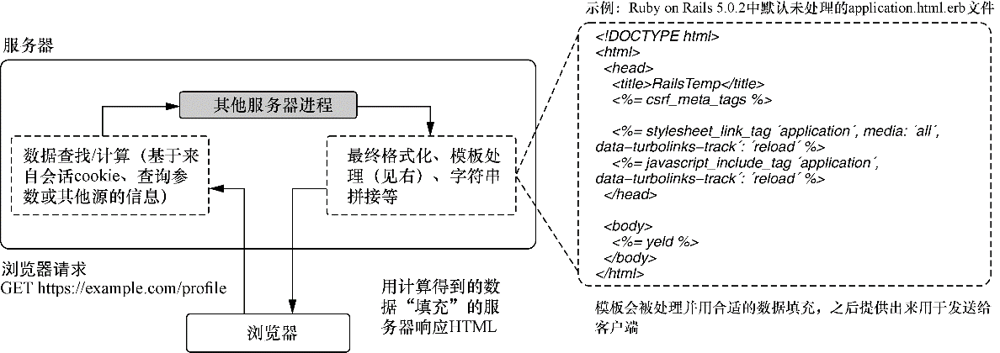
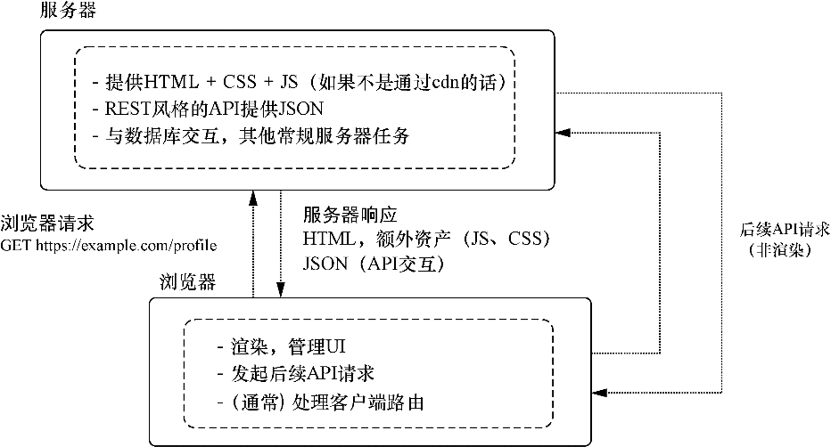

### 12.1　什么是服务器端渲染

在研究服务器端使用React之前，让我们先简要回顾一下Web应用程序渲染的历史。如果已经熟悉SSR的工作原理（也许以前使用过Ruby on Rails或Laravel之类的框架，或者已经了解了这种机制），可以跳到12.1.4节，直接开始为应用程序实现SSR。

在过去（今天许多应用仍然如此），只拥有服务器端渲染视图的应用才是普遍情况。通常这些应用会创建带有用户相关信息或其他数据的HTML字符串并通过HTTP将这些字符串发送到浏览器。虽然情况最终会有所好转，但一开始甚至服务器端也很原始。开发人员创建简单的服务器端脚本，这些脚本手动将HTML字符串的各个部分连接在一起，然后将形式的这个整体作为响应发送出去。这种方法虽然奏效，但让事情变得更为困难，因为手动创建连接起来的视图非常耗时而且可能很难更改。随着时间的推移，一些框架甚至语言被开发或创建出来以使开发人员能够更好地构建主要在服务器端渲染的用户界面。

图12-1展示了这个过程的大致情况。其基本思想是，服务器使用动态生成的HTML响应来自浏览器的请求，这些HTML以某种方式包含了特定于请求用户的信息。ERB模板示例展示了工程师在创建HTML时要处理的内容。如果你之前接触过Node.js社区，可能会熟悉Pug（别名Jade）模板语言。

<b class="my_markdown">图12-1　服务器端渲染的简单概览</b>

Ruby on Rails、WordPress（基于PHP的内容管理框架）以及其他框架被开发并发展起来，以满足用这种方式构建应用的需求。这种以服务器为中心的方式运作得很好，现在仍然如此。但随着客户端JavaScript变得更加健壮以及浏览器变得更加强大，开发人员终于开始不再只是使用JavaScript为应用程序添加基本交互，而是开始用JavaScript生成和更新带有动态数据的界面。这意味着服务器更少地用于模板输出，而更多地用作数据源。因此，你会发现许多应用程序（如我们的应用程序）使用健壮的客户端应用程序来管理UI，并使用远程API（通常是REST）提供动态数据。这是我们在本书中到目前为止一直在使用的范式。但本章将稍作改变，混合使用服务器端渲染模式和客户端渲染模式。下一节将展示服务器端渲染的一些更为具体的示例。图12-2展示了这种设置的示例，与图12-1进行对比。

<b class="my_markdown">图12-2　随着浏览器和JavaScript语言的发展（有时发展速度很慢），客户端JavaScript承担了更多的责任。如果回头查看图12-1并将其与本图进行比较，你会发现它们正在完成相同的基本任务
 （获取或计算数据，并向用户显示），但客户端和服务器又分别承担了不同的责任</b>

